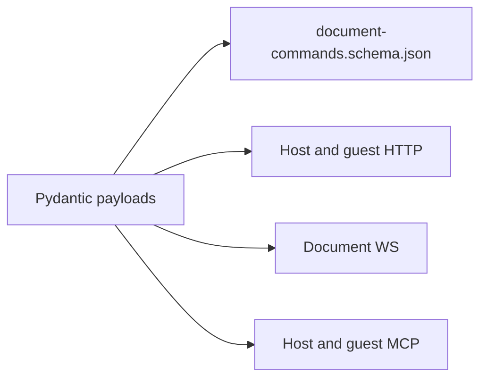

# Podcast MCP developer docs

> **Alpha:** public API shapes may change without notice. Pin to a git SHA if you
> experiment. A dated changelog arrives when we leave alpha.

Contract docs for agents and engineers integrating with **capabilities**,
**document commands**, **guest share HTTP**, and **remote MCP**.

> **Local-first:** document commands work on the host Sharecut Studio alone.
> **Share HTTP** and **remote MCP** use the built-in FOSS `collaboration`
> extension (disable with `PODCAST_EXTENSIONS=`). Internet guests also need a FOSS
> `podcast tunnel` + relay. See [extensions](https://github.com/calebn/sharecut-studio/blob/main/docs/extensions.md)
> and [extension-seams](https://github.com/calebn/sharecut-studio/blob/main/docs/extension-seams.md).

Live site: [docs.sharecut.studio](https://docs.sharecut.studio/).

| Page | What |
|------|------|
| [Quickstart](#/quickstart) | Curl + Cursor MCP + one document command |
| [Capabilities](#/capabilities) | Host surface matrix (command / key / MCP / CLI / skill) |
| [Document commands](#/document-commands) | Typed command catalog (host + guest; always on host) |
| [Share HTTP](#/share-http) | Token-scoped guest routes (**collaboration extension**; relay for public URLs) |
| [Remote MCP](#/remote-mcp) | Guest MCP tools (**collaboration extension** + `mcp` cap) |
| [Errors & limits](#/errors) | 422 / 429 / MCP codes and body caps |
| [Threat model](#/threat-model) | Host / relay / guest trust boundaries |

Product UX (screens, journeys, shortcuts): **[ux.sharecut.studio](https://ux.sharecut.studio/)**.

Machine-readable: [llms.txt](../llms.txt),
[.well-known/api-catalog](../.well-known/api-catalog),
[capabilities.manifest.schema.json](../schemas/capabilities.manifest.schema.json),
[document-commands.schema.json](../schemas/document-commands.schema.json),
[guest-share.openapi.json](../schemas/guest-share.openapi.json).

Engineer depth in the repo: [`docs/session-sync.md`](https://github.com/calebn/sharecut-studio/blob/main/docs/session-sync.md),
[`docs/host-online-relay.md`](https://github.com/calebn/sharecut-studio/blob/main/docs/host-online-relay.md).

Source of truth for command fields is the schema (and the Pydantic models that generate it)—not this site’s hand-written pages.
