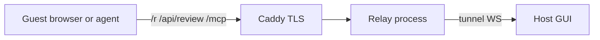

# Threat model (public surfaces)

Short map of who to trust. Engineer depth:
[host-online-relay.md](https://github.com/calebn/sharecut-studio/blob/main/docs/host-online-relay.md),
[share-tokens.md](https://github.com/calebn/sharecut-studio/blob/main/docs/share-tokens.md).

## Actors

| Actor | Trust |
|-------|--------|
| Host laptop (`podcast gui` / tunnel) | Trusted — holds project files, runs FFmpeg, mints shares |
| Public relay (Caddy + `podcast-relay`) | Semi-trusted — TLS, path allowlist, rate limits; must not see host filesystem paths |
| Guest (browser / agent with share URL) | Untrusted — only what caps allow; never receives host paths |
| Random internet | Untrusted — no token ⇒ no share APIs |

## Trust boundaries

- Guests never pass `?project=` paths; responses are sanitized.
- Relay proxies only allowlisted path prefixes; share tokens bind to a host via HMAC claims.
- Host GUI defaults to loopback; Host/Origin binding mitigates DNS-rebind CSRF on local APIs.
- Remote MCP is off until `PODCAST_REMOTE_MCP=1`; guest render is opt-in.

## Disclosure

See [security.txt](../.well-known/security.txt). Do not post live share tokens in public issues.
