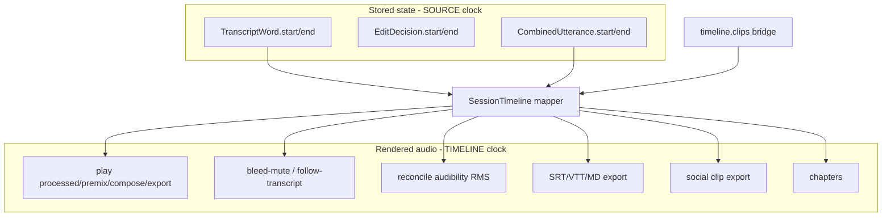

# Architecture

## Layers

```text
Adapters     CLI (Typer)    MCP (MCPServer)  GUI (FastAPI viewer)
                    \             |             /
                     \            |            /
Application              services/  (ProjectWorkspace, *Service)
                                    |
Domain                   edits/  clips/  pipeline/  engines/  ingest/
                                    |
Models                   models/  (EpisodeProject, snapshots)
```

1. **Models** (`podcast_mcp.models`) — Pydantic episode project on disk; no I/O side effects.
2. **Engines** (`podcast_mcp.engines`) — FFmpeg, transcription, `.wfpk` waveform peak pyramids (`waveform_pyramid.py`, media refs + build hooks in `waveform_media.py`; [waveform.md](waveform.md)), source↔timeline mapping (`session_timeline.py`), multitrack alignment audit (`alignment_audit.py`: VAD overlap, session-start sweep, `showwavespic` diagnostics), cleanup analysis (`audio_audit.py`: gate overreach, boundary fades, word audibility, cross-track bleed), transcript reconciliation (`transcript_reconcile.py`, `reconciliation_state.py`).
3. **Ingest** (`podcast_mcp.ingest`) — generic recorder-folder scan (`import_folder.py`), `ingest.yaml` manifest, consolidate to one dialogue track per speaker. See [multitrack-ingest.md](multitrack-ingest.md).
4. **Edits** (`podcast_mcp.edits`) — Filler detection, transcript search/cuts, global inaudible cut optimizer (`inaudible_cuts.py`), narrative handoff silence islands (`silence_islands.py`), clip timeline ops (`timeline_ops.py`, `clips_ops.py`, `strip_silence.py`), transcript sync/correction, chapters, timeline review comments (`comments.py`), agent audition context (`audition_context.py`, `audition_eval.py`).
5. **Clips** (`podcast_mcp.clips`) — Social clip candidates and WAV export.
6. **Pipeline** (`podcast_mcp.pipeline`) — Registered steps, runner with `--from` / `--only`.
7. **Services** (`podcast_mcp.services`) — Shared orchestration for CLI, MCP, and GUI; history-wrapped mutations. Owner golden-ear A/B harness: `services/golden_ear.py` (script `scripts/golden_ear_harness.py`). Waveform pyramids (host `/api/waveform/*`, guest `/daw/waveform/*`) go through `services/waveform.py` (media index LRU, status, tiles, PCM windows, GC); the media refs and build hooks it re-exports live in `engines/waveform_media.py` so the pipeline never imports services. In-process WS fan-out uses [`fanout_hub.py`](../src/podcast_mcp/services/fanout_hub.py) (`SessionHub` and the guest progress hub are separate instances). `podcast doctor` checks live in `services/doctor.py`; sanitized bug-report zips are `DiagnosticsService` (`services/diagnostics.py`) — CLI `podcast doctor --bundle` and host Help; nothing is uploaded. Mode-specific configuration diagnostics live in `services/config_check.py`.
8. **CLI** (`podcast_mcp.cli`) — Typer commands in `main.py`, `episode.py`, `edit.py`, `clips.py`, `comment.py`, `pipeline.py`, `history.py`.
9. **MCP** (`podcast_mcp.mcp`) — Tool registration in `server.py`; handlers in `mcp/tools/`.
10. **GUI** (`podcast_mcp.gui`) — DAW viewer HTTP/WS adapter (`server.py` + `routes/`); must call services (e.g. `PlayService`, `PipelineService`, `BounceService`, `CommentService`, `SessionSyncService`, bootstrap via `services/bootstrap.py`, diagnostics via `services/diagnostics.py`), not duplicate path/render logic. Host MCP over Streamable HTTP is the same `MCPServer` as stdio, mounted at `/mcp` on loopback binds via [`gui/host_mcp.py`](../src/podcast_mcp/gui/host_mcp.py) (`streamable_http_app()`). **ProjectView seam:** `ViewProjection` / `parse_view_projection` live in `services/document_sync/projection_types.py` so services can name projections without importing `gui/`. Construction and dump stay in `gui/assembler.py` (`build_project_view`, `dump_project_projection`; assembler re-exports the types as the compatibility path). Services dump via a lazy assembler callback — keep dump next to construction rather than forking a second assembler in `services/`. Agent ↔ DAW transport: [session-sync.md](session-sync.md) — `services/session_sync/service.py` is the sync authority; `services/session_sync/viewer.py` adapts viewer blobs / agent play into typed commands. Timeline comments: [timeline-comments.md](timeline-comments.md). Share/auth/guest routes mount only via **Sharecut Studio Extensions** ([extensions.md](extensions.md)). Lightweight stem/range bounce: `BounceService` → `export/bounces/`; mastered deliverables stay on `PipelineService.export_audio`. Both share encode/copy via `export.audio.write_audio_formats` (distinct intents; same writer). Optional native host: Tauri under `gui/desktop/` ([desktop-packaging.md](desktop-packaging.md); frozen sidecar via `PODCAST_GUI_DIST`). Deferred iOS/Android hosts and in-app BYOK agent: [cross-platform-byok.md](cross-platform-byok.md) (keep ffmpeg calls inside `FFmpegEngine`).
11. **Extensions** (`podcast_mcp.extensions`) — public FeatureRegistry / soft-load SPI; built-in FOSS `collaboration` extension; optional independently installed provider extension named `online`; example stub. `collaboration` composes share CLI/MCP, anonymous guest identity, review/record/remote-MCP routes, guest SPA hooks, and share/tunnel feature slots. `online` contributes only provider account/auth surfaces. Absent extension ⇒ no contributed routes/tools/UI ([extension-seams.md](extension-seams.md)). FOSS share mint works against any self-hosted relay; provider defaults, accounts, and quotas remain outside this repository.
12. **Relay** (`podcast_relay`) — FOSS host-online reverse tunnel edge (`podcast-relay`); host connects via `podcast tunnel` (`services/tunnel.py`). Packaging: `deploy/relay/` plus static vhosts (`/download`, Sharecut marketing, company page). See [host-online-relay.md](host-online-relay.md).

Shared utilities: `project_store.py` (canonical load/commit), `project_io.py`, `history/session.py`, `util/` (incl. `util/dsp.py` — shared RMS dB, pitch autocorrelation, and boolean-run primitives; reuse them instead of private copies in `edits/` / `engines/`), `export/`.
The raw-media, diagnostics, waveform-pyramid, transcript-cache, recorder-import, consolidated-ingest, and playback-stem guards use `util/workspace_paths.resolve_within`. Callers keep their own input grammar and public error messages; the shared resolver checks the resolved path against the resolved allowed root, including symlink targets. Other artifact guards retain their own validation.
The alignment energy VAD, heuristic/Silero breath scans, and silence-island scan use `util.dsp.bool_runs` for contiguous masks. Only alignment VAD bridges a single quiet chunk before extracting runs; each caller still owns its threshold, duration, and timestamp policy.

**Configuration seam:** `runtime_config.py` validates host relay and optional
S3-compatible storage. Relay fields use explicit > environment > YAML > safe
default; object-store fields use environment > YAML > disabled. `distribution.py` validates public build identity and exact trusted
origins. Runtime secrets never enter the distribution profile; Tauri’s build
script generates Rust constants from that same public profile.

**Episode state:** `episode.project.json` v2 is the single source of truth. See [episode-format-v2.md](episode-format-v2.md).

### Durable storage

Host-local durable stores beyond the episode JSON (session sync sqlite, share
token registry, review sidecars) are cataloged in [persistence.md](persistence.md).
Share token algorithm (coolname, active + cooldown pools): [share-tokens.md](share-tokens.md).
**Extend an existing store** instead of inventing a parallel JSON index or DB.
Recording sessions reuse the share registry (`kind`) and prefixed session-sync
sqlite tables (`record_*`) rather than a new plane — see [recording-session.md](recording-session.md).

## Data flow

Raw WAV → project JSON → transcripts → edit decisions (proposals) / clip timeline (applied) → FFmpeg render → deliverables.

Cut data flow: cut operations that remove a time range route through `edits/inaudible_cuts.py` before commit (local snap + absorb). `strip_silence` is an exception: it rebuilds keep islands from silence detection and does not call the cut optimizer. Narrative handoffs that need a beat use `edits/silence_islands.py` / `suggest_handoff_cut` and lock bounds with `use_inaudible_opt=false`. See [inaudible-cuts.md](inaudible-cuts.md).

Episode workspaces live outside this repo; the CLI accepts `--project path/to/episode.project.json`.

## Design decisions

### Timebase: source vs timeline clock

**All stored times (`TranscriptWord`, `EditDecision`, `CombinedUtterance`) are source-media seconds; `timeline.clips` is the only bridge; anything that touches rendered audio (stems, premix, mastered, export) must map through [`SessionTimeline`](../src/podcast_mcp/engines/session_timeline.py).**



`SessionTimeline` owns all clip time math (fingerprint-cached per-track index, `bisect` lookup). The per-track index follows **originating media** (`clip.source_id` → track whose `media.path` matches, else `clip.track_id`), so a clip parked on another lane still maps on the source track; words stay on that speaker's transcript. `TranscriptMatch` from `search_transcript` carries **both** clocks (`start/end` = source, `timeline_start/end` = mapped, `None` if cut away) so no caller guesses. Edit/render code that works on a clip list without a full project uses the `clip_timeline_overlap_to_source` / `clip_timeline_point_to_source` helpers in the same module. The only other place the mapping formula appears is the `Clip.timeline_end` property.

**Enforcement:** `tests/test_timebase_guards.py` fails CI if the mapping arithmetic appears outside `session_timeline.py` / `Clip.timeline_end`; `util/tool_timebase.py` + `tests/test_time_conformance.py` require every time-bearing MCP tool to declare its clock. `podcast doctor --project` and `export_qc.json` report per-track `max_drift` and flag transcript words that fall outside all clip source ranges (legacy timeline-coord words).

### Transcript is a derived view of audio

The per-track transcript is produced by ASR on raw audio, then kept accurate via **reconciliation** — measuring word-level RMS across all dialogue tracks and updating `suppressed`, `audibility_status`, and `dominant_track` on each `TranscriptWord`.

### Audio and transcript are separate layers

| Layer | Controls | Examples |
|-------|----------|----------|
| **Audio** | What the listener hears | Gate, denoise, gain, mute, clip edits |
| **Transcript** | What the text says | Suppression, text corrections, combined merge |

Reconciliation **reads** rendered stems (or raw audio) and updates transcript metadata. It never modifies audio waveforms.

### Why suppression does not duck audio

Bleed from another speaker is physically mixed into the same mic waveform as room tone and the primary speaker. Ducking audio during transcript suppression would create audible holes and break undo. Tune gate/FX on the audio layer; run `reconcile_transcript` afterward so the transcript reflects the new audible state.

### Automatic transcript sync

Any operation that can change what the listener hears must keep per-track transcripts aligned with audible audio. Reconciliation measures word-level RMS across dialogue tracks and updates transcript metadata (`audibility_status`, `dominant_track`, and optionally `suppressed`).

**Central hooks** (all audio edits should flow through these):

| Hook | When it runs | What happens |
|------|----------------|--------------|
| [`run_mutation`](../src/podcast_mcp/history/session.py) | Every `ProjectWorkspace.mutate` (cuts, FX, gain, timeline ops, etc.) | Marks stale when `audio_state_fingerprint()` changes; reconciles only if stems already match the new state (rare — follow FX/cuts with `render_preview`) |
| [`rerender_preview`](../src/podcast_mcp/render.py) | After `assemble_timeline` (+ music mix) | Auto-reconciles when `analysis.reconcile_on_render` is true (default) and `transcript_mode` is not `off` |
| [`PipelineRunner`](../src/podcast_mcp/pipeline/runner.py) | Audio-affecting pipeline steps | Marks stale; full pipeline runs `reconcile_transcript` after `render_dialogue_stems` (pass 1) and after `assemble_timeline` (pass 2) |
| [`reconcile_transcript`](../src/podcast_mcp/pipeline/steps.py) pipeline step | Pass 1 and pass 2 in ordered pipeline | Same engine as `reconcile_transcript_tool` |

Implementation entry point: `maybe_auto_reconcile()` in [`edits/transcript_reconcile.py`](../src/podcast_mcp/edits/transcript_reconcile.py).

**Policy** (`analysis` in [`.agents/defaults/pipeline.yaml`](../.agents/defaults/pipeline.yaml)):

| Setting | Default | Effect |
|---------|---------|--------|
| `transcript_mode` | `reconcile` | Updates audibility metadata **and** suppresses inaudible/bleed words; rebuilds combined |
| `reconcile_on_render` | `true` | Reconcile automatically after every preview render |
| `transcript_mode: flag` | — | Tag audibility only; no suppressions (use `--dry-run` on CLI to preview without applying) |
| `transcript_mode: off` | — | Disables automatic and manual audibility reconciliation |

**Adding new audio operations:** route mutations through `ProjectWorkspace.mutate` (never bare `save()` on timeline/mix/transcript fields). If the operation renders stems, call `rerender_preview` or the `assemble_timeline` pipeline step so reconciliation sees processed audio. Do not duck or mute waveforms when suppressing transcript words.

**Manual override:** `reconcile_transcript_tool` / `podcast edit reconcile-transcript` remains available when stems are stale, you need a dry-run report, or you want to apply suppressions with confirmation.

**Operational guide:** bleed heuristics, debugging zero bleed counts, and synthetic fixture recipes — [transcript-reconcile.md](transcript-reconcile.md).

**Performance:** Word-level audibility uses `TrackRmsCache` — each processed stem is decoded once at 8 kHz mono; per-word RMS is numpy slicing (not one FFmpeg subprocess per word). Progress: [progress.md](progress.md); CLI adapter: [cli-progress.md](cli-progress.md).

### Staleness

`audio_state_fingerprint()` hashes gain, mute, FX chains, clips, edits, and envelopes. Any audio-affecting mutation or pipeline step sets `reconciliation_stale`. With default settings, reconciliation runs automatically after `render_preview`; until then `reconciliation_status_tool` reports stale.

**Render invalidations (diagnostic):** `render.invalidations[]` is a first-class cause journal (timeline ranges for cuts; whole-track for FX/gain/mute/envelope). Appended in `run_mutation` when the audio fingerprint changes; cleared per track after a fresh stem (hash write may run in parallel workers; invalidation clears run serially on the main thread). Mutations and render snapshots in the same workspace share a process-local lock, including document submits. Stem workers render and hash one snapshot; if the live render hash, eligible track set, or committed project revision changed during rendering, the new invalidation remains and the step stops before publishing track outputs. A fresh on-demand stem clears its live diagnostic journal and persists that change only when the stored track still matches its render snapshot. This does not serialize separate processes (see #213). The journal does **not** enable partial re-render — stems stay whole-artifact. Sharecut Studio hover uses these for regional bands vs header chips. Freshness booleans (`stem_is_fresh`, `needs_rerender`) remain derived from disk hashes/mtimes — the journal alone does not flip the Stale pill.

`ProjectWorkspace.reload()` avoids a second JSON parse when the project's mtime, size, and file identity match its last load. A changed file or an earlier workspace commit is loaded again before caching its revision; this is an in-process parse optimization, not a write lock. Commits and history-index writes are serialized across processes by `util.project_state.project_commit_lock` (file lock at `artifacts/episode.project.json.lock`); loads stay unlocked. `util.project_state.file_revision()` supplies the shared file identity used here and by render consistency checks.

## Testing

Pytest runs with a **95% coverage floor** (`pyproject.toml` → `[tool.pytest.ini_options]` / `[tool.coverage.report]`). See [testing.md](testing.md).

## Agent bundle

All skills and MCP template live under `.agents/`. See [setup.md](setup.md).

## Contributing

See [contributing.md](contributing.md) for where to add new operations.
