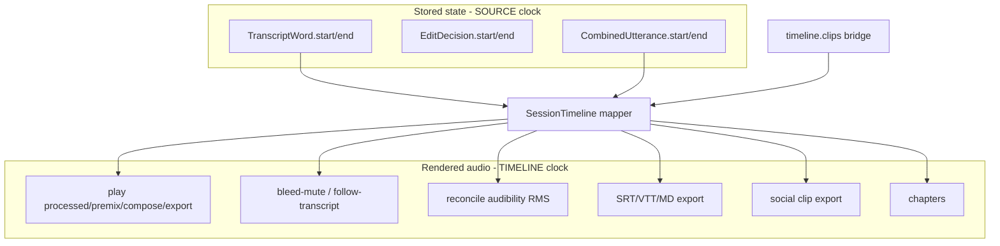

# Architecture

## Layers

Retained mixed bleed has a separate, conservative local alignment path.
`engines/bleed_delay.py` measures signed copy delays with extended reference
context and shifted null controls; it never claims that the lane owner is absent.
`edits/retained_bleed_alignment.py` plans immutable complete direct-source phrase
moves, validates quiet seams in every source channel, and applies existing split
and move operations on a working copy. Services own workspace history and render
publication. The mixed lane is unchanged. Declared crossfade joins abstain with
`unsupported_crossfade_evidence_clock`, because their rendered clock can differ
from raw clip placement. Supported windows must cover the inferred copy phrase
endpoints as well as independent interior probes. All known retained-copy peers in
the region must corroborate one offset; uncertain or conflicting evidence abstains.
Source-scoped user choices live in `editorial.retained_bleed_alignments`.
Destination overlap is removed only from verified quiet source material using
existing clip geometry, with source ranges and reason in the move edit log.
Any reduction of retained-word source coverage abstains. Saved mix-muted lanes
are excluded from automatic alignment; muted secondary copies cannot veto it.
Planning, trim guards, and bleed gates share `selected_source_transcripts`.
`transcript_for_source` prefers an exact recording transcript; track-level words
apply only to primary media or a physically equivalent explicit source alias.
An unrelated source without a transcript supplies no phrase or gate authorization,
and a destination trim touching it abstains. Selected transcript words map only
through that recording's placements using
`SessionTimeline.map_selected_source_span(s)`. Implicit primary lanes keep the
identity source-to-timeline clock, independent of copies parked on other lanes.
Phrase indexes are built once per
direct lane and traversal stops when the 64-phrase evidence budget is spent.
Local delay reads include bounded lag and shifted-null context with an explicit
timeline origin, rather than decoding complete recordings. Overlapping old/new
correction footprints, including quiet trim and seam fades, abstain as a batch.
Each immutable proposal records every retained-copy reference lane used in its
evidence. A batch also abstains when another correction would move a referenced
copy region. Repeated transcript seeds expanding to identical complete source
geometry produce one correction. Measured unsupported probes intersecting the
copy phrase prevent whole-phrase approval, even if endpoints and other probes agree.
Implicit full-media timelines remain playable but local retiming abstains until
explicit clip placements exist. Missing or unmatched direct phrases are reported.
`set_track_clips` carries manual per-clip ingest metadata onto surviving
same-source subclips, so a split or scoped override preserves other placement locks.
Saved choices include an optional opaque digest of the normalized recording path;
primary media and equivalent explicit source references share that identity.
No host path is added to editorial metadata. Legacy choices resolve through their
existing source/primary media references.

Transcript bleed gating plans bounded foreign attenuation in
`engines/bleed_gate.py` from ungated selected media, mapped by
`engines/ungated_audio.py`. An immutable `BleedGatePlan` carries protected phrases,
verified attenuation spans, and abstention reasons.
Project playback and rendering apply those conservative plans to rendered audio.

`engines/transcript_gated_play.py` uses absolute transition positions so segment
requests add no word-edge fades. `edits/transcript_bleed_mute.py` persists the
track's source selection and publishes a fresh source render through the existing
render lock and history mutation path. ASR coverage is not an exhaustive audio
whitelist. A process-local LRU retains at most 16 immutable gate plans keyed by
serialized relevant metadata, selected media revisions, and policy; it retains
neither live projects nor PCM. Initial evidence still decodes selected sources.
Owner phrases and unresolved activity retain full gain.

```text
Adapters     CLI (Typer)    MCP (MCPServer)  GUI (FastAPI viewer)
                    \             |             /
                     \            |            /
Application              services/  (ProjectWorkspace, *Service)
                                    |
Domain                   edits/  clips/  pipeline/  engines/  ingest/
                                    |
Models                   models/  (EpisodeProject, snapshots)
```

1. **Models** (`podcast_mcp.models`) — Pydantic episode project on disk; no I/O side effects. `Transcript.words` is a `TranscriptWords` list: every in-place words edit (a `TranscriptWord` field or a list mutation) bumps an in-memory process-wide revision (`models/words_revision.py`), and `Transcript.memoize_words` caches derived values (e.g. the prosody reader's words fingerprint) against it. Never key such a memo on object identity.
2. **Engines** (`podcast_mcp.engines`) — FFmpeg, transcription, `.wfpk` waveform peak pyramids (`waveform_pyramid.py`, media refs + build hooks in `waveform_media.py`; [waveform.md](waveform.md)), source↔timeline mapping (`session_timeline.py`), utterance gap-run grouping shared by `merge_transcripts` and the GUI view mapper (`utterance_runs.py`, #758), multitrack alignment audit (`alignment_audit.py`: VAD overlap, session-start sweep, `showwavespic` diagnostics), cleanup analysis (`audio_audit.py`: gate overreach, boundary fades, word audibility, cross-track bleed), same-room bleed echo profile over timeline-clock tracks (`bleed_echo.py`: per-frame cross-correlation of one mic against another where one speaker dominates, lag clustering, scored against the same pair time-shifted as its null; reconciliation uses rendered stems when available and projects raw media through `SessionTimeline` when they are absent; feeds `audition_context`'s `echo_risk` from fresh-stem evidence), transcript reconciliation (`transcript_reconcile.py`, `reconciliation_state.py`), CTC forced word alignment (on by default when its optional model is installed; `word_align.py` over `ctc_forced_align.py`; model catalog in `word_aligner_models.py`, beside `whisper_models.py`; both pin a per-file sha256 manifest via `util/model_manifest.py`), segment-level prosody analysis (`prosody.py`: pitch/rate/energy/voice-quality/prominence/boundary contours via `praat-parselmouth`, optional `prosody` extra; see [pipeline.md § Prosody profile](pipeline.md#prosody-profile)).
3. **Ingest** (`podcast_mcp.ingest`) — generic recorder-folder scan (`import_folder.py`), `ingest.yaml` manifest, consolidate to one dialogue track per speaker. See [multitrack-ingest.md](multitrack-ingest.md).
4. **Edits** (`podcast_mcp.edits`) — Filler detection, tighten intensity presets (`tighten_intensity.py`), transcript search/cuts, global inaudible cut optimizer (`inaudible_cuts.py`), narrative handoff silence islands (`silence_islands.py`), clip timeline ops (`timeline_ops.py`, `clips_ops.py`, `strip_silence.py`, `ingest_placement.py` for consolidate session placement), transcript sync/correction, chapters, timeline review comments (`comments.py`), agent audition context (`audition_context.py`, `audition_eval.py`), voiced speech cut through at a splice (`join_speech.py`: clipped onset / tail per clip edge from raw source energy plus voicing, shared by `audition_context`'s `speech_crosses_cut` and the join sweep's `speech` rows; joins come from `clips_ops.splice_joins`), cached per-track prosody profile + timeline window for audition context (`prosody_profile.py`).

   `clips_ops.py` owns trim, roll, and move geometry. `timeline_ops.py` calls those domain mutations and adds transcript rebuilding, applied-edit records, and change summaries for service adapters; it does not independently calculate the same geometry.
5. **Clips** (`podcast_mcp.clips`) — Social clip candidates and WAV export.
6. **Pipeline** (`podcast_mcp.pipeline`) — Registered steps, runner with `--from` / `--only`.
7. **Services** (`podcast_mcp.services`) — Shared orchestration for CLI, MCP, and GUI; history-wrapped mutations. Owner golden-ear A/B harness: `services/golden_ear.py` (script `scripts/golden_ear_harness.py`). Waveform pyramids (host `/api/waveform/*`, guest `/daw/waveform/*`) go through `services/waveform.py` (media index LRU, status, tiles, PCM windows, GC); the media refs and build hooks it re-exports live in `engines/waveform_media.py` so the pipeline never imports services. In-process WS fan-out uses [`fanout_hub.py`](../src/podcast_mcp/services/fanout_hub.py) (`SessionHub` and the guest progress hub are separate instances); each subscriber queue is fed on the event loop it subscribed with, so one key may mix loops. Studio job SSE streams (pipeline slot, agent, bootstrap) use a third, job-id-keyed `FanoutHub` instance in [`gui/job_events.py`](../src/podcast_mcp/gui/job_events.py): one bounded drop-oldest queue per subscriber. `podcast doctor` checks live in `services/doctor.py`; sanitized bug-report zips are `DiagnosticsService` (`services/diagnostics.py`) — CLI `podcast doctor --bundle` and host Help; explicit Help consent forwards a registered bundle through `services/report_submission.py` to the public relay intake. Mode-specific configuration diagnostics live in `services/config_check.py`.
8. **CLI** (`podcast_mcp.cli`) — Typer commands in `main.py`, `episode.py`, `edit.py`, `clips.py`, `comment.py`, `pipeline.py`, `history.py`.
9. **MCP** (`podcast_mcp.mcp`) — Tool registration in `server.py`; handlers in `mcp/tools/`.
10. **GUI** (`podcast_mcp.gui`) — DAW viewer HTTP/WS adapter (`server.py` + `routes/`); must call services (e.g. `PlayService`, `PipelineService`, `BounceService`, `CommentService`, `SessionSyncService`, bootstrap via `services/bootstrap.py`, diagnostics via `services/diagnostics.py`), not duplicate path/render logic. Host MCP over Streamable HTTP is the same `MCPServer` as stdio, mounted at `/mcp` on loopback binds via [`gui/host_mcp.py`](../src/podcast_mcp/gui/host_mcp.py) (`streamable_http_app()`). **ProjectView seam:** `ViewProjection` / `parse_view_projection` live in `services/document_sync/projection_types.py` so services can name projections without importing `gui/`. Construction and dump stay in `gui/assembler.py` (`build_project_view`, `dump_project_projection`; assembler re-exports the types as the compatibility path). Services dump via a lazy assembler callback — keep dump next to construction rather than forking a second assembler in `services/`. Agent ↔ DAW transport: [session-sync.md](session-sync.md) — `services/session_sync/service.py` is the sync authority; `services/session_sync/viewer.py` adapts viewer blobs / agent play into typed commands. `services/cross_process_sync.py` bridges other processes' journal writes into the in-process hub while a socket watches the workspace (#695). Timeline comments: [timeline-comments.md](timeline-comments.md). Share/auth/guest routes mount only via **Sharecut Studio Extensions** ([extensions.md](extensions.md)). Lightweight stem/range bounce: `BounceService` → `export/bounces/`; mastered deliverables stay on `PipelineService.export_audio`. Both share encode/copy via `export.audio.write_audio_formats` (distinct intents; same writer). Optional native host: Tauri under `gui/desktop/` ([desktop-packaging.md](desktop-packaging.md); frozen sidecar via `PODCAST_GUI_DIST`). Deferred iOS/Android hosts and in-app BYOK agent: [cross-platform-byok.md](cross-platform-byok.md) (keep ffmpeg calls inside `FFmpegEngine`).

`gui/jobs.py` keeps `PipelineJobManager` as the route/MCP facade for starting and waiting on jobs. Its `_JobCatalog` collaborator owns the shared lock, live agent claims, bounded finished-job lookup, and status snapshots. SSE fan-out is not the catalog's job: `gui/job_events.py` publishes and subscribes per job id, and `gui/routes/sse_common.py` builds the shared `StreamingResponse` both `/api/pipeline/events` and `/api/bootstrap/events` return, so concurrent subscribers never steal each other's events. Job execution still resolves `PipelineService` and `ProjectWorkspace` through the facade module so runtime patches and adapters use the same entry points.
11. **Extensions** (`podcast_mcp.extensions`) — public FeatureRegistry / soft-load SPI; built-in FOSS `collaboration` extension; optional independently installed provider extension named `online`; example stub. `collaboration` composes share CLI/MCP, anonymous guest identity, review/record/remote-MCP routes, guest SPA hooks, and share/tunnel feature slots. `online` contributes only provider account/auth surfaces. Absent extension ⇒ no contributed routes/tools/UI ([extension-seams.md](extension-seams.md)). FOSS share mint works against any self-hosted relay; provider defaults, accounts, and quotas remain outside this repository.
12. **Relay** (`podcast_relay`) — FOSS host-online reverse tunnel edge (`podcast-relay`); host connects via `podcast tunnel` (`services/tunnel.py`). Packaging: `deploy/relay/` plus static vhosts (`/download`, Sharecut marketing, company page). See [host-online-relay.md](host-online-relay.md).

Shared utilities: `project_store.py` (canonical load/commit), `project_merge.py` (three-way merge for long-job saves), `project_io.py`, `history/session.py` (`run_mutation`), `history/rollback.py` (history checkpoint and rollback after a failed record/commit), `util/` (incl. `util/dicts.py` — `deep_merge`, shared by pipeline config, tighten presets and transcript context layering (`skip_private=False` there keeps `_`-prefixed context YAML keys); `util/loudness.py` — BS.1770 gating over ebur128 momentary blocks, optionally speech-gated; `util/dsp.py` — shared scalar clamps (`clamp`, `clamp01`), RMS dB, dB-to-amplitude, pitch autocorrelation, and boolean-run primitives; reuse them instead of private copies in `edits/` / `engines/`; `util/dsp.frame_rms_db_stream` (the same frames over a chunk stream); `util/pcm_stream.py` — `SequentialWindowReader`: start-ordered sample windows from a forward-only decode (`FFmpegEngine.stream_mono_f32`), so per-segment analysis never holds a whole track; `window()` takes float seconds (floor/ceil rounding, prosody segments); `window_samples()` takes exact integer sample indices (`engines/ctc_forced_align.py`'s `retime_spans_stream`, #730); reuse one of them instead of a whole-file `load_mono_full` when windows are start-ordered; `NoAudioDecodedError` is the "no audio decoded from <path>" error for an empty ffmpeg decode (`asr_silence.py`, `audio_audit.py`, `word_align.py`); `engines/align.py` keeps `AudioWindowUnavailableError` (its callers skip unusable windows on it) but builds the text with `no_audio_decoded_message`; raise `NoAudioDecodedError`, or reuse `no_audio_decoded_message` for a caller-specific type, instead of a new ad hoc string; `util/file_locks.py` (`shared_file_lock(lock_path)`: one re-entrant `FileLock` per sidecar lock path, built with `timeout=0` so a bare `with lock:` / `lock.acquire()` fails fast instead of filelock's own default of waiting forever; `hold_shared_file_lock(lock_path, *, timeout=...)`: a context manager that acquires the shared instance with that caller's own timeout — each acquisition brings its own timeout rather than one baked into the registry (#494); reuse one of them for any new `artifacts/*.lock` writer instead of a private registry); `util/keyed_lock.py` (`KeyedLocks`: one in-process lock per key, created on first use, with `discard_idle` eviction; reuse it instead of a private guard + dict registry)), `export/`.
Shared backend helpers keep caller policy explicit: `util/intervals.merge_intervals` takes a merge gap (the timeline, occupied-span, and range callers retain their respective tolerances); `util/source_spans.source_span_timeline_bounds` takes an empty-span fallback. The `edits/ranges.py` and `edits/timeline_span.py` imports remain compatibility paths for edit callers; engines import the neutral utilities directly to avoid package initialization cycles. `util/atomic_render.render_atomic` publishes rendered cache artifacts from unique sibling temporary paths and removes them after failure. `util/dsp.py` owns scalar clamps and linear RMS, while `util/tracks.py` owns canonical and existing rendered stem paths; callers still choose their own signal floors and raw-media fallbacks. UTC record timestamps use `util/datetime_utils.now_iso`.

The raw-media, diagnostics, waveform-pyramid, transcript-cache, recorder-import, consolidated-ingest, and playback-stem guards use `util/workspace_paths.resolve_within`. Callers keep their own input grammar and public error messages; the shared resolver checks the resolved path against the resolved allowed root, including symlink targets. Other artifact guards retain their own validation.
The alignment energy VAD, heuristic/Silero breath scans, and silence-island scan use `util.dsp.bool_runs` for contiguous masks. Only alignment VAD bridges a single quiet chunk before extracting runs; each caller still owns its threshold, duration, and timestamp policy.

`util.intervals.HalfOpenIntervalIndex` provides immutable overlap queries for transcript cut guards, filler spans, and GUI word projection. Callers keep their own word filtering and source-clock rules; the index preserves original word ordinals for view ordering.

**Configuration seam:** `runtime_config.py` validates host relay and optional
S3-compatible storage. Relay fields use explicit > environment > YAML > safe
default; object-store fields use environment > YAML > disabled. `distribution.py` validates public build identity and exact trusted
origins. Runtime secrets never enter the distribution profile; Tauri’s build
script generates Rust constants from that same public profile.

**Episode state:** `episode.project.json` v2 is the single source of truth. See [episode-format-v2.md](episode-format-v2.md).

### Durable storage

Host-local durable stores beyond the episode JSON (session sync sqlite, share
token registry, review sidecars) are cataloged in [persistence.md](persistence.md).
Share token algorithm (coolname, active + cooldown pools): [share-tokens.md](share-tokens.md).
**Extend an existing store** instead of inventing a parallel JSON index or DB.
Recording sessions reuse the share registry (`kind`) and prefixed session-sync
sqlite tables (`record_*`) rather than a new plane — see [recording-session.md](recording-session.md).

## Data flow

Raw WAV → project JSON → transcripts → edit decisions (proposals) / clip timeline (applied) → FFmpeg render → deliverables.

Cut data flow: cut operations that remove a time range route through `edits/inaudible_cuts.py` before commit (local snap + absorb). `strip_silence` is an exception: it rebuilds keep islands from silence detection and does not call the cut optimizer. Narrative handoffs that need a beat use `edits/silence_islands.py` / `suggest_handoff_cut` and lock bounds with `use_inaudible_opt=false`. See [inaudible-cuts.md](inaudible-cuts.md).

Episode workspaces live outside this repo; the CLI accepts `--project path/to/episode.project.json`.

## Design decisions

### Timebase: source vs timeline clock

**All stored times (`TranscriptWord`, `EditDecision`, `CombinedUtterance`) are source-media seconds; `timeline.clips` is the only bridge; anything that touches rendered audio (stems, premix, mastered, export) must map through [`SessionTimeline`](../src/podcast_mcp/engines/session_timeline.py).**


```mermaid
flowchart TB
    subgraph stored [Stored state - SOURCE clock]
        WORDS[TranscriptWord.start/end]
        DECS[EditDecision.start/end]
        UTTS[CombinedUtterance.start/end]
    end
    CLIPS[timeline.clips bridge]
    ST[SessionTimeline mapper]
    subgraph rendered [Rendered audio - TIMELINE clock]
        PLAY[play processed/premix/compose/export]
        GATE[bleed-mute / follow-transcript]
        REC[reconcile audibility RMS]
        SRT[SRT/VTT/MD export]
        SOCIAL[social clip export]
        CHAP[chapters]
    end
    WORDS --> ST
    UTTS --> ST
    CLIPS --> ST
    ST --> PLAY
    ST --> GATE
    ST --> REC
    ST --> SRT
    ST --> SOCIAL
    ST --> CHAP
```

`SessionTimeline` owns all clip time math (fingerprint-cached per-track index, `bisect` lookup). Repeated source spans or points over a stable project snapshot use `map_source_spans` / `sources_to_timeline` to build the clip index once (e.g. the #719 prosody overlay); individual mappings recheck clip geometry so in-place edits cannot leave stale results. `map_timeline_spans` retains paired timeline/source bounds on the originating media track. `lane_clip_spans` retains each clip and its paired bounds on the current lane. Raw audio caches use those lane placements and the renderer's `resolve_clip_audio_path` policy, decode each selected file once, sum overlaps, and leave gaps silent. If any selected media or required samples are unavailable, the lane supplies no raw acoustic evidence. The per-track index follows **originating media** (`clip.source_id` → track whose `media.path` matches, else `clip.track_id`), so a clip parked on another lane still maps on the source track; words stay on that speaker's transcript. Look up one source ID through `EpisodeProject.source_by_id()` so missing IDs consistently return `None`; batch callers may build a per-call source map. `TranscriptMatch` from `search_transcript` carries **both** clocks (`start/end` = source, `timeline_start/end` = mapped, `None` if cut away) so no caller guesses. Edit/render code that works on a clip list without a full project uses the `clip_timeline_overlap_to_source` / `clip_timeline_point_to_source` / `clip_source_to_timeline_shift` helpers in the same module (the shift helper also backs the `max_drift` diagnostic). The only other place the mapping formula appears is the `Clip.timeline_end` property. Ingest consolidate writes the session placement as clip geometry (`edits/ingest_placement.py`), so `ingest verify` and pipeline `align_tracks` read raw files through those clips.

**Enforcement:** `tests/test_timebase_guards.py` fails CI if the mapping arithmetic appears outside `session_timeline.py` / `Clip.timeline_end`; `util/tool_timebase.py` + `tests/test_time_conformance.py` require every time-bearing MCP tool to declare its clock. `podcast doctor --project` and `export_qc.json` report per-track `max_drift` and flag transcript words that fall outside all clip source ranges (legacy timeline-coord words); zero-length ASR words are padded to a 1 ms span (`SessionTimeline.map_word_spans`, shared with the GUI word views; a word at a kept clip's source end maps onto that clip's last 1 ms) and counted separately as `zero_length_words` warnings, not unmapped; words that end more than 20 ms before they start are `inverted_words`, a hard issue (#621). `export_qc.json` also carries unaccepted relative align drift (`alignment`). Doctor and `export_qc.json` also flag same-media clips that overlap on the timeline (`same_source_timeline_overlaps`) as a hard issue — stacked copies of the same source would otherwise play twice (#520). Relative align drift sampling lives in `SessionTimeline.clip_relative_drift`; `edits/align_accept_status` owns only the accept/lock policy shared by the unattended gate and export QC.

### Transcript is a derived view of audio

The per-track transcript is produced by ASR on raw audio, then kept accurate via **reconciliation** — measuring word-level RMS across all dialogue tracks and updating `suppressed`, `audibility_status`, and `dominant_track` on each `TranscriptWord`.

### Audio and transcript are separate layers

| Layer | Controls | Examples |
|-------|----------|----------|
| **Audio** | What the listener hears | Gate, denoise, gain, mute, clip edits |
| **Transcript** | What the text says | Suppression, text corrections, combined merge |

Reconciliation **reads** rendered stems (or raw audio) and updates transcript metadata. It never modifies audio waveforms.

### Why suppression does not duck audio

Bleed from another speaker is physically mixed into the same mic waveform as room tone and the primary speaker. Ducking audio during transcript suppression would create audible holes and break undo. Tune gate/FX on the audio layer; run `reconcile_transcript` afterward so the transcript reflects the new audible state.

### Automatic transcript sync

Any operation that can change what the listener hears must keep per-track transcripts aligned with audible audio. Reconciliation measures word-level RMS across dialogue tracks and updates transcript metadata (`audibility_status`, `dominant_track`, and optionally `suppressed`).

**Central hooks** (all audio edits should flow through these):

| Hook | When it runs | What happens |
|------|----------------|--------------|
| [`run_mutation`](../src/podcast_mcp/history/session.py) | Every `ProjectWorkspace.mutate` (cuts, FX, gain, timeline ops, etc.) | Marks stale when `audio_state_fingerprint()` changes; reconciles only if stems already match the new state (rare — follow FX/cuts with `render_preview`) |
| [`rerender_preview`](../src/podcast_mcp/render.py) | After `assemble_timeline` (+ music mix) | Auto-reconciles when `analysis.reconcile_on_render` is true (default) and `transcript_mode` is not `off` |
| [`PipelineRunner`](../src/podcast_mcp/pipeline/runner.py) | Audio-affecting pipeline steps | Marks stale; full pipeline runs `reconcile_transcript` after `render_dialogue_stems` (pass 1) and after `assemble_timeline` (pass 2) |
| [`reconcile_transcript`](../src/podcast_mcp/pipeline/steps.py) pipeline step | Pass 1 and pass 2 in ordered pipeline | Same engine as `reconcile_transcript_tool` |

Implementation entry point: `maybe_auto_reconcile()` in [`edits/transcript_reconcile.py`](../src/podcast_mcp/edits/transcript_reconcile.py).

**Policy** (`analysis` in [`.agents/defaults/pipeline.yaml`](../.agents/defaults/pipeline.yaml)):

| Setting | Default | Effect |
|---------|---------|--------|
| `transcript_mode` | `reconcile` | Updates audibility metadata **and** suppresses inaudible/bleed words; rebuilds combined |
| `reconcile_on_render` | `true` | Reconcile automatically after every preview render |
| `transcript_mode: flag` | — | Tag audibility only; no suppressions (use `--dry-run` on CLI to preview without applying) |
| `transcript_mode: off` | — | Disables automatic and manual audibility reconciliation |

**Adding new audio operations:** route mutations through `ProjectWorkspace.mutate` (never bare `save()` on timeline/mix/transcript fields). If the operation renders stems, call `rerender_preview` or the `assemble_timeline` pipeline step so reconciliation sees processed audio. Do not duck or mute waveforms when suppressing transcript words.

**Manual override:** `reconcile_transcript_tool` / `podcast edit reconcile-transcript` remains available when stems are stale, you need a dry-run report, or you want to apply suppressions with confirmation.

**Operational guide:** bleed heuristics, debugging zero bleed counts, and synthetic fixture recipes — [transcript-reconcile.md](transcript-reconcile.md).

**Performance:** Word-level audibility uses `TrackRmsCache` — each processed stem is decoded once at 8 kHz mono; per-word RMS is numpy slicing (not one FFmpeg subprocess per word). Progress: [progress.md](progress.md); CLI adapter: [cli-progress.md](cli-progress.md).

### Staleness

The render status report probes each existing stem once and uses that duration
for both display and timeline-length freshness checks. A stem may be shorter
than its timeline after applied edits; an overlong stem is stale.

`audio_state_fingerprint()` hashes the dialogue tracks' render state (gain, FX chains, clips, edits, fades, mute regions) and **dialogue** envelopes; music/intro/outro envelopes are left out because reconciliation only measures dialogue (#621). Any mutation that changes it, and any pipeline step the runner runs from `AUDIO_AFFECTING_STEPS` (not `mix_with_music`; inline assembles in `ensure_current_premix` rely on the fingerprint), sets `reconciliation_stale`. With default settings, reconciliation runs automatically after `render_preview`; until then `reconciliation_status_tool` reports stale.

**Render invalidations (diagnostic):** `render.invalidations[]` is a first-class cause journal (timeline ranges for cuts; whole-track for FX/gain/mute/envelope). Appended in `run_mutation` when the audio fingerprint changes; cleared per track after a fresh stem (hash write may run in parallel workers; invalidation clears run serially on the main thread). Mutations and render snapshots in the same workspace share a process-local lock, including document submits. Stem workers render and hash one snapshot; if the live render hash or eligible track set changed during rendering, or another writer committed a project whose render hashes or track set differ from the snapshot, the new invalidation remains and the step stops before publishing track outputs. A saved volume or mute alone does not stop it, because `track_render_hash` leaves those mix-only fields out. A fresh on-demand stem clears its live diagnostic journal and persists that change only when the stored track still matches its render snapshot. Render snapshots and loads are not serialized across processes (see #213); render **writers** are (`util.project_state.render_lock`, #482: `@with_render_lock` on project-first functions, `with render_lock(project):` in services); pipeline steps mutate a private copy that is published under `project_state_lock` after the step (#357); individual commits are, via `project_commit_lock` (see below). The journal does **not** enable partial re-render — stems stay whole-artifact. Sharecut Studio hover uses these for regional bands vs header chips. Freshness booleans (`stem_is_fresh`, `needs_rerender`) remain derived from disk hashes/mtimes — the journal alone does not flip the Stale pill.

`ProjectWorkspace.reload()` avoids a second JSON parse when the project's mtime, size, and file identity match its last load. A changed file or an earlier workspace commit is loaded again before caching its revision; this is an in-process parse optimization, not a write lock. Each commit and history-index write takes `util.project_state.project_commit_lock` (file lock at `artifacts/episode.project.json.lock`), so two processes never interleave the writes of one commit. `ProjectWorkspace.transaction()` holds that lock from the reload through the commit, and `mutate()` always runs inside it, so read-modify-write is serialized across processes (#213). The outermost transaction adopts the saved project in place only when another writer committed since this workspace loaded or last committed it (unsaved edits are then dropped; adopting replaces whole sections in place, so callers re-fetch sub-objects afterwards); nested transactions do not re-read. A slow mutation holds the lock for its whole run, and a writer in another process waits 30 s, then raises `ProjectBusyError` (a fixed-message `filelock.Timeout` subclass). Every adapter maps a busy project or render lock to the same `project_busy` code at one choke point each: the document routes' own `Timeout` / sqlite-busy mapping plus an app-wide FastAPI exception handler on `Timeout` (`gui/routes/deps.py::project_busy_exception_handler`) return HTTP 503 with `X-Sharecut-Error-Code: project_busy`; the CLI's root `BusyErrorGroup` (`cli/busy.py`) prints `Error: <message>` to stderr and exits 1; MCP's `install_busy_errors` (`mcp/busy_errors.py`) returns a structured `is_error` `CallToolResult`; and guest remote MCP (`services/remote_mcp/protocol.py`) returns JSON-RPC `-32000` with `data.error_code: "project_busy"` (#488). `BusyErrorGroup` is also the CLI's one choke point for a domain guard error (`ValueError` / `RuntimeError`) escaping any command, printed the same `Error: <message>` way (#773); `PODCAST_DEBUG=1` bypasses both cases and re-raises for the original traceback — see [setup.md § Debugging the CLI](setup.md#debugging-the-cli). Render writers wait on the separate render lock (`artifacts/render.lock`, taken before the project locks): up to 60 min in 0.5 s slices that stop for a cancelled job (`CancelledProgress`), then `RenderBusyError`, a `ProjectBusyError` subclass that every adapter maps the same way. Playback waits at most 2 s, then falls back to a segment render or the premix/stem already on disk (see [pipeline.md](pipeline.md)). See [history.md § Storage layout](history.md#storage-layout). `util.project_state.file_revision()` supplies the shared file identity used here and by render consistency checks.

**Long jobs merge their saves:** a pipeline run, `render_final`, `export_audio`, the play premix re-render (`PlayService._ensure_premix`) and `HistoryService.undo` / `redo` / `goto` with `rerender=True` keep their own workspace copy for seconds to minutes. They call `ProjectWorkspace.checkpoint()` first and `save_merged()` instead of `save()`. `save_merged()` three-way merges (base = the one read of the saved file that checkpoint() also uses to decide whether its copy is current, ours = the job copy, including unsaved edits it already had only while the file is unchanged since the workspace loaded it (if another writer committed first, checkpoint() adopts the saved file and those unsaved edits are dropped), theirs = the file now) through `project_merge.merge_project_data`: dicts merge key by key, lists of objects by `id`, else `track_id`+`parameter`, else `track_id`, and history entries are unioned. Other lists (such as transcript words) merge as one value, so both sides changing one conflicts. The merge is adopted in place so later steps see it and is recorded as an `after merging concurrent edits` history entry. If both sides changed the same value, `ProjectMergeConflict` fails the job, saves nothing and asks for a re-run (a history move's conflict says to re-render the preview instead, since the move is already saved, or to check `history_status` first when another undo or redo moved the cursor). The job's own history entries go into the same locked commit (`save_merged(history_label=...)`); rollback on failure and the undo/redo conflict (`history.lineage`) are described in [history.md § Storage layout](history.md#storage-layout). The premix hash stays truthful: it records the gains the WAV was mixed with, so a volume saved mid-mix leaves the premix stale and the next Refresh or `master_loudness` re-mixes. Refresh renders inside `mutate()`, which re-reads the saved project under the cross-process lock.

### Derived-value caches

Three idioms cache a value derived from project data; pick by how the input changes:

- **Media on disk** — `functools.lru_cache` keyed on `util.project_state.file_revision(path)` plus the other inputs (`engines/asr_silence._cached_silent_fraction`). The file identity changes when the file does.
- **Small immutable geometry** — `lru_cache` keyed on the content itself as a tuple (`engines/session_timeline._build_index` on clip keys). Building the key is cheap relative to the value.
- **Large in-memory data edited in place** — stamp against a bump-on-mutation revision and memo on the object (`Transcript.memoize_words` over `models/words_revision.py`, #729). Hashing the content would cost as much as the value. A path key is wrong here because loads and deep copies build new words without moving the revision. Memoized values must be immutable.

Never key a cache on object identity (`id()`) of mutable project data.

## Testing

Pytest runs with a **95% coverage floor** (`pyproject.toml` → `[tool.pytest.ini_options]` / `[tool.coverage.report]`). See [testing.md](testing.md).

## Agent bundle

All skills and MCP template live under `.agents/`. See [setup.md](setup.md).

## Contributing

See [contributing.md](contributing.md) for where to add new operations.
