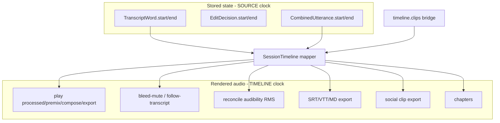

# Architecture

## Layers

Whole-lane recorder latency is the last stage of pipeline `align_tracks`.
`engines/envelope_lag.py` finds the lag between a voice's direct track and its copy
on another mic from level envelopes, tested against shifted nulls. It abstains
when the best lag sits on the search boundary or is not a strict peak. Reuse it for
any other copy-lag measurement instead of a private estimator.
`edits/bleed_latency.py` measures every ordered lane pair in windows, rejects
scattered or drifting pairs (a window settles when it agrees with the median or a
neighbour, and drift is a trend inside runs between steps, so a long step is not
drift), and solves one latency per lane by weighted least
squares with a residual per pair. Each lane gets one decision from its reason
(`DECISIONS`): `apply` only when pairs a path delay cannot explain (the direct
track trails its copy) connect it to the reference, `propose` when only later
copies do, `flag` on conflict or drift, else `keep`. `edits/conversation_align.py`
loads the lane envelopes near their planned placement (`measure_bleed_latency`
reports lags back where each lane sits, where direction is judged), folds the
decisions into the plans (`bleed_lag`, or `candidate_offset_sec` with a `proposal`), and keeps a lane
whose corrected placement is within `align.bleed_lag_deadband_sec` of where it
sits (`bleed_lag_kept`). `edits/bleed_lag_segments.py` then finds where such a
lane's latency steps from every latency-explained pair it shares with a track on the
reference clock (`BleedPair`, each searched around its `steady_lag` measured on the
lane's media), in the lane's source time, with each step in a silence of its
full-band envelope (RMS and sample peak both under their gates) and the step cost
chosen per lane by cross-validation (`LagSteps.step_cost`). `conversation_align.py`
(`_stepped_lanes`) places lanes on the clock outward from the reference, turns the
segments into per-clip plans with `steps`, and `apply_alignment_plans` splits those
clips (`split_clip_at`) before slipping each piece; a clip already at its recorded
placement keeps its `meta.ingest_alignment` entry, so a re-run changes nothing.
Once the clips are placed, the
`align_tracks` step calls `edits/clipped_onsets.py`, which measures the copy paths
again where the lanes now sit (`measure_pair`) and checks every opening whose sound
reached another mic first. An opening that jumps straight to the word's level, in step
with the copy (`envelope_lag.shift_correlations` at zero shift), is a clipped start: the
word's start moves (old start in `snapped_from`, restored and judged again on every run)
and gets its own `Align tracks` comment. An opening whose sound matches the copy shifted
back by the lead is a late track, which is alignment's to fix: nothing is flagged or
moved. Comments stay in step through
`edits/comments.py`. A word a person re-timed (`TranscriptWord.retime(..., by_person=True)`, via
`apply_word_timing`) carries `timing_edited` and is never judged. It reads only the project and audio, never the solver's internals.

Retained mixed bleed has a separate, conservative local alignment path.
`engines/bleed_delay.py` measures signed copy delays with extended reference
context and shifted null controls; it never claims that the lane owner is absent.
`edits/retained_bleed_alignment.py` plans immutable complete direct-source phrase
moves, validates quiet seams in every source channel, and applies existing split
and move operations on a working copy. Services own workspace history and render
publication. The mixed lane is unchanged. Declared crossfade joins abstain with
`unsupported_crossfade_evidence_clock`, because their rendered clock can differ
from raw clip placement. Supported windows must cover the inferred copy phrase
endpoints as well as independent interior probes. All known retained-copy peers in
the region must corroborate one offset; uncertain or conflicting evidence abstains.
Source-scoped user choices live in `editorial.retained_bleed_alignments`.
Destination overlap is removed only from verified quiet source material using
existing clip geometry, with source ranges and reason in the move edit log.
Any reduction of retained-word source coverage abstains. Saved mix-muted lanes
are excluded from automatic alignment; muted secondary copies cannot veto it.
Planning, trim guards, and bleed gates share `selected_source_transcripts`.
An explicitly selected bleed lane with finite start/end also discovers candidates
from retained owner phrases on selected direct recordings, without inventing copy
transcript words. Both origins exclude retained words explicitly marked bleed,
dominant on another lane or speaker-matched to another lane from owner seeds.
Manual text retention does not override those ownership exclusions; unattributed
and own-lane words remain eligible for the acoustic validator.
Both discovery origins use one complete-phrase validator. It also refuses a
completed direct interval overlapping explicit foreign attribution on that
selected recording, including gaps between seeds and completion margins. Foreign
rows veto even when suppressed or ignored because raw evidence includes their
samples. Attribution on another recording or outside that source interval does
not veto it. A lane with neither a transcript seed nor an eligible bounded owner
phrase reports
`no_retained_bleed_candidate`; this is unmeasured alignment, not acoustic clearance.
Examined candidates retain their specific abstention reasons.
`transcript_for_source` prefers an exact recording transcript; track-level words
apply only to primary media or a physically equivalent explicit source alias.
An unrelated source without a transcript supplies no phrase or gate authorization,
and a destination trim touching it abstains. Its complete selected placement is
protected from lane-wide attenuation, including overlaps with authorized clips;
when candidate planning proceeds, the gate reports
`untranscribed_source_protected`. Earlier abstentions preserve the whole lane
without an attenuation plan. Transcript enrollment, including empty transcripts,
is part of the persistent gate fingerprint. Disjoint authorized bleed
remains eligible for attenuation. Selected transcript words map only
through that recording's placements using
`SessionTimeline.map_selected_source_span(s)`. Implicit primary lanes keep the
identity source-to-timeline clock, independent of copies parked on other lanes.
Phrase indexes retain selected recording identity and are built once per direct
lane. Unbounded runs retain the 64-phrase transcript-seeded workflow. Explicit
lane/start/end requests have one 64-unit budget for phrase attempts, directed pair
measurements and quiet reads. Completed envelopes cannot exceed 30 seconds. The
bounded path does not build fresh whole-recording bleed gate plans or assume hard
attenuation to exclude peers. Every other unmuted placed lane in the possible
copy footprint must be measured quiet in every channel or corroborate the full
phrase delay; known retained-copy peers always participate. Missing, active
unverified or conflicting peers veto the candidate. No proposal survives an
unmeasured required peer when the budget is exhausted.
Local delay reads include bounded lag and shifted-null context with an explicit
timeline origin, rather than decoding complete recordings. Overlapping old/new
correction footprints, including quiet trim and seam fades, abstain as a batch.
Each immutable proposal records every retained-copy reference lane used in its
evidence. A batch also abstains when another correction would move a referenced
copy region. Repeated transcript seeds expanding to identical complete source
geometry produce one correction. Measured unsupported probes intersecting the
copy phrase prevent whole-phrase approval, even if endpoints and other probes agree.
Implicit full-media timelines remain playable but local retiming abstains until
explicit clip placements exist. Missing or unmatched direct phrases are reported.
`set_track_clips` carries manual per-clip ingest metadata onto surviving
same-source subclips, so a split or scoped override preserves other placement locks.
Saved choices include an optional opaque digest of the normalized recording path;
primary media and equivalent explicit source references share that identity.
No host path is added to editorial metadata. Legacy choices resolve through their
existing source/primary media references.

Transcript bleed gating plans bounded foreign reduction in
`engines/bleed_gate.py` from ungated selected media, mapped by
`engines/ungated_audio.py`. An immutable `BleedGatePlan` carries protected phrases,
verified reduction spans, the lane's resolved reduction (`mute` or `attenuate`, from
`analysis.heuristics.bleed_handling` read through `AnalysisPolicy`; `auto` picks per
lane from its bed, the median level away from its own speech and the copies), the
attenuation in dB, that bed, and abstention reasons. Evidence is each lane's level envelope; the copy lag comes from
the shared `engines/envelope_lag.py` estimator over the peer's own speech and holds
only when the copy's timbre confirms it (`copy_timbre.confirmed_likeness`), every frame
the peer's direct track reaches at that lag is foreign, and own speech is sound over
the copy's expected level by more than the copy's own spread, or nearer it, a fifth
of a second whose fine spectrum is not the peer's (`engines/copy_timbre.py`).
Reconciliation reuses both: `TrackRmsCacheSet.copy_path` measures each bleed pair's
copy lag and likeness once, and `compute_word_audibility_map` reads the source mic
at that lag, taking a word from its speaker only when its fine spectrum is the copy's
([transcript-reconcile.md](transcript-reconcile.md#words-are-judged-at-the-copy-lag-1052)).
Project playback and rendering apply those conservative plans to rendered audio.

`engines/transcript_gated_play.py` uses absolute transition positions so segment
requests add no word-edge fades. `edits/transcript_bleed_mute.py` persists the
track's source selection and publishes a fresh source render through the existing
render lock and history mutation path. ASR coverage is not an exhaustive audio
whitelist. A process-local LRU retains at most 16 immutable gate plans keyed by
serialized relevant metadata, selected media revisions, and policy; it retains
neither live projects nor PCM. Initial evidence still decodes selected sources.
Owner phrases and unresolved activity retain full gain.

`engines/media_probe.py` shares successful `AudioProbe` metadata by resolved path
and file revision in a bounded process-local cache. Rendered-media audit retains
its container-duration policy. Reviewed bleed discovery requires a known, finite,
unestimated first-audio-stream extent and memoizes unavailable extents within each
receiving-lane discovery call. Declared extent is not proof of decodable PCM or
owner absence.

```text
Adapters     CLI (Typer)    MCP (MCPServer)  GUI (FastAPI viewer)
                    \             |             /
                     \            |            /
Application              services/  (ProjectWorkspace, *Service)
                                    |
Domain                   edits/  clips/  pipeline/  engines/  ingest/
                                    |
Models                   models/  (EpisodeProject, snapshots)
```

1. **Models** (`podcast_mcp.models`) — Pydantic episode project on disk; no I/O side effects. `Transcript.words` is a `TranscriptWords` list: every in-place words edit (a `TranscriptWord` field or a list mutation) bumps an in-memory process-wide revision (`models/words_revision.py`), and `Transcript.memoize_words` caches derived values (e.g. the prosody reader's words fingerprint) against it. Never key such a memo on object identity.
2. **Engines** (`podcast_mcp.engines`) — FFmpeg, transcription, `.wfpk` waveform peak pyramids (`waveform_pyramid.py`, media refs + build hooks in `waveform_media.py`; [waveform.md](waveform.md)), source↔timeline mapping (`session_timeline.py`), utterance gap-run grouping shared by `merge_transcripts` and the GUI view mapper (`utterance_runs.py`, #758), multitrack alignment audit (`alignment_audit.py`: VAD overlap, session-start sweep, `showwavespic` diagnostics), cleanup analysis (`audio_audit.py`: gate overreach, boundary fades, word audibility, cross-track bleed), same-room bleed echo profile over timeline-clock tracks (`bleed_echo.py`: per-frame cross-correlation of one mic against another where one speaker dominates, lag clustering, scored against the same pair time-shifted as its null; reconciliation uses rendered stems when available and projects raw media through `SessionTimeline` when they are absent; feeds `audition_context`'s `echo_risk` from fresh-stem evidence), transcript reconciliation (`transcript_reconcile.py`, `reconciliation_state.py`), CTC forced word alignment (on by default when its optional model is installed; `word_align.py` over `ctc_forced_align.py`; model catalog in `word_aligner_models.py`, beside `whisper_models.py`; both pin a per-file sha256 manifest via `util/model_manifest.py`), segment-level prosody analysis (`prosody.py`: pitch/rate/energy/voice-quality/prominence/boundary contours via `praat-parselmouth`, optional `prosody` extra; see [pipeline.md § Prosody profile](pipeline.md#prosody-profile)), speaker attribution for a split of one recording into lanes (`speaker_split.py`: voice-embedding windows, k-means with optional enrollment, a Viterbi pass; `speaker_hand_overs.py` builds one fixed union of global and provisional-cluster level measurements plus actual detector-positive sound, then settles each hand-over into its measured pauses or flags it as crosstalk. Detector availability remains distinct from the all-true embedding fallback, cluster calibration qualifies eligible runs before level expansion, and unavailable-detector settlement abstains when any calibrated cluster lacks separation from its measured floor; [multitrack-ingest.md § Split one recording by speaker](multitrack-ingest.md#split-one-recording-by-speaker)).
3. **Ingest** (`podcast_mcp.ingest`) — generic recorder-folder scan (`import_folder.py`), `ingest.yaml` manifest, consolidate to one dialogue track per speaker. See [multitrack-ingest.md](multitrack-ingest.md).
4. **Edits** (`podcast_mcp.edits`) — Filler detection, tighten intensity presets (`tighten_intensity.py`), transcript search/cuts, global inaudible cut optimizer (`inaudible_cuts.py`), narrative handoff silence islands (`silence_islands.py`), clip timeline ops (`timeline_ops.py`, `clips_ops.py`, `strip_silence.py`, `ingest_placement.py` for consolidate session placement), room tone for pads and mute fills chosen from the track's audio (`room_tone.py`), the room tone of a recording and the sounds that rise out of it, which a pause trim cuts around (`room_model.py`, pure on level arrays; `session_air.py` reads every dialogue recording once, through its own lane's clips, and lays its sounds on the session clock; the band levels are filtered once per recording in `audio_cache.py::BandLevels`; [filler-cut-quality.md](filler-cut-quality.md) § Decision: Pause trims cut only air), room tone or comfort noise under the digital silence a recorder's noise gate leaves in a track, written as a fill on the media's clock that render sums under the media (`gate_fill.py`; `PlacedSegment.fill_path` in `engines/ffmpeg.py`), transcript sync/correction, chapters, timeline review comments (`comments.py`), agent audition context (`audition_context.py`, `audition_eval.py`), the next word's acoustic onset after a filler, plosive bursts included, that a padded Tighten cut must end before (`word_onset.py`), voiced speech cut through at a splice (`join_speech.py`: clipped onset / tail per clip edge from raw source energy plus voicing, shared by `audition_context`'s `speech_crosses_cut` and the join sweep's `speech` rows; joins come from `clips_ops.splice_joins`), cached per-track prosody profile + timeline window for audition context (`prosody_profile.py`), a speaker split of one recording into lanes that share its media, muted where another speaker owns the audio (`speaker_split.py`, over the attribution in `engines/speaker_split.py`; [multitrack-ingest.md § Split one recording by speaker](multitrack-ingest.md#split-one-recording-by-speaker)).

   `decisions.py` resolves a pending source decision for read-only silence-boundary suggestions and reuses `optimize_source_cut_range` over its full stored interval. `EditService` supplies the workspace. Host and capability-checked guest routes only delegate. Applying a displayed suggestion uses the existing `UpdatePendingEdit` mutation without a second optimization.

   `clips_ops.py` owns trim limits, roll, and move geometry. `ripple.py` owns the edit modes (`EditMode`: `ripple` | `gap`): the one ripple scope rule (`ripple_track_ids`: every dialogue track plus the edited track), planned removals (`RippleRemoval`), the remove/insert kernels every ripple path uses, and trim plans (`plan_trim`, `apply_trim_geometry`). Its private edge-lane transform classifies whole followers from the anchor's original bounds at 1 ns precision. `apply_trim_geometry` builds every moving edge lane before installing any, refusing a newly negative follower atomically with `ripple_before_zero`. `cut_speech.py` is the speech guard: `clear_ripple` checks a planned removal for other tracks' unsuppressed words whose own voice sounds in it (`speech_energy_guard.speech_words_in`) or own sound (`speech_energy_guard.measure_peer_speech`) and returns a `SpeechClearance` or a `CutSpeechConfirmation`; the rippling apply functions require the clearance. Tighten and NL proposals use `resolve_cut_scope`, which returns available `ResolvedCutScope` evidence or a scope-free `CutScopeUnavailable`. Manual proposals hold before publishing; generated candidates reject unavailable assessment before initial planning and final-edge or re-gate publication, counted once as `scope_unavailable`. Completed peer speech and speaker bleed retain their current scope rules. Saved track scope names the selected track operation. Ordinary SOURCE session consumption reassesses the actual span and holds unavailable evidence before clearing the session window through `clear_ripple`; a session hold never silently becomes a punch. `timeline_ops.py` calls those domain mutations and adds transcript rebuilding, applied-edit records, and change summaries for service adapters; it does not independently calculate the same geometry. See [daw-editing.md § Edit modes](daw-editing.md#edit-modes-ripple-and-gap).
5. **Clips** (`podcast_mcp.clips`) — Social clip candidates and WAV export.
6. **Pipeline** (`podcast_mcp.pipeline`) — Registered steps, runner with `--from` / `--only`.
7. **Services** (`podcast_mcp.services`) — Shared orchestration for CLI, MCP, and GUI; history-wrapped mutations. Owner golden-ear A/B harness: `services/document/golden_ear.py` (script `scripts/golden_ear_harness.py`). Waveform pyramids (host `/api/waveform/*`, guest `/daw/waveform/*`) go through `services/media/waveform.py` (media index LRU, status, tiles, PCM windows, GC); the media refs and build hooks it re-exports live in `engines/waveform_media.py` so the pipeline never imports services. In-process WS fan-out uses [`fanout_hub.py`](../src/podcast_mcp/services/app/fanout_hub.py) (`SessionHub` and the guest progress hub are separate instances); each subscriber queue is fed on the event loop it subscribed with, so one key may mix loops. Studio job SSE streams (pipeline slot, agent, bootstrap) use a third, job-id-keyed `FanoutHub` instance in [`gui/job_events.py`](../src/podcast_mcp/gui/job_events.py): one bounded drop-oldest queue per subscriber. `podcast doctor` checks live in `services/support/doctor.py`; sanitized bug-report zips are `DiagnosticsService` (`services/support/diagnostics.py`) — CLI `podcast doctor --bundle` and host Help; explicit Help consent forwards a registered bundle through `services/support/report_submission.py` to the public relay intake. Mode-specific configuration diagnostics live in `services/support/config_check.py`.

   The media context (`services/media/`) owns bounce, ingest, source uploads,
   review and proxy media, speaker and transcript services, and waveform requests.
   CLI, MCP, GUI, and other service contexts import its declared public symbols
   from `podcast_mcp.services.media`. Its lazy facade loads only the implementation
   needed for a request. Media implementations may use `services.app` for workspace
   history and `services.pipeline` for ASR options through those facades.
   `EpisodeService` delegates external audio
   copying to `media_store.ensure_audio_in_workspace` before applying the domain
   track mutation.

   The document context (`services/document/`) owns episode, clip, edit,
   playback, history, boundary, comment, and alignment orchestration. CLI,
   MCP, GUI, and other services import its public names from
   `podcast_mcp.services.document`. The facade resolves each name on first
   access, so importing the package does not load playback or editing. Its
   implementations use `services.app` for workspace mutations,
   `services.media` for media operations, and `services.pipeline` for prosody
   settings. `document_sync` and `session_sync` own separate document and
   transport logs. The `collaboration` context owns share, review, guest
   progress, record-share, session-control, share-page, and tunnel orchestration.
   `record`, `share_auth`, and `remote_mcp` each own their existing workflows.
8. **CLI** (`podcast_mcp.cli`) — Typer commands in `main.py`, `episode.py`, `edit.py`, `clips.py`, `comment.py`, `pipeline.py`, `history.py`.
9. **MCP** (`podcast_mcp.mcp`) — Tool registration in `server.py`; handlers in `mcp/tools/`. Lists and objects are typed tool parameters (`list[str]`, `mcp/args.py` `JsonObject` / `JsonObjectList`) that the SDK validates at the boundary, never JSON text in a `str` parameter; free-text `str` / `str | None` arguments reach tools verbatim (`install_free_text_args`) — see [contributing.md § Structured MCP arguments](contributing.md#structured-mcp-arguments). Tool failures cross one boundary, `install_tool_errors` (`mcp/tool_errors.py`): a busy lock (`project_busy`) or a `CodedError` refusal reaches the agent as a structured `is_error` result with its message and `error_code`; any other exception is a crash whose text stays in the server log. The rule lives in `util/tool_refusal.py` so guest remote MCP (`services/remote_mcp/protocol.py`) applies the same one, with host paths redacted from a refusal's message (#1182) — see [contributing.md § MCP tool errors](contributing.md#mcp-tool-errors).
10. **GUI** (`podcast_mcp.gui`) — DAW viewer HTTP/WS adapter (`server.py` + `routes/`); must call services (e.g. `PlayService`, `PipelineService`, `BounceService`, `CommentService`, `SessionSyncService`, bootstrap via `services.pipeline`, diagnostics via `services/support/diagnostics.py`), not duplicate path/render logic. Host MCP over Streamable HTTP is the same `MCPServer` as stdio, mounted at `/mcp` on loopback binds via [`gui/host_mcp.py`](../src/podcast_mcp/gui/host_mcp.py) (`streamable_http_app()`). **ProjectView seam:** `ViewProjection` / `parse_view_projection` live in `services/document_sync/projection_types.py` so services can name projections without importing `gui/`. Construction and dump stay in `gui/assembler.py` (`build_project_view`, `dump_project_projection`; assembler re-exports the types as the compatibility path). Services dump via a lazy assembler callback — keep dump next to construction rather than forking a second assembler in `services/`. Agent ↔ DAW transport: [session-sync.md](session-sync.md) — `services/session_sync/service.py` is the sync authority; `services/session_sync/viewer.py` adapts viewer blobs / agent play into typed commands. `services/document/cross_process_sync.py` bridges other processes' journal writes into the in-process hub while a socket watches the workspace (#695). Timeline comments: [timeline-comments.md](timeline-comments.md). Share/auth/guest routes mount only via **Sharecut Studio Extensions** ([extensions.md](extensions.md)). Lightweight stem/range bounce: `BounceService` → `export/bounces/`; mastered deliverables stay on `PipelineService.export_audio`. Both share encode/copy via `export.audio.write_audio_formats` (distinct intents; same writer). Optional native host: Tauri under `gui/desktop/` ([desktop-packaging.md](desktop-packaging.md); frozen sidecar via `PODCAST_GUI_DIST`). Deferred iOS/Android hosts and in-app BYOK agent: [cross-platform-byok.md](cross-platform-byok.md) (keep ffmpeg calls inside `FFmpegEngine`).

`gui/jobs.py` keeps `PipelineJobManager` as the route/MCP facade for starting and waiting on jobs. Its `_JobCatalog` collaborator owns the shared lock, live agent claims, bounded finished-job lookup, and status snapshots. SSE fan-out is not the catalog's job: `gui/job_events.py` publishes and subscribes per job id, and `gui/routes/sse_common.py` builds the shared `StreamingResponse` both `/api/pipeline/events` and `/api/bootstrap/events` return, so concurrent subscribers never steal each other's events. Job execution still resolves `PipelineService` and `ProjectWorkspace` through the facade module so runtime patches and adapters use the same entry points.
11. **Extensions** (`podcast_mcp.extensions`) — public FeatureRegistry / soft-load SPI; built-in FOSS `collaboration` extension; optional independently installed provider extension named `online`; example stub. `collaboration` composes share CLI/MCP, anonymous guest identity, review/record/remote-MCP routes, guest SPA hooks, and share/tunnel feature slots. `online` contributes only provider account/auth surfaces. Absent extension ⇒ no contributed routes/tools/UI ([extension-seams.md](extension-seams.md)). FOSS share mint works against any self-hosted relay; provider defaults, accounts, and quotas remain outside this repository.
12. **Relay** (`podcast_relay`) — FOSS host-online reverse tunnel edge (`podcast-relay`); host connects via `podcast tunnel` (`services/collaboration/tunnel.py`). Packaging: `deploy/relay/` plus static vhosts (`/download`, Sharecut marketing, company page). See [host-online-relay.md](host-online-relay.md).

`FFmpegEngine` and single-command consumers select one validated `FFmpegPair`
through `util.binaries.resolve_ffmpeg_pair`. The value carries absolute command
paths, an equal numeric release, and the selection source. Explicit supported
pairs win, followed by the declared exact-release bundle, native Homebrew, complete
PATH directories and the existing source-use cache. Discovery is lazy and
read-only. Inaccessible optional directories count as unavailable. Version
validation lives at this executable boundary. Readiness reports retain its failures and source.
`contracts/ffmpeg-build.json` owns the release and native source recipe.
`scripts/ffmpeg_payload.py` owns catalog admission, bounded closed-inventory
extraction, native proof, complete payload replacement and pair signing. CI and
the sidecar call this owner. The native dependency producer in
`scripts/build_ffmpeg.py` shares its executable proofs and has no ordinary
consumer workflow. The importer retains the original producer manifest and
records signed executable hashes separately. The production target catalog pins the hosted archive and original manifest hashes. The native launcher supplies `PODCAST_MCP_FFMPEG_BUNDLE` in GUI, CLI and
MCP modes. Bootstrap downloads model assets only. See
[FFmpeg version and pair policy](setup.md#ffmpeg-version-and-pair-policy).

Playback meter sources live under `gui/web/src/audio/`. Transports bind one
runtime source through `playbackMeterSource.ts`; track meter leaves subscribe
without sending frame readings through the project store. `channelPeakTap.ts`
measures channels independently so opposite-polarity stereo cannot cancel.
`ProxyEngine` owns its post-gain taps. `hostPlaybackMeterMonitor.ts` owns silent
track monitors synchronized to the audible HTMLAudio transport, preserving the
premix playback path. Shared metering math and the reference-counted frame
scheduler supply peak hold and clip detection. Transport cleanup owns audio
resources; the meter leaf owns presentation. `playbackClipLatches.ts` retains
clearable clip state across responsive shell remounts, scoped to the current
project and surviving tracks.

Timeline horizontal scroll policy lives in `gui/web/src/timeline/useFixedPlayheadScroll.ts`.
The parent hook owns lead lifecycle, committed canvas sizing, DOM scroll echoes,
and pointer zoom gating. Its immutable render binding connects the canonical
scroller and geometry to separate `TimelineScrollSync` and `FixedPlayheadRecenter`
children. Hot scroll and transport subscriptions belong to those children,
outside the parent hook, so frame updates stay outside arrangement rendering.
`TimelineView` retains shared column measurement, gesture attachment, and desktop
region reveal. Vertical geometry remains in `timelineMetrics.ts`. See
[GUI render isolation](gui-integration.md#read-only-daw-viewer).

Frontend pointer dispatch policy lives in `gui/web/src/commands/pointer.ts`.
`gui/web/src/commands/seek.ts` routes transport seeks through that pointer
adapter and returns the command result so Listen, timeline, and DAW WebMCP share
the same seek path.
`runPointerCommand` dispatches without keyboard `when` gates and returns `void`;
`executePointerCommand` exposes the same dispatch promise for completion and
result handling. Keyboard input evaluates its gates in the keymap listener,
while WebMCP play awaits `execute` in its agent adapter and WebMCP seek awaits
the shared seek helper. Configurable `CommandButton` gates remain in the UI
bridge. See [the frontend command adapters](../gui/web/README.md#api-adapters).

`ProjectStore.transcript_vocabulary_state()` keeps a bounded process-local cache of
immutable track/revision/edit metadata from the existing validated project loader.
The vocabulary status service combines it with freshly loaded layered context YAML.
It watches canonical project and history-index file signatures, including ctime,
and publishes a miss only when the signatures stay unchanged across the load.
It retains no project models or words. Cold reads still validate the complete project.
If a cache signature cannot be read, it uses the authoritative loader without caching;
only history reads required by that loader can fail the request.

`engines/timeline_render.py::_render_placed_track` owns placement for full tracks
and seek windows, including clips from one recording. Its accumulated output
clock retains nested overlaps and intentional source-edit or join contraction.
`FFmpegEngine.render_timeline` groups selected media inputs and executes the
resulting segments, with track effects applied after assembly.

Shared utilities: `project_store.py` (canonical load/commit), `project_merge.py` (three-way merge for long-job saves), `project_io.py`, `history/session.py` (`run_mutation`), `history/rollback.py` (shared `HistoryCheckpoint` and `RollbackOutcome` for mutations and merged saves; ownership-aware entry cleanup or directory-difference cleanup under an uninterrupted commit lock), `util/` (incl. `util/dicts.py` — `deep_merge`, shared by pipeline config, tighten presets and transcript context layering (`skip_private=False` there keeps `_`-prefixed context YAML keys); `util/loudness.py` — BS.1770 gating over ebur128 momentary blocks, optionally speech-gated; `util/dsp.py` — shared scalar clamps (`clamp`, `clamp01`), RMS dB, dB-to-amplitude, pitch autocorrelation, and boolean-run primitives; reuse them instead of private copies in `edits/` / `engines/`; `util/dsp.frame_db_stream` (several per-frame reductions, such as `frame_rms_db` and `frame_peak_db`, in one pass over a chunk stream; `frame_rms_db_stream` is the RMS one); `util/pcm_stream.py` — `SequentialWindowReader`: start-ordered sample windows from a forward-only decode (`FFmpegEngine.stream_mono_f32`), so per-segment analysis never holds a whole track; `window()` takes float seconds (floor/ceil rounding, prosody segments); `window_samples()` takes exact integer sample indices (`engines/ctc_forced_align.py`'s `retime_spans_stream`, #730); reuse one of them instead of a whole-file `load_mono_full` when windows are start-ordered; `NoAudioDecodedError` is the "no audio decoded from <path>" error for an empty ffmpeg decode (`asr_silence.py`, `audio_audit.py`, `word_align.py`); `engines/align.py` keeps `AudioWindowUnavailableError` (its callers skip unusable windows on it) but builds the text with `no_audio_decoded_message`; raise `NoAudioDecodedError`, or reuse `no_audio_decoded_message` for a caller-specific type, instead of a new ad hoc string; `util/file_locks.py` (`shared_file_lock(lock_path)`: one re-entrant `FileLock` per sidecar lock path, built with `timeout=0` so a bare `with lock:` / `lock.acquire()` fails fast instead of filelock's own default of waiting forever; `hold_shared_file_lock(lock_path, *, timeout=...)`: a context manager that acquires the shared instance with that caller's own timeout — each acquisition brings its own timeout rather than one baked into the registry (#494); reuse one of them for any new `artifacts/*.lock` writer instead of a private registry); `util/keyed_lock.py` (`KeyedLocks`: one in-process lock per key, created on first use, with `discard_idle` eviction; reuse it instead of a private guard + dict registry)), `export/`.

`util/ws_delivery.py` owns serialized WebSocket send deadlines and count/byte-bounded queues shared by guest GUI guards, relay guest streams and host tunnel proxies. Application hubs retain their document, roster and progress recovery policies.

Shared backend helpers keep caller policy explicit: `util/intervals.merge_intervals` takes a merge gap (the timeline, occupied-span, and range callers retain their respective tolerances); `util/source_spans.source_span_timeline_bounds` takes an empty-span fallback. The `edits/ranges.py` and `edits/timeline_span.py` imports remain compatibility paths for edit callers; engines import the neutral utilities directly to avoid package initialization cycles. `util/wav.open_wav` is the one stdlib-`wave` reader for source code: it accepts integer-PCM WAVE_FORMAT_EXTENSIBLE headers (what ffmpeg and most recorders write for more than two channels or 16 bits) on Python 3.11, whose `wave` rejects them, and raises `wave.Error` for any other EXTENSIBLE sub-format GUID (the same full-GUID rule as 3.12's stdlib; `PCM_SUBFORMAT_GUID` is shared with `transcript_gated_play`); never call `wave.open` on media in `src/`. `util/wav_pcm.decode_integer_pcm` normalizes 8-, 16-, 24-, and 32-bit integer samples for waveform and alignment readers; those readers retain format admission and read bounds. `util/atomic_file` owns byte writes and completed-file fsync/replace, while `util/atomic_render.render_atomic` retains render temp names, stale-partial reaping, and the hash invalidation hook. `util/atomic_json` retains JSON, UTF-8 text, and metadata-preserving copy policy. `util/dsp.py` owns scalar clamps and linear RMS, while `util/tracks.py` owns canonical and existing rendered stem paths; callers still choose their own signal floors and raw-media fallbacks. UTC record timestamps use `util/datetime_utils.now_iso`.

The raw-media, diagnostics, waveform-pyramid, transcript-cache, recorder-import, consolidated-ingest, and playback-stem guards use `util/workspace_paths.resolve_within`. Callers keep their own input grammar and public error messages; the shared resolver checks the resolved path against the resolved allowed root, including symlink targets. Other artifact guards retain their own validation.
The alignment energy VAD, heuristic/Silero breath scans, and silence-island scan use `util.dsp.bool_runs` for contiguous masks. Only alignment VAD bridges a single quiet chunk before extracting runs; each caller still owns its threshold, duration, and timestamp policy.

`util.intervals.HalfOpenIntervalIndex` provides immutable overlap queries for transcript cut guards, filler spans, and GUI word projection. Callers keep their own word filtering and source-clock rules; the index preserves original word ordinals for view ordering.

**Configuration seam:** `runtime_config.py` validates host relay and optional
S3-compatible storage. Relay fields use explicit > environment > YAML > safe
default; object-store fields use environment > YAML > disabled. `distribution.py` validates public build identity and exact trusted
origins. Runtime secrets never enter the distribution profile; Tauri’s build
script generates Rust constants from that same public profile.

**Episode state:** `episode.project.json` v2 is the single source of truth. See [episode-format-v2.md](episode-format-v2.md).

### Guest failure presentation

`util/tool_refusal.py` owns refusal recognition along the explicit exception
cause chain and guest path redaction. File-lock timeouts take precedence over
SQLite busy or locked errors, which take precedence over coded refusals.
`gui/routes/guest_errors.py` projects that shared policy into HTTP errors and
safe WebSocket values. Unmarked failures produce fixed `internal error` and a
host traceback. Busy WebSocket admission and setup close with transient `1013`;
recording command contention sends `invalid_state` with `error_code=project_busy`
and leaves the socket usable. Services mark deliberate permission, input, missing-resource,
and state guards with coded error types. They do not import GUI error handlers.
Guest waveform routes call the media facade directly, then project failures;
owner waveform routes retain their owner adapter. Record upload shells convert
pre-acknowledgment refusals for their own caller. The shared ingest helper retains
post-acknowledgment landing recovery and returns the successful file ACK.

### Durable storage

Host-local durable stores beyond the episode JSON (session sync sqlite, share
token registry, review sidecars) are cataloged in [persistence.md](persistence.md).
Share token algorithm (coolname, active + cooldown pools): [share-tokens.md](share-tokens.md).
**Extend an existing store** instead of inventing a parallel JSON index or DB.
Recording sessions reuse the share registry (`kind`) and prefixed session-sync
sqlite tables (`record_*`) rather than a new plane — see [recording-session.md](recording-session.md).
`EditService.list_clips` acquires the host-local recording-key secret from the
share registry once per call; `edits.timeline_ops.list_clips` passes it to pure
HMAC derivation in `edits.clips_ops.recording_key`. Registry and session SQLite owners share
`util/sqlite_wal.ensure_wal` for the bounded WAL transition; session setup retains
its per-path locks and timing controls. A failed registry secret transaction closes
its connection. The process-wide getter and each registry operation recover from
durable state before token lookup, including directly injected registry owners.

### Service contexts

`services/support/` owns runtime/configuration diagnostics, sanitized bundles,
and explicit report submission. `services/pipeline/` owns pipeline execution,
working configuration, Analyze, and component bootstrap. Adapters and sibling
services import each context's declared symbols from
`podcast_mcp.services.support` or `podcast_mcp.services.pipeline`; focused tests
may import implementation modules. The pipeline context depends on the existing
`services.app` facade for `ProjectWorkspace`, and support reads pipeline component status
through the public facade. Neither context imports CLI, MCP, or GUI modules.
All eleven service contexts expose explicit typed names through lazy package
facades using `util/lazy_exports.py`. Importing a facade does not load its
implementation modules or optional integrations.

`tests/test_service_boundaries.py` scans production Python imports, including
nested and relative imports. It rejects external imports of implementation
modules in every service context and names absent from each facade's `__all__`.
It requires the root `services/__init__.py` to stay empty, forbids flat service
modules, and requires every context directory to be registered. All services
are barred from `gui.routes` imports.
The current narrow GUI dependencies are app GUI launch to `gui.bind` and
`gui.static_assets`, document sync projection to `gui.assembler`, remote MCP
tools to `gui.jobs`, and collaboration share projection and playback to
`gui.mapper` and `gui.audio`. Other service imports of CLI, MCP, or GUI
adapters are rejected.
The projection guard remains in
`tests/test_import_direction.py`.

## Data flow

Raw WAV → project JSON → transcripts → edit decisions (proposals) / clip timeline (applied) → FFmpeg render → deliverables.

Cut data flow: cut operations that remove a time range route through `edits/inaudible_cuts.py` before commit (local snap + absorb). Exact selected-range Cut uses validated occurrences and canonical punches without source snapping. `strip_silence` is another exception: it rebuilds keep islands from silence detection and does not call the cut optimizer. Narrative handoffs that need a beat use `edits/silence_islands.py` / `suggest_handoff_cut` and lock bounds with `use_inaudible_opt=false`. See [inaudible-cuts.md](inaudible-cuts.md).

Episode workspaces live outside this repo; the CLI accepts `--project path/to/episode.project.json`.

## Design decisions

Transcript context owns vocabulary limits and the immutable prompt/revision
snapshot returned by `TranscriptContext.transcription_vocabulary()`.
`AsrOptions.language` resolves `transcribe.language` for both the pipeline and
`TranscriptService`. `TranscriptPrecorrectService` converts context writer lock
timeouts to `TranscriptContextBusyError`; adapters handle the service error.

ASR caches are derived files, separate from canonical transcript mirrors.
`TranscriptionEngine` retains two input variants per exact job/audio family.
ASR and alignment publication share that family's `artifacts/transcript-cache-*.lock`;
inference runs outside it. The persistence contract is in [persistence.md](persistence.md).

### Narrative handoff evidence

Narrative handoff selection belongs to `EditService.suggest_handoff_cut`. Omitted human selectors resolve to all dialogue IDs, including muted lanes. Explicit selectors resolve to one lane. `edits.silence_islands` accepts a track collection, samples the maximum RMS on a shared timeline grid using one cache build for the selected lanes, and reuses the silence-island retain and snap planner. Missing or incomplete evidence cannot qualify a hop as quiet. The waveform snap overlay passes its one selected lane to the same scanner.

### Timebase: source vs timeline clock

`util.media_identity.same_recording` compares canonical paths and existing physical
files, including hardlinks. Distinct missing files prove no equivalence. Identical
missing paths preserve metadata geometry but cannot authorize an audio edit.
Exact removal geometry inventories the queried recording across every stored
placement, including another lane's primary media. A matching unclipped lane
holds because the renderer independently plays its full recording. Ordinary
point mapping retains semantic lane ownership. Transcript groups retain exact
source IDs even when their files match.
Primary placements select their own lane transcript before physical audio reuse.
Parked sources use their explicit transcript or a unique primary owner's primary
transcript. Ambiguous primary ownership refuses the trim before mutation.
Primary tightening candidates and their flank/index guards use only the primary
transcript. Foreign recording words cannot become primary cut proposals. Unclipped
peer playback with a parked source holds instead of losing its ripple clock shift.
Peer pause floors compare current placed transcript words with the surviving primary
gap on the session clock. A parked or shifted word cannot lower an unrelated solo floor.
Zero-duration transcript markers provide no peer speech span and cannot lower that floor.
Editorially ignored tokens and rendered zero-gain mute samples provide no peer turn.
Mute masks belong to each playback occurrence and are bounded before abutting clips
merge. An unmuted continuation or replay retains its own words. Positive mute fade
wings retain kept words, while a mix listening mute retains the lane's turn evidence.
The renderer and placement masks share source sample rounding and short-fade behavior.
Raw transcript spans remain the separate authority for room calibration and voice anchors.

Pause effects change only their owned edge. A left effect changes the outgoing
fade and preserves the clip's earlier incoming join. A right effect selects the
new incoming fade. The render cache revision includes these semantics.

`SessionAir.pause_observation` owns descriptive recording content for pause retention and finite effects. It keeps guarded removal sounds unchanged and reconciles actual kept-voice boundaries against the same recording's independent band evidence. `fillers._prepare_candidate` remains the single pause policy owner. It qualifies current once-only original source pieces on both sides of the final removal between complete live word images. Duration comes from their disjoint source union after exact mapping, actual-media alias checks, mute and ignored-region exclusions, simultaneous activity, registered beds, and known pad receipts. Deleted source interior can separate surviving pieces in a continuous current playback chain. Current clip fields do not prove the history of indistinguishable replacements. A shortfall tries bounded right, left, and bilateral contractions through fresh preparation and finish, preserving both hard bounds and the original decision ID. If no clean contraction meets the original floor, the pause holds without an automatic silence or room-tone pad. `timeline_ops.bind_pause_effects` projects the existing kernel and distinguishes authored fades from temporary split fades. `source_removals.consume_source_remove` freshly prepares and assigns exact source-keyed effects after consumption, then returns their actual footprint and pad-tile receipt for the existing edit log.

The recording measures onset and release independently. Acoustic retention filters
the complete original release-to-onset corridor with native bands, caps and frame
storage, then smooths that whole corridor. Each outer collar needs at least five
complete frames at or below the same original reach in both bands. Missing, nongrid,
nonfinite or clipped source evidence preserves that guard edge. The complete
queried guard must have one full placement and no other same-media placement
touching it, including placements on another lane or outside the query. Deleted
corridor interior and disjoint interior replay do not prevent original measurement.
They supply no retained-duration credit. Geometric retention reads no room and uses
the placement boundary only for an unknown anchor direction.

**All stored times (`TranscriptWord`, `EditDecision`, `CombinedUtterance`) are source-media seconds; `timeline.clips` is the only bridge; anything that touches rendered audio (stems, premix, mastered, export) must map through [`SessionTimeline`](../src/podcast_mcp/engines/session_timeline.py).**


```mermaid
flowchart TB
    subgraph stored [Stored state - SOURCE clock]
        WORDS[TranscriptWord.start/end]
        DECS[EditDecision.start/end]
        UTTS[CombinedUtterance.start/end]
    end
    CLIPS[timeline.clips bridge]
    ST[SessionTimeline mapper]
    subgraph rendered [Rendered audio - TIMELINE clock]
        PLAY[play processed/premix/compose/export]
        GATE[bleed-mute / follow-transcript]
        REC[reconcile audibility RMS]
        SRT[SRT/VTT/MD export]
        SOCIAL[social clip export]
        CHAP[chapters]
    end
    WORDS --> ST
    UTTS --> ST
    CLIPS --> ST
    ST --> PLAY
    ST --> GATE
    ST --> REC
    ST --> SRT
    ST --> SOCIAL
    ST --> CHAP
```

`SessionTimeline` owns all clip time math (fingerprint-cached per-track index, `bisect` lookup). Repeated source spans or points over a stable project snapshot use `map_source_spans` / `sources_to_timeline` to build the clip index once (e.g. the #719 prosody overlay); individual mappings recheck clip geometry so in-place edits cannot leave stale results. `map_timeline_spans` retains paired timeline/source bounds on the originating media track. `lane_clip_spans` retains each clip and its paired bounds on the current lane. Raw audio caches use those lane placements and the renderer's `resolve_clip_audio_path` policy, decode each selected file once, sum overlaps, and leave gaps silent. If any selected media or required samples are unavailable, the lane supplies no raw acoustic evidence. The per-track index follows **originating media** (`clip.source_id` → track whose `media.path` matches, else `clip.track_id`), so a clip parked on another lane still maps on the source track; words stay on that speaker's transcript. Look up one source ID through `EpisodeProject.source_by_id()` so missing IDs consistently return `None`; batch callers may build a per-call source map. `TranscriptMatch` from `search_transcript` carries **both** clocks (`start/end` = source, `timeline_start/end` = mapped, `None` if cut away) so no caller guesses. Edit/render code that works on a clip list without a full project uses the `clip_timeline_overlap_to_source` / `clip_timeline_point_to_source` / `clip_source_to_timeline_shift` helpers in the same module (the shift helper also backs the `max_drift` diagnostic). The only other place the mapping formula appears is the `Clip.timeline_end` property. A source second means the same sample on every read path: ffmpeg reads that start past 0 seek through `MediaSeek` (`engines/media_seek.py`), which seeks to a whole second at least 0.5 s early and trims the rest by timestamp, so a window from any container (including AAC `.m4a`) matches a full decode sample for sample (#1141). Ingest consolidate writes the session placement as clip geometry (`edits/ingest_placement.py`), so `ingest verify` and pipeline `align_tracks` read raw files through those clips.
For ripple trim geometry, `edits/ripple.py` compares timeline endpoints at 1 ns precision to decide whether a clip follows an edge. The separate 1 ms tolerance in `plan_trim` selects a moving peer; it does not change the source-to-timeline clock or widen follower membership.

Ordinary SOURCE REMOVE uses `edits/source_removals.py` for assessment and fresh consumption. `SessionTimeline.exact_source_span` requires complete once-only source coverage, continuous timeline placement, and no overlapping unselected audio on the origin lane or its selected placements. `exact_timeline_source_span` proves the actual final optimizer window back to that originating recording and forward again. `inspect_source_remove_placement` proves the original pending request's complete forward and reverse placement and canonical lane membership before optimization. Full `inspect_source_remove` assesses pause shortening and perceptibility only on the finalized window. Kernels consume that proven window without another optimizer. `origin_placement_lanes` identifies the actual lanes playing the origin in that window. Every selected placement must belong to the canonical operation: named lane for a punch, or `ripple_track_ids(project, removal.edited_track_ids)` for the actual session removal. Parked MUSIC holds with `operation_scope`; quiet parked DIALOGUE can be consumed. This geometry proof does not authorize speech: voiced parked media remains subject to fresh conservative scope checks. A stored track pause always holds.

A current implicit primary lane is eligible only with a known finite media duration and no intentional `timeline_empty` state. Before mutation the consumer proves every affected implicit lane's extent and materializes it with `track_media.full_span_clip`. It never derives extent from words, source endpoints, or project duration. Display mapping retains its broader identity and merged-interval contracts.

Generated REMOVE/MUTE decisions are explicitly pending. Coalescing partitions rows outside `merge_ids` before copying or assessment; an empty set publishes nothing. Owned pending source singleton and merged survivors get final inspection, and generated holds are counted once per group. Complete merge identity and independent-review barriers preserve other operations. Manual cuts use the same private sorted rolling-hull grouping rule as coalescing to own only the component containing the new row. Each owned existing source input is validated before widening, then the final survivor is validated before publication. Unrelated rows retain their serialized fields and relative order. Complete track/type partitioning, exact-row exclusion, identity, and review barriers remain canonical. Focus supplies a count sink even when callers omit one; its pipeline summary reports holds.

Proposal append, update and coalescing check actual final source bounds and pad before publication. A pause requires positive played loss after its pad and the existing perceptibility rule before shared twins. Approval rechecks each row against evolving playback; holds distinguish geometry, operation coverage, peer speech, speaker bleed and unavailable evidence. `EditService` adds the selected-batch unchanged guarantee and returns speech confirmation only after history and the registered editable/render restore both complete. UNKNOWN recovery rethrows the primary error. Automatic application has one monotonic held set. Each trial starts from the stable post-MUTE project and chooses only surviving source extents; any new hold discards that trial and restarts. Only a complete hold-free copy is adopted. Suggested approval runs on its separate preview snapshot. Exact ranges, source MUTE, SPLIT, clip-ID and explicit timeline operations retain their own contracts.

**Enforcement:** `tests/test_timebase_guards.py` fails CI if the mapping arithmetic appears outside `session_timeline.py` / `Clip.timeline_end`; `util/tool_timebase.py` + `tests/test_time_conformance.py` require every time-bearing MCP tool to declare its clock. `podcast doctor --project` and `export_qc.json` report per-track `max_drift` and flag transcript words that fall outside all clip source ranges (legacy timeline-coord words); zero-length ASR words are padded to a 1 ms span (`SessionTimeline.map_word_spans`, shared with the GUI word views; a word at a kept clip's source end maps onto that clip's last 1 ms) and counted separately as `zero_length_words` warnings, not unmapped; words that end more than 20 ms before they start are `inverted_words`, a hard issue (#621). `export_qc.json` also carries unaccepted relative align drift (`alignment`). Doctor and `export_qc.json` also flag same-media clips that overlap by more than 50 ms on the timeline (`same_source_timeline_overlaps`) as a hard issue. Same-lane pairs count for every role; cross-lane pairs count when both lanes are dialogue. Only time both clips sound counts: a clip's `mute_regions` are left out, so the lanes of a speaker split are copies only where two of them play at once (the flagged crosstalk of a `--crosstalk both` split). Each reported pair retains its clip and lane IDs in matching order. Alignment compares project-wide pairs before and after each staged dialogue-lane move, then restores the lane if the move introduces a new pair (#520). Relative align drift sampling lives in `SessionTimeline.clip_relative_drift`; `edits/align_accept_status` owns only the accept/lock policy shared by the unattended gate and export QC.

### Transcript is a derived view of audio

The per-track transcript is produced by ASR on raw audio, then kept accurate via **reconciliation** — measuring word-level RMS across all dialogue tracks and updating `suppressed`, `audibility_status`, and `dominant_track` on each `TranscriptWord`.

### Audio and transcript are separate layers

| Layer | Controls | Examples |
|-------|----------|----------|
| **Audio** | What the listener hears | Gate, denoise, gain, mute, clip edits |
| **Transcript** | What the text says | Suppression, text corrections, combined merge |

Reconciliation **reads** rendered stems (or raw audio) and updates transcript metadata. It never modifies audio waveforms.

### Why suppression does not duck audio

Bleed from another speaker is physically mixed into the same mic waveform as room tone and the primary speaker. Ducking audio during transcript suppression would create audible holes and break undo. Tune gate/FX on the audio layer; run `reconcile_transcript` afterward so the transcript reflects the new audible state.

### Automatic transcript sync

Any operation that can change what the listener hears must keep per-track transcripts aligned with audible audio. Reconciliation measures word-level RMS across dialogue tracks and updates transcript metadata (`audibility_status`, `dominant_track`, and optionally `suppressed`).

**Central hooks** (all audio edits should flow through these):

| Hook | When it runs | What happens |
|------|----------------|--------------|
| [`run_mutation`](../src/podcast_mcp/history/session.py) | Every `ProjectWorkspace.mutate` (cuts, FX, gain, timeline ops, etc.) | Marks stale when `audio_state_fingerprint()` changes; reconciles only if stems already match the new state (rare — follow FX/cuts with `render_preview`) |
| [`rerender_preview`](../src/podcast_mcp/render.py) | After `assemble_timeline` (+ music mix) | Auto-reconciles when `analysis.reconcile_on_render` is true (default) and `transcript_mode` is not `off` |
| [`PipelineRunner`](../src/podcast_mcp/pipeline/runner.py) | Audio-affecting pipeline steps | Marks stale; full pipeline runs `reconcile_transcript` after `render_dialogue_stems` (pass 1) and after `assemble_timeline` (pass 2) |
| [`reconcile_transcript`](../src/podcast_mcp/pipeline/steps.py) pipeline step | Pass 1 and pass 2 in ordered pipeline | Same engine as `reconcile_transcript_tool` |

Cut synchronization lives in `edits/transcript_sync.py`. It maps pre-edit clip overlaps to the selected recording transcript, retains removed word metadata in `Transcript.archived_words`, and restores fully covered source words after boundary expansion. `gui/mapper.py` projects these archived words for preview; it does not load history or mutate transcripts. Project and history serialization carry the archive with the transcript.

Implementation entry point: `maybe_auto_reconcile()` in [`edits/transcript_reconcile.py`](../src/podcast_mcp/edits/transcript_reconcile.py).

**Policy** (`analysis` in [`.agents/defaults/pipeline.yaml`](../.agents/defaults/pipeline.yaml)):

| Setting | Default | Effect |
|---------|---------|--------|
| `transcript_mode` | `reconcile` | Updates audibility metadata **and** suppresses inaudible/bleed words; rebuilds combined |
| `reconcile_on_render` | `true` | Reconcile automatically after every preview render |
| `transcript_mode: flag` | — | Tag audibility only; no suppressions (use `--dry-run` on CLI to preview without applying) |
| `transcript_mode: off` | — | Disables automatic and manual audibility reconciliation |

**Adding new audio operations:** route mutations through `ProjectWorkspace.mutate` (never bare `save()` on timeline/mix/transcript fields). If the operation renders stems, call `rerender_preview` or the `assemble_timeline` pipeline step so reconciliation sees processed audio. Do not duck or mute waveforms when suppressing transcript words.

**Manual override:** `reconcile_transcript_tool` / `podcast edit reconcile-transcript` remains available when stems are stale, you need a dry-run report, or you want to apply suppressions with confirmation.

**Operational guide:** bleed heuristics, debugging zero bleed counts, and synthetic fixture recipes — [transcript-reconcile.md](transcript-reconcile.md).

**Performance:** Word-level audibility uses `TrackRmsCache` — each processed stem is decoded once at 8 kHz mono; per-word RMS is numpy slicing (not one FFmpeg subprocess per word). Progress: [progress.md](progress.md); CLI adapter: [cli-progress.md](cli-progress.md).

### Staleness

The render status report probes each existing stem once and uses that duration
for both display and timeline-length freshness checks. A stem may be shorter
than its timeline after applied edits; an overlong stem is stale.

`audio_state_fingerprint()` hashes the dialogue tracks' render state (gain, FX chains, clips, edits, fades, mute regions) and **dialogue** envelopes; music/intro/outro envelopes are left out because reconciliation only measures dialogue (#621). Any mutation that changes it, and any pipeline step the runner runs from `AUDIO_AFFECTING_STEPS` (not `mix_with_music`; inline assembles in `ensure_current_premix` rely on the fingerprint), sets `reconciliation_stale`. With default settings, reconciliation runs automatically after `render_preview`; until then `reconciliation_status_tool` reports stale.

**Render invalidations (diagnostic):** `render.invalidations[]` is a first-class cause journal (timeline ranges for cuts; whole-track for FX/gain/mute/envelope). Appended in `run_mutation` when the audio fingerprint changes; cleared per track after a fresh stem (hash write may run in parallel workers; invalidation clears run serially on the main thread). Mutations and render snapshots in the same workspace share a process-local lock, including document submits. Stem workers render and hash one snapshot; if the live render hash or eligible track set changed during rendering, or another writer committed a project whose render hashes or track set differ from the snapshot, the new invalidation remains and the step stops before publishing track outputs. A saved volume or mute alone does not stop it, because `track_render_hash` leaves those mix-only fields out. A fresh on-demand stem clears its live diagnostic journal and persists that change only when the stored track still matches its render snapshot. Render snapshots and loads are not serialized across processes (see #213); render **writers** are (`util.project_state.render_lock`, #482: `@with_render_lock` on project-first functions, `with render_lock(project):` in services); pipeline steps mutate a private copy that is published under `project_state_lock` after the step (#357); individual commits are, via `project_commit_lock` (see below). The journal does **not** enable partial re-render — stems stay whole-artifact. Sharecut Studio hover uses these for regional bands vs header chips. Freshness booleans (`stem_is_fresh`, `needs_rerender`) remain derived from disk hashes/mtimes — the journal alone does not flip the Stale pill.

`ProjectWorkspace.reload()` avoids a second JSON parse when the project's mtime, size, and file identity match its last load. A changed file or an earlier workspace commit is loaded again before caching its revision; this is an in-process parse optimization, not a write lock. Each commit and history-index write takes `util.project_state.project_commit_lock` (file lock at `artifacts/episode.project.json.lock`), so two processes never interleave the writes of one commit. `ProjectWorkspace.transaction()` holds that lock from the reload through the commit, and `mutate()` always runs inside it, so read-modify-write is serialized across processes (#213). The outermost transaction adopts the saved project in place only when another writer committed since this workspace loaded or last committed it (unsaved edits are then dropped; adopting replaces whole sections in place, so callers re-fetch sub-objects afterwards); nested transactions do not re-read. A slow mutation holds the lock for its whole run, and a writer in another process waits 30 s, then raises `ProjectBusyError` (a fixed-message `filelock.Timeout` subclass). Every adapter maps a busy project or render lock to the same `project_busy` code at one choke point each: the document routes' own `Timeout` / sqlite-busy mapping plus an app-wide FastAPI exception handler on `Timeout` (`gui/routes/deps.py::project_busy_exception_handler`) return HTTP 503 with `X-Sharecut-Error-Code: project_busy`; the CLI's root `BusyErrorGroup` (`cli/busy.py`) prints `Error: <message>` to stderr and exits 1; MCP's `install_tool_errors` (`mcp/tool_errors.py`) returns a structured `is_error` `CallToolResult`; and guest remote MCP (`services/remote_mcp/protocol.py`) returns the same `isError` tool result, through the rule both MCP servers share (`util/tool_refusal.py`, #488, #1182). `BusyErrorGroup` is also the CLI's one choke point for a domain guard error (a `CodedError`, `ValueError` or `RuntimeError`) escaping any command, printed the same `Error: <message>` way (#773). A `CodedError` (`util/coded_error.py`: a refusal whose message is written for the caller, for example `MixUnavailableError`'s `no_mix` / `stale_mix` / `stale_master`, an unknown id, a missing project, a stale guard) keeps its code on every adapter: the CLI appends `(code <code>)`, `install_tool_errors` returns the same structured `is_error` result with that `error_code` (the only way a refusal's text reaches an MCP agent, #1178), and GUI routes that map one send `X-Sharecut-Error-Code`; `PODCAST_DEBUG=1` bypasses both cases and re-raises for the original traceback — see [setup.md § Debugging the CLI](setup.md#debugging-the-cli). Render writers wait on the separate render lock (`artifacts/render.lock`, taken before the project locks): up to 60 min in 0.5 s slices that stop for a cancelled job (`CancelledProgress`), then `RenderBusyError`, a `ProjectBusyError` subclass that every adapter maps the same way. Playback waits at most 2 s, then falls back to a segment render or the premix/stem already on disk (see [pipeline.md](pipeline.md)). See [history.md § Storage layout](history.md#storage-layout). `util.project_state.file_revision()` supplies the shared file identity used here and by render consistency checks.

**Long jobs merge their saves:** a pipeline run, `render_final`, `export_audio`, the play premix re-render (`PlayService._ensure_premix`) and `HistoryService.undo` / `redo` / `goto` with `rerender=True` keep their own workspace copy for seconds to minutes. They call `ProjectWorkspace.checkpoint()` first and `save_merged()` instead of `save()`. `save_merged()` three-way merges (base = the one read of the saved file that checkpoint() also uses to decide whether its copy is current, ours = the job copy, including unsaved edits it already had only while the file is unchanged since the workspace loaded it (if another writer committed first, checkpoint() adopts the saved file and those unsaved edits are dropped), theirs = the file now) through `project_merge.merge_project_data`: dicts merge key by key, lists of objects by `id`, else `track_id`+`parameter`, else `track_id`, and history entries are unioned. Other lists (such as transcript words) merge as one value, so both sides changing one conflicts. The merge is adopted in place so later steps see it and is recorded as an `after merging concurrent edits` history entry. If both sides changed the same value, `ProjectMergeConflict` fails the job, saves nothing and asks for a re-run (a history move's conflict says to re-render the preview instead, since the move is already saved, or to check `history_status` first when another undo or redo moved the cursor). The job's own history entries go into the same locked commit (`save_merged(history_label=...)`); rollback on failure and the undo/redo conflict (`history.lineage`) are described in [history.md § Storage layout](history.md#storage-layout). The premix hash stays truthful: it records the gains the WAV was mixed with, so a volume saved mid-mix leaves the premix stale and the next Refresh or `master_loudness` re-mixes. Refresh renders inside `mutate()`, which re-reads the saved project under the cross-process lock.

### Derived-value caches

Three idioms cache a value derived from project data; pick by how the input changes:

- **Media on disk** — `functools.lru_cache` keyed on `util.project_state.file_revision(path)` plus the other inputs (`engines/asr_silence._cached_silent_fraction`). The file identity changes when the file does.
- **Small immutable geometry** — `lru_cache` keyed on the content itself as a tuple (`engines/session_timeline._build_index` on clip keys). Building the key is cheap relative to the value.
- **Large in-memory data edited in place** — stamp against a bump-on-mutation revision and memo on the object (`Transcript.memoize_words` over `models/words_revision.py`, #729). Hashing the content would cost as much as the value. A path key is wrong here because loads and deep copies build new words without moving the revision. Memoized values must be immutable.

Never key a cache on object identity (`id()`) of mutable project data.

### Transcript replacement plans

`edits/transcript_replace.py` owns literal whole-token phrase matching and an immutable source-keyed replacement plan. It fingerprints the complete candidate set and reuses `transcript_correct.correct_transcript_word` and the pure `build_phrase_replacement` policy on exact source words. Existing manual track correction keeps its current primary-view resolution. `EditService.preview_transcript_replacement` returns the review data; `replace_transcript_matches` recomputes and validates it under one workspace transaction, assembles each source's replacement word list once without repeated full-list copies, rebuilds the combined transcript once, and records one undo action. The host preview route and document-command handler only parse and delegate.

### Exact-source word timing

`edits/transcript_timing.py` owns raw transcript identity, dependency guards, source bounds, overlap warnings and evidence invalidation. `services/document/transcript_timing.py` resolves the existing recording and current waveform metadata; `EditService` supplies the transaction and single history mutation. The Wordbar receives an on-demand context through a thin GUI route and saves through `SetTranscriptWordTiming`. Its raw preview is a local owned descriptor in the existing transport slice/controller, with separate source progress and no session transport publication. The shared waveform renderer accepts an explicit viewport for local source-clock editors. Existing timeline mapping and public raw/processed/mix semantics are unchanged.

### Captured fade dependencies

`edits/clip_fades.py` owns the immutable saved fade pair and its comparison.
`EditService.set_clip_fade` checks it under the workspace transaction before
history capture. The document payload requires the baseline. Local host MCP
can deliberately set both fades unconditionally through the same service.

### Document projection authority

`services/document_sync/projection_delta.py` compares the named projections built by `gui/assembler.py`. It emits closed section operations with bounded row, word, and text splices. It does not persist another document model. The assembler owns the dependency census for the process-local immutable snapshot cache. The cache holds at most four entries and 16 MiB, and command admission follows SQLite commit while project ownership is held.

Document ownership uses ctime-inclusive file certificates and can force a workspace reload when the ordinary `FileRevision` signature is unchanged. The opaque state token combines those certificates with the journal head and assembler dependencies. It is independent of projection scope. The atomic state endpoint and every delta expose this token, so equal sequence numbers alone never certify an unjournaled predecessor.

The frontend document authority owns the immutable server view and project generation. Pending command drafts produce the displayed view and cannot become the next delta basis. All server document input uses that authority, including detail hydration and HTTP recovery. See [session-sync.md](session-sync.md#document-plane) for recovery and retry semantics.

Held inspector trims have one detachable display layer in the existing project store. The layer retains a clean origin and accepted preview; token and document lifetime establish ownership. Transformation writers read `projectEditBasis()` before building replacements or rollback baselines. Ordinary publication and hydration retire the layer atomically. Repeats use the existing pure `trimDraft` kernel; the store does not import runtime nudge or API modules. Discard composes current pending drafts over origin. Invalid lifetime uses only ready current authority, or refuses until replacement. Save handoff preserves the exact accepted preview and the existing pending-save rollback contract.

Host realtime delivery uses one `/api/host/ws` connection with independent session,
document and recording planes. The route owns admission and lifecycle, delegates
mutations and snapshots to services on worker threads, and serializes output through
the bounded WebSocket writer. Teardown shields finite subscription and membership
cleanup from cancellation using AnyIO.

## Testing

Pytest runs with a **95% coverage floor** (`pyproject.toml` → `[tool.pytest.ini_options]` / `[tool.coverage.report]`). See [testing.md](testing.md).

## Agent bundle

All skills and MCP template live under `.agents/`. See [setup.md](setup.md).

## Contributing

See [contributing.md](contributing.md) for where to add new operations.

## Exact selected ranges

Exact selected ranges use `edits/range_edits.py`. The sealed target names timeline intervals, destination lanes, clip occurrences, and opaque media revisions. Approval and pending audition use that kernel. Cut leaves holes and later placements stay aligned. A whole range action uses one workspace mutation and one History Undo. `Track.timeline_empty` distinguishes a fully removed lane from implicit raw media.

`edits/bleed_review.py` subtracts protected selected-source word coverage before building bounded exact-range hypotheses with this kernel. The MCP adapter submits a pending mute through the existing document command service. Interactive host approval applies it through the same range mutation and history path. Discovery does not establish acoustic ownership.

Batch approval validates before mutation, combining mutes and canonical punches
per original clip with the existing microfade policy. Only lanes with validated
occurrences mutate. Clipless media with unknown duration rejects selection.
Stored duration retains fully removed lane extent, including moved media.
`services/media/range_audio.py`, exported by the media facade, owns FFmpeg
orchestration for islands and silence; domain code owns geometry and validation.
Selected segments bake staging gain, so their mix adds fader gain only. Full
Bounce stems retain the ordinary output-gain path.

### Registry backup boundary

`edits/share_registry.py` owns the current main/WAL/SHM/journal privacy scope,
connection recovery, and durable secret. `util/registry_privacy.py` selects the
native operation-scoped admission check. Source and backup reuse the same native
ACL predicates and ancestry walk in `registry_backup_posix.py` and
`registry_backup_windows.py`. The publisher alone owns snapshot names, staging,
and no-replace publication. Backend workspace, created-file, and reader contexts
own acquisition and cleanup before metadata, validation, or CRT conversion.
The publisher borrows paths and descriptors without recapturing creation identity.
`util/registry_cleanup.py` preserves initiating errors and drains independent
releases, including snapshot SQLite close. Unknown creation identity permits
resource release but not name deletion. Completed final backups are never cleanup targets.

`edits/share_registry.py` owns the online SQLite snapshot and registry transaction
recovery. Its narrow `util/registry_backup.py` publisher creates a private disk
snapshot, then streams bytes into a new single-file backup. Platform helpers pin
and verify POSIX directory descriptors/ACLs or Windows NTFS handles/DACLs. SQLite
never opens a destination staging pathname. Publication is atomic no-replace on
the destination filesystem; the helper does not manage other stores or review
leases. See [backup/restore](share-tokens.md#backup--restore) for operator rules.

### Applied Restore ownership

`edits/edit_log.py` owns one Restore eligibility query and the existing source MUTE subtraction. `EditService.revert_applied` calls that query under its workspace transaction before creating history, and the domain mutator reuses it. All clip-inserting archives and exact ranges raise the coded `local_restore_requires_history` refusal. History Undo remains the owner of whole-action editable restoration. No removed-material schema or recording-identity inference is added. Archive seam clocks still drive applied ticks and MUTE Restore. See [History](history.md#individual-restore-and-whole-action-undo).
