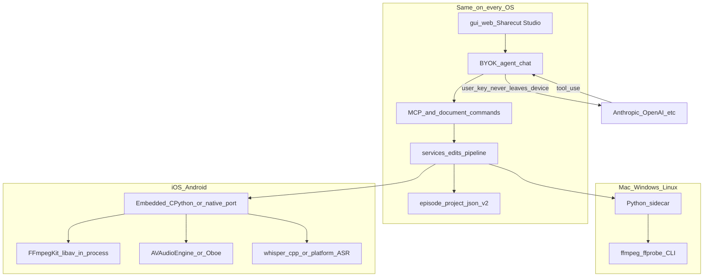

# Cross-platform Sharecut Studio and bring-your-own agent

**Status:** deferred long-horizon path. Do **not** implement this as a project now. Use it to steer architecture so a later native iOS/Android app and in-app agent do not require a rewrite.

Near-term work stays desktop packaging, episode format, MCP, and the existing phone **web** shell ([gui-mobile.md](gui-mobile.md)). This document is the detailed counterpart to the one-line pointers in [ROADMAP.md](../ROADMAP.md). When implementing, start at [When it is time to build](#when-it-is-time-to-build) so you do not re-run the 2026 research.

**Thesis:** the user talks to **their** model (API key on the device). That model calls **our** tools. Tools mutate **episode.project.json** and bounce audio through a media engine. UI is the existing React Sharecut Studio. Platforms differ only in *how* Python (or a port of it) and FFmpeg are hosted.

System assistants (Siri App Intents, Android App Functions) are optional OS glue later (play, search, share sheet). They cannot drive a full editorial pass. Do not design the product around them.

---

## Interim architectural decisions

Follow these **now**, while shipping unrelated features. They are cheap constraints; violating them is what would make native mobile or in-app BYOK expensive.

### Do

1. **Keep one media facade.** All encode/decode/filter/bounce goes through [`engines/ffmpeg.py`](../src/podcast_mcp/engines/ffmpeg.py) (`FFmpegEngine`). Do not spawn `ffmpeg` from GUI routes, MCP handlers, or new services. A later `AudioEngine` protocol (subprocess on desktop, in-process libav on phones) is a backend swap behind that class, not a second edit engine.
2. **Keep filtergraph construction in one place.** `render_timeline`, `filter_audio`, loudnorm, deess, `arnndn`, concat/acrossfade strings must stay next to `FFmpegEngine` so an FFmpegKit `execute("-y -i …")` backend can reuse them.
3. **Keep playback separate from bounce.** `PlayService` / session transport / guest Web Audio scheduler are not FFmpeg live graphs. Mobile will use AVAudioEngine / Oboe for scrub; FFmpeg stays offline render. Do not merge play and render into one “just call ffmpeg” path.
4. **Keep episode format v2 as the portable document.** Phone and PC must round-trip the same `episode.project.json` + media folder ([episode-format-v2.md](episode-format-v2.md)). Do not invent a mobile-only project schema or a second clip model.
5. **Keep the React Sharecut Studio as the only DAW UI.** Native shells are windows around [`gui/web`](../gui/web) ([gui-mobile.md](gui-mobile.md)). Do not start a SwiftUI/Jetpack timeline “just for mobile.”
6. **Keep adapters thin.** New surfaces (chat, future Siri, Shortcuts) call `services/` and document commands ([entry-points.md](entry-points.md), [capabilities.manifest.json](../contracts/capabilities.manifest.json)). If you add an in-app agent later, it is another adapter, not a fork of `EditService`.
7. **Preserve owner vs guest.** Review-share remote MCP stays a **guest** allowlist ([host-online-relay.md](host-online-relay.md) § Remote MCP, [`allowlist.py`](../src/podcast_mcp/services/remote_mcp/allowlist.py)). Do not “just enable pipeline on the share token” so a phone can edit. An owner phone is a host session, not a cooler guest link.
8. **Prefer MCP tool profiles when touching registration.** Named slices (`edit`, `transcript`, `review`, `pipeline`, `full`) are still a ROADMAP item — they are **not** implemented yet (`register_all` registers everything). They are how an in-app agent stays under LLM tool-count caps. Do not grow `register_all` as an undifferentiated dump if you are already in that code.
9. **Treat the Tauri sidecar as desktop-only.** [`gui/desktop/`](../gui/desktop/) `externalBin` / `podcast gui` process does not exist on iOS. Keep host glue thin ([desktop-packaging.md](desktop-packaging.md)). Do not put episode logic in Rust/Tauri that Python `services/` already own.
10. **Secrets stay out of the project.** If anyone adds API keys, chat history, or model prefs, they are user/device settings (Keychain / Credential Manager / Keystore), never `episode.project.json`, never the relay, never a share sidecar.
11. **Bootstrap pattern for large binaries.** First-run CDN for FFmpeg/Whisper/RNNoise ([`contracts/bootstrap-assets.json`](../contracts/bootstrap-assets.json)) is the same idea mobile will use for whisper.cpp / FFmpegKit models. Do not hardcode “must be on PATH” into new product flows; keep `resolve_ffmpeg()` / bootstrap as the seam.
12. **Timebase invariant stays.** Source-clock stored times, `SessionTimeline` for render ([architecture.md](architecture.md) § Timebase). A mobile renderer that “just uses timeline seconds in the WAV” will drift.

### Don’t

- Don’t use **ffmpeg.wasm** in the WebView as a stand-in engine (RAM/CPU for hour-long multitrack).
- Don’t rewrite render/loudnorm/deess in AVFoundation “because iOS” unless legal forbids LGPL FFmpeg — that duplicates `FFmpegEngine`.
- Don’t assume a guest share + user API key is a full phone DAW (missing pipeline, ingest, host-only mutations).
- Don’t design Siri / App Intents as the editor (no production-audio App Schema; 10 App Shortcut cap). Cursor-style tool use is the editor.
- Don’t put torch / joinqc in the GUI bootstrap path; they stay optional desktop/cloud even in the end state.
- Don’t fork document commands or clip math for a “lite” mobile apply path.

### Cheap prep (only when you are already in that file)

| If you are touching… | Leave it in a shape mobile/BYOK can use |
| -------------------- | ---------------------------------------- |
| `engines/ffmpeg.py` | Method-shaped API (`probe`, `render_timeline`, `filter_audio`, …), not scattered argv in callers |
| `mcp/tools/__init__.py` | Filterable registration (profiles), not one inseparable blob |
| Capabilities manifest | New agent-facing tools get `mcp` + service row; don’t skip the contract |
| Tauri / sidecar | Process manager only; no new domain logic in Rust |
| Deep links (`share_url.rs`) | Parse/allowlist stays OS-agnostic (`ShareDeepLink` + canonical `https://sharecut.studio/r/{token}`). Open adapters stay thin: desktop `shell.open` vs future in-app guest `/r/{token}`. Do not navigate the desktop WebView to the public origin. |
| Guest MCP allowlist | Guest stays guest; owner-on-device is a different session class |
| Settings / prefs | Device-local store with room for a later API key; not project JSON |
| Play / proxy scheduler | Keep as playback; bounce still goes through `FFmpegEngine` |

---

## What already exists (do not rebuild)

- **Document:** episode format v2 — clips, edits, transcripts, processing chains.
- **UI:** phone/tablet/desktop shells in `gui/web`.
- **Commands:** document plane ([`schemas/document-commands.schema.json`](../schemas/document-commands.schema.json)) + capability manifest.
- **Agent tools today:** local MCP stdio (full host) and share-token remote MCP (guest subset — no pipeline/ingest).
- **Desktop host:** Tauri 2 + Python sidecar + FastAPI. Media = subprocess `ffmpeg`/`ffprobe` ([`util/binaries.py`](../src/podcast_mcp/util/binaries.py)).
- **Laptop-online collab:** relay + tunnel. Fine as a *bridge* while mobile has no engine; not the first-class phone product.

Packaging rule still holds: if the user can edit **offline**, the engine belongs in the app. Relay is for guests on the internet.

---

## Bring-your-own agent (all platforms)

In-app MCP host, not an IDE, not the OS assistant.

1. User pastes Anthropic / OpenAI / compatible key (optional base URL for OpenRouter, Azure, local llama.cpp HTTP, etc.).
2. Store in the OS secret store. Never in project JSON, never on the relay, never in our cloud unless they opt into a billed proxy.
3. Chat sends messages + a **named tool profile** to that API from the device.
4. `tool_use` → same `services/` as CLI/MCP/GUI. Timeline updates via [session-sync.md](session-sync.md).
5. Default payload: transcript + tool results, **not** raw audio, unless the user opts into an audio-capable model.
6. Destructive tools (ripple, approve-all, pipeline, master) stay listen-first / confirm.
7. Owner session ≠ review-share guest.

This is how a **full editorial pass** works on a phone: the model decides; local tools apply. Cursor already proves the loop on desktop via stdio MCP. Sharecut Studio chat just hosts it.

Whenever this becomes real: **desktop chat first** (sidecar already there). Mobile chat without an on-device engine only works while a Mac/PC is reachable.

---

## Media engine: one facade, two backends

`FFmpegEngine` is CLI-shaped today: build argv, `run([ffmpeg, …])`. Methods already cover probe, `render_timeline` (concat / acrossfade / gaps / fades), mix, two-pass `loudnorm`, `filter_audio` (deesser, afftdn, arnndn, acompressor), extract, MP3 (`libmp3lame`), astats, spectrogram / showwavespic.

**Later:** extract an `AudioEngine` protocol. Desktop backend remains subprocess. iOS/Android backend is in-process **libav**.

**iOS** cannot exec a bundled `ffmpeg` binary. Compile libav\* into the `.app`. [FFmpegKitNext](https://github.com/arthenica/ffmpeg-kit-next) XCFrameworks still accept ffmpeg CLI strings (`FFmpegKit.execute("-y -i …")`), which maps onto existing argv. LGPL build only — no x264/x265/GPL extras. Publish FFmpeg source + relink objects for LGPL; counsel before App Store.

**Android:** same Kit (JNI). Prefer one in-process backend for both phones even though Android can spawn binaries more easily.

**Do not use FFmpeg for live play/scrub or ASR.** Playback: AVAudioEngine / Oboe / current HTMLAudio. ASR: whisper.cpp (Metal / Vulkan / NNAPI) or platform speech APIs (SpeechAnalyzer, on-device Android). That replaces faster-whisper, not `FFmpegEngine`.

Filters to keep in a mobile libav build: concat, acrossfade, afade, volume, loudnorm, acompressor, deesser, afftdn, arnndn + RNNoise model, astats, showspectrumpic, showwavespic, lame. Torch / joinqc stay desktop-or-cloud optional.

---

## Domain logic (Python) per platform

Cuts, fillers, inaudible bounds, and pipeline steps live in Python (`edits/`, `services/`). Media libraries do not replace that.

- **macOS / Windows / Linux:** PyInstaller/Nuitka sidecar (ROADMAP). Unchanged.
- **iOS:** no sidecar spawn. Prefer embed **CPython 3.13+** (PEP 730) calling FFmpegKit via FFI (reuses tests). PyO3/static libpython into the Tauri iOS lib is experimental. RustPython is likely too incomplete. A Swift/Rust port of `services/` is last resort (dual implementation).
- **Android:** CPython-on-Android (Chaquopy, Python-for-Android, or NDK libpython) + FFmpegKit. Budget for Tauri Android file-read issues that have bitten Python plugins.

Tauri 2 can wrap the same WebView on iOS/Android, but **desktop sidecars do not port**. Mobile host = WebView + in-process engine, not `externalBin`.

---

## Files, sandbox, background

- Projects live in the app sandbox (iOS Files picker / Android SAF). Import copies or security-scoped bookmarks. No arbitrary host `project_path`.
- Sync later: iCloud/Drive/Syncthing of the episode folder. Format is already a folder of JSON plus audio.
- Long transcribe/render: foreground + checkpoint. iOS background time will not finish a 2-hour Whisper pass.
- Binary size: FFmpegKit + whisper.cpp + CPython is large. CDN-download models on first run, same idea as desktop bootstrap.

---

## Platform matrix (target end state)

- **macOS:** Tauri `.app`, Python sidecar, ffmpeg CLI, Keychain. Full pipeline including optional joinqc.
- **Windows:** Tauri msi/nsis, same sidecar + ffmpeg, Credential Manager, WebView2.
- **Linux:** AppImage/deb, sidecar + system or bundled ffmpeg.
- **iOS / iPadOS:** WebView shell, in-process libav, AVAudioEngine play, whisper.cpp or SpeechAnalyzer, Keychain, phone UI modes. Pipeline subset on-device; joinqc optional off-device.
- **Android:** same as iOS with Oboe/AudioTrack + FFmpegKit JNI + Keystore.
- **Laptop-offline phone:** requires the mobile engine above.
- **Laptop-online phone (interim):** tunnel + authenticated **owner** tools, never a review-link guest catalog.

Laptop-offline use requires the mobile engine. It is not required for BYOK on desktop.

---

## Suggested sequence (years, not this quarter)

1. Desktop installers + frozen sidecar (in progress).
2. MCP tool profiles.
3. Desktop BYOK chat → local tools.
4. `AudioEngine` protocol; desktop still subprocess.
5. iOS (then Android) shell around `gui/web`; FFmpegKit; platform playback; sandbox import.
6. Embedded CPython (or thin native `services/`) so NL tools run without a laptop.
7. On-device ASR + bounce/export; hybrid offload for joinqc/master if needed.
8. Optional OS assistants for play/search/share — never as the editor.

---

## When it is time to build

Future agents: **do not re-derive** “Siri vs BYOK” or “can FFmpeg run on iOS.” That research is below. Read this section, then only the linked files. Re-check **external** URLs and library versions; they rot. In-repo paths are the contract.

Research snapshot: **August 2026** (iOS 27 / macOS 27 developer season). Update the snapshot date when you re-verify.

### Do not re-research (conclusions that should still hold)

- **Editor = in-app tool-calling with the user’s model key**, same shape as Cursor + local MCP. Not Siri, not Shortcuts as the brain.
- **Siri App Intents** (iOS/macOS 27): App Schemas are consumer domains (mail, photos, **play** a podcast). There is no DAW / audio-production schema. Custom intents: Shortcuts + at most **10** App Shortcuts. Optional later for play/search/open only. Apple: [App Intents](https://developer.apple.com/documentation/appintents), [schema domains](https://developer.apple.com/documentation/appintents/app-schema-domains), [`.audio` is playback](https://developer.apple.com/documentation/appintents/app-schema-domain-audio) (`podcastShow` / `podcastEpisode` / `playAudio`). WWDC26: [Build intelligent Siri experiences with App Schemas](https://developer.apple.com/videos/play/wwdc2026/240/) — *schemas make actions Siri-executable*; plain App Intents are the rest of the system.
- **iOS cannot `posix_spawn` a bundled `ffmpeg` CLI.** Desktop `FFmpegEngine` is subprocess; phones need **in-process libav**. FFmpegKit is the CLI-string compatibility layer, not a new DSP design.
- **Guest remote MCP ≠ owner phone.** Pipeline, ingest, episode create, host-speaker play stay denied on share tokens even with `mcp`.

### In-repo start list (read in this order)

1. This file (thesis + interim rules + this section).
2. [`engines/ffmpeg.py`](../src/podcast_mcp/engines/ffmpeg.py) — the `AudioEngine` contract (methods below).
3. [`tests/test_ffmpeg_engine.py`](../tests/test_ffmpeg_engine.py) + [`tests/test_ffmpeg_integration.py`](../tests/test_ffmpeg_integration.py) + [`tests/test_timeline_render.py`](../tests/test_timeline_render.py) — a libav backend must keep these green (or an equivalent suite).
4. [`mcp/tools/__init__.py`](../src/podcast_mcp/mcp/tools/__init__.py) `register_all` — host tool surface; live catalog https://docs.sharecut.studio/#/capabilities
5. [`schemas/document-commands.schema.json`](../schemas/document-commands.schema.json) — GUI mutations; chat can call these instead of every MCP tool.
6. [`services/remote_mcp/allowlist.py`](../src/podcast_mcp/services/remote_mcp/allowlist.py) + [host-online-relay.md](host-online-relay.md) § Remote MCP — what a **share** may never do.
7. [`gui/web`](../gui/web) + [gui-mobile.md](gui-mobile.md) — UI to wrap, not replace.
8. [`gui/desktop/`](../gui/desktop/) + [desktop-packaging.md](desktop-packaging.md) — desktop host; **not** a mobile template.
9. [persistence.md](persistence.md) — API keys are a **new user/device store**, not project JSON / share registry / session sqlite.
10. Skills the in-app agent should follow (do not fork): `podcast-edit-natural-language`, `podcast-tighten-dialogue`, `podcast-focus-episode`, `podcast-inaudible-cuts`, `podcast-transcript-workflow`, `podcast-play-audition`, `podcast-bounce-export`, `podcast-master-export`, `podcast-audio-cleanup`, `podcast-pipeline-run`. Hub list: [`.agents/skills/`](../.agents/skills/).

`FFmpegEngine` public methods to wrap (August 2026): `check_available`, `probe`, `segments_after_edits`, `build_track_filter`, `render_track_to_file`, `render_timeline`, `join_audio_parts`, `apply_gain`, `mix_tracks`, `measure_loudnorm_stats`, `measure_loudness_full`, `master_loudnorm`, `filter_audio`, `export_audio`, `export_mp3`, `measure_loudness`, `render_dialogue_track`, `extract_segment`, `render_spectrogram`, `render_showwavespic`, `render_stacked_showwavespic`, `annotate_time_marks`. Callers besides the engine itself include `PlayService`, `media_store`, `proxy_media`, `timeline_render`, `ingest/consolidate`, `edits/audio_quality`, `edits/audition_context`, `export/audio`, pipeline helpers.

Libav filters used in product code (enable these in an LGPL iOS/Android build): `acrossfade`, `afade`, `volume`, `loudnorm`, `acompressor`, `deesser`, `afftdn`, `arnndn` (+ RNNoise `.rnnn` from bootstrap), `astats`, `showspectrumpic`, `showwavespic`, `drawbox`, optional `drawtext` (needs libfreetype; overlay falls back to `drawbox` or a copy), concat demuxer, `libmp3lame`. See `build_track_filter` and [audio-engineering.md](audio-engineering.md).

### External links to re-verify (do not treat as frozen)

Media / FFmpeg:

- [FFmpegKitNext](https://github.com/arthenica/ffmpeg-kit-next) (successor to archived FFmpegKit; iOS/Android XCFrameworks + CLI-string execute). Releases around v8.x / FFmpeg 7–8 in 2026 — pin a version.
- [FFmpegKit commercial / LGPL notes](https://github.com/arthenica/ffmpeg-kit/wiki/Using-FFmpegKit-in-Commercial-Applications) — App Store static-link vs LGPL relink; **no GPL extras** (x264/x265).
- [FFmpeg legal](https://www.ffmpeg.org/legal.html) — confirm the configure flags you enable are still LGPL.
- [whisper.cpp](https://github.com/ggml-org/whisper.cpp) — Metal / Vulkan / NNAPI; replaces faster-whisper on device, not `FFmpegEngine`.

Python on mobile:

- [PEP 730 – CPython on iOS](https://peps.python.org/pep-0730/) — preferred DRY path vs rewriting `services/` in Swift.
- [CPython iOS README](https://github.com/python/cpython/blob/main/iOS/README.rst) (path may move).
- [Chaquopy](https://chaquo.com/chaquopy/) / [python-for-android](https://github.com/kivy/python-for-android) — Android options.
- [tauri-plugin-python](https://github.com/marcomq/tauri-plugin-python) — iOS RustPython/PyO3 experiments; Android file-read issue historically [tauri#11823](https://github.com/tauri-apps/tauri/issues/11823). Re-check before betting the host on it.

Shells / playback / ASR:

- [Tauri 2 sidecars](https://v2.tauri.app/develop/sidecar/) — desktop `externalBin` only.
- [Tauri 2 mobile](https://v2.tauri.app/start/prerequisites/) — iOS/Android are static libs into Xcode/Gradle, not sidecars.
- Apple [AVAudioEngine](https://developer.apple.com/documentation/avfaudio/avaudioengine), [SpeechAnalyzer](https://developer.apple.com/documentation/speech) (on-device ASR direction as of iOS 26+; name/API may have shifted — search current Speech framework).
- Android [Oboe](https://github.com/google/oboe), [SAF](https://developer.android.com/guide/topics/providers/document-provider).

Apple Intelligence (optional OS glue only):

- [Apple Intelligence for developers](https://developer.apple.com/apple-intelligence/)
- [App Shortcuts HIG](https://developer.apple.com/design/human-interface-guidelines/app-shortcuts) — max 10 shortcuts.
- WWDC26: [Make your app available to Siri](https://developer.apple.com/videos/play/wwdc2026/344/), [App Intents new capabilities](https://developer.apple.com/videos/play/wwdc2026/345/) (`LongRunningIntent`, `SyncableEntity` — useful for pipeline Live Activities / Mac↔phone entity IDs, **not** for NL editing).

BYOK HTTP (implement as OpenAI-compatible + Anthropic; do not hardcode one vendor):

- Anthropic Messages + tool use, OpenAI Chat Completions / Responses + tools, optional OpenRouter-compatible `base_url`.

### Re-evaluate these decisions at kickoff (do not assume 2026 answers)

- FFmpegKit vs raw libav FFI (Kit saves CLI-string reuse; Kit’s FFmpeg version may lag desktop bootstrap).
- Embedded CPython vs Swift/Rust `services/` port (DRY vs binary size / App Review).
- whisper.cpp vs Apple/Android on-device ASR (quality vs size vs “no extra model download”).
- Tauri mobile WebView vs a thin WKWebView/Chrome Custom host (Tauri if desktop sharing is still worth it).
- In-app chat transport: MCP stdio-in-process vs HTTP to local FastAPI vs document commands only (start from document commands + `edit` MCP profile).
- Laptop-offline use requires the mobile engine rather than a review-link guest session.
- Store vs sideload: LGPL+static iOS is easier on TestFlight / direct Mac download than App Store.

### Kickoff checklist (update this list as you complete it)

- [ ] Re-read interim rules; grep for `ffmpeg` / `ffprobe` outside `engines/ffmpeg.py` and `util/binaries.py`.
- [ ] Confirm MCP tool profiles exist (or add them first — ROADMAP item).
- [ ] Extract `AudioEngine` protocol; desktop subprocess stays default; add a failing iOS/Android backend test harness.
- [ ] Pin FFmpegKitNext + enabled filters; document LGPL source/object offer.
- [ ] Desktop BYOK chat against local tools + Keychain before any phone engine.
- [ ] Owner session class ≠ guest share token (new auth, not `allowlist.py` expansion).
- [ ] User-settings store for keys ([persistence.md](persistence.md) — new row, not episode JSON).
- [ ] Sandbox import (Files / SAF) + no `project_path` from the model.
- [ ] Foreground transcribe/render + resume; do not rely on iOS background time.
- [ ] First-run model CDN (extend [`contracts/bootstrap-assets.json`](../contracts/bootstrap-assets.json)).
- [ ] Point this snapshot date forward when versions are pinned.

---

## Out of scope until this is an active project

- Implementing FFmpegKit, embedded CPython, or in-app chat now.
- Teaching system Siri a DAW vocabulary.
- Dumping the full MCP catalog into Shortcuts or App Intents.
- Running torch/joinqc on phones as v1.

**Bottom line:** one document, one UI, one BYOK agent. Desktop = Python + ffmpeg CLI. Phones = same tools + in-process FFmpeg libraries + platform playback/ASR. Until then, do not scatter ffmpeg, do not conflate guest MCP with an owner device, and do not put a second DAW in a native UI toolkit.
