# Issue #20 visual comparison

These captures use the same deterministic Playwright episode fixture and
viewport before and after the design polish change. **Before** is the light
theme on `main` before #20; **after** shows the facelift in both themes.
Desktop views are 1440 × 900; the phone view is 390 × 844 (the Listen screen
with its hero). The capture path is `gui/web/e2e/design-polish.spec.ts`
(`DESIGN_POLISH_SCREENSHOT_DIR`). The empty timeline uses a separate
disposable empty project with `EMPTY_STAGE_SCREENSHOT_DIR` set during capture.

| View | Before (light) | After (light) | After (dark) |
| --- | --- | --- | --- |
| Timeline | 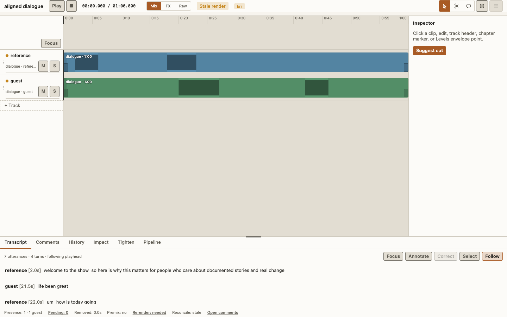 | 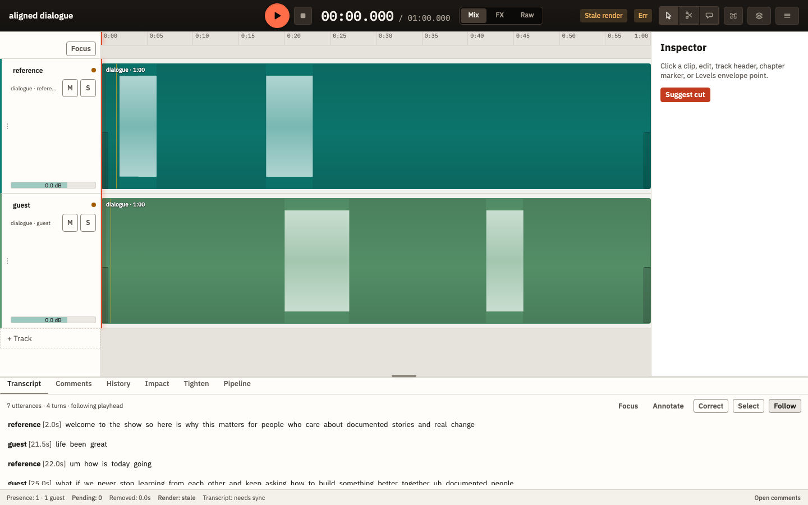 | 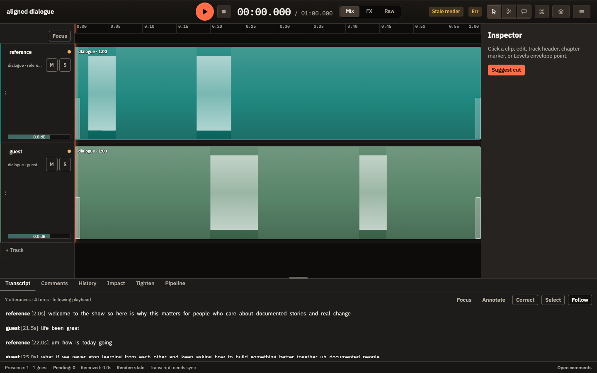 |
| Inspector | 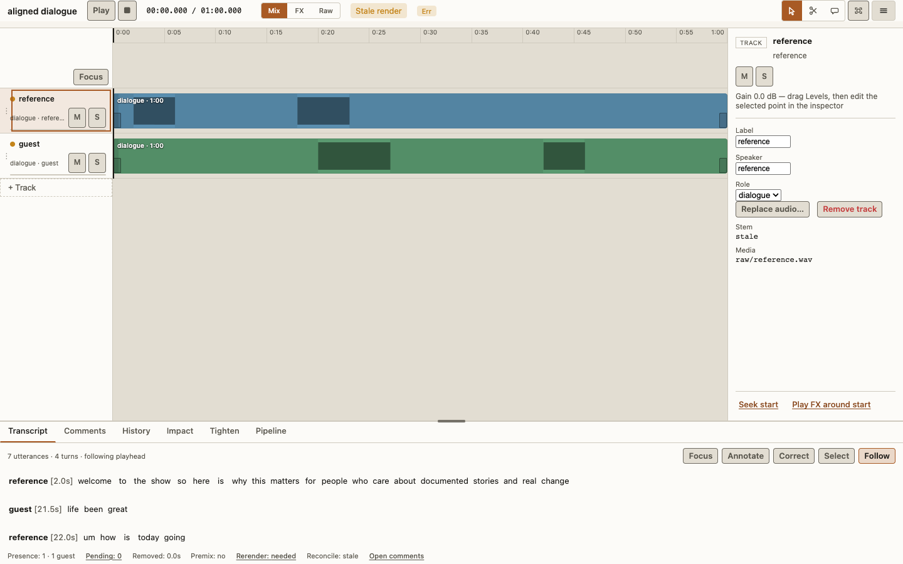 | 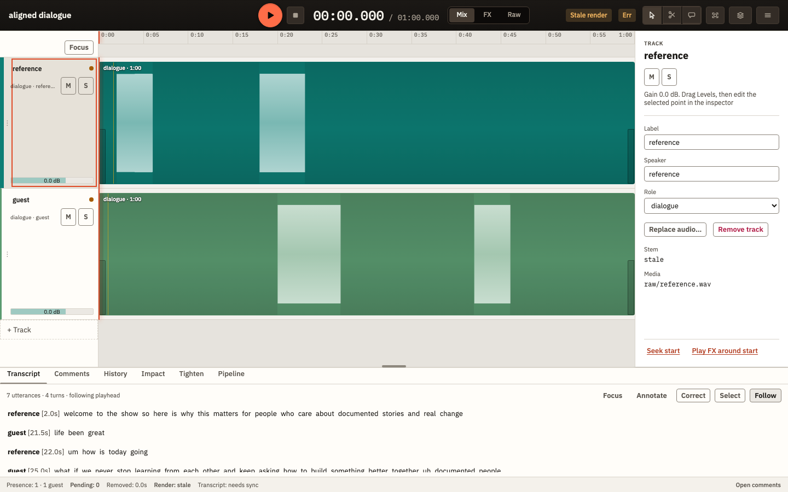 | 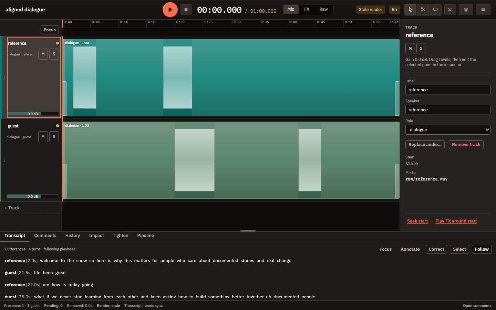 |
| Share dialog | 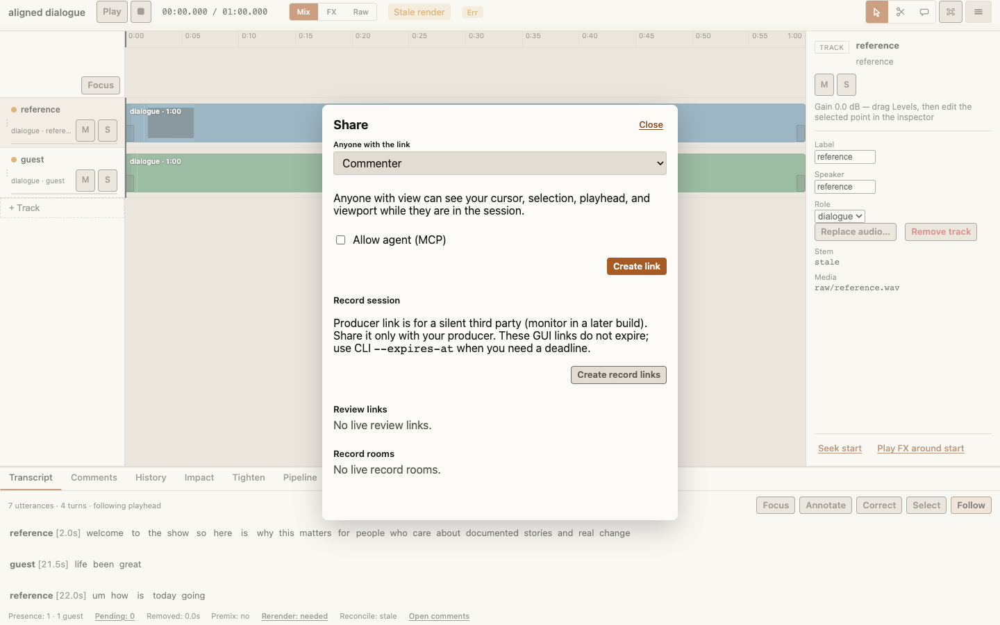 | 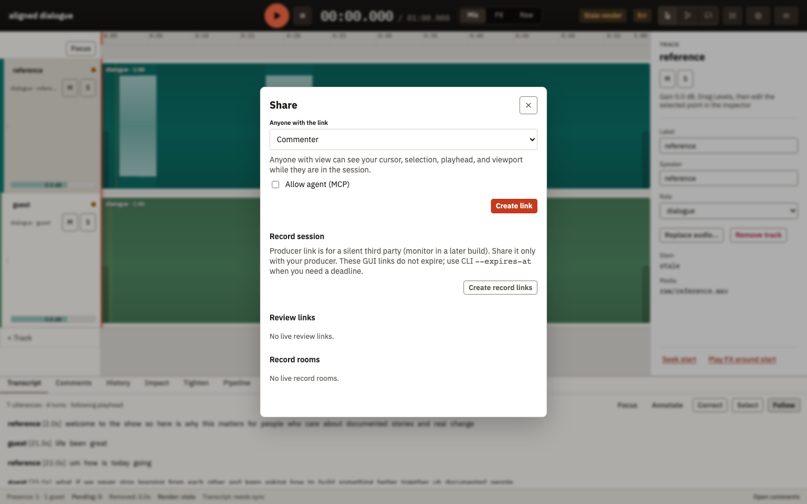 | 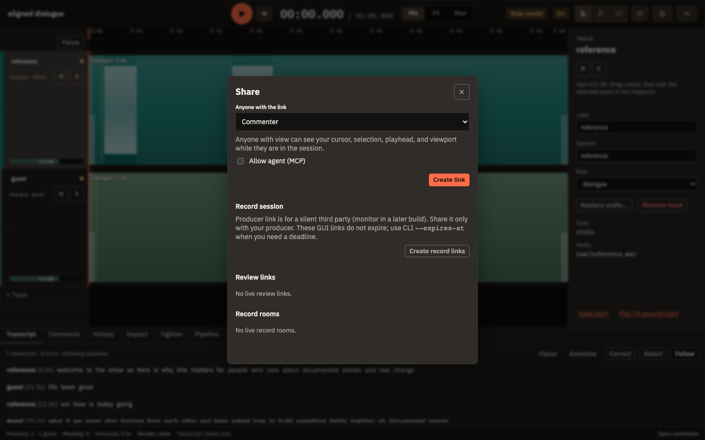 |
| Empty state | 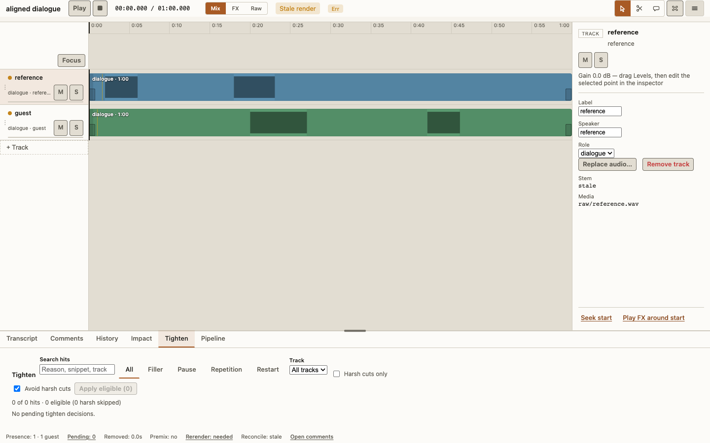 | 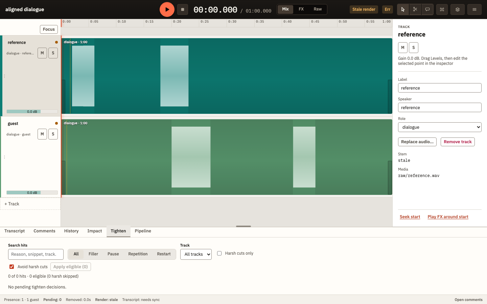 | 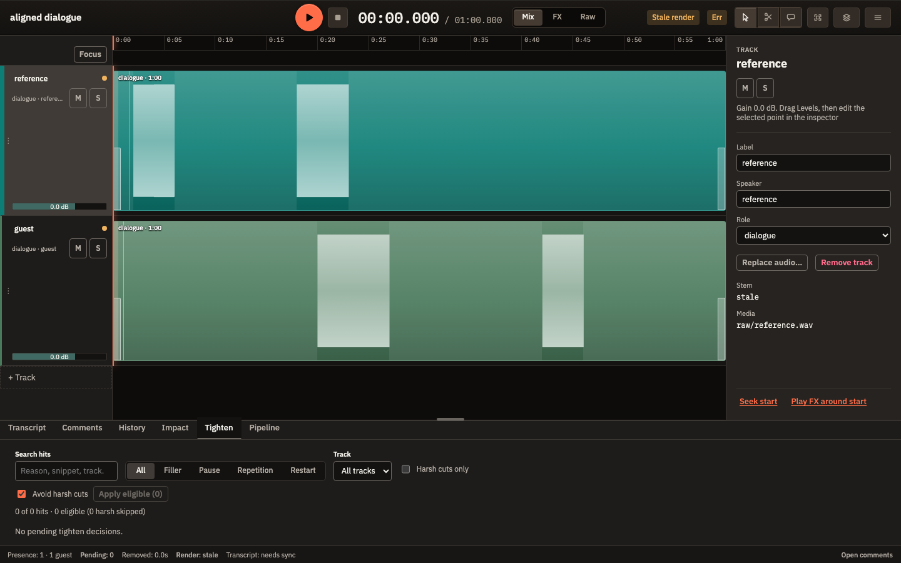 |
| Empty timeline | — | 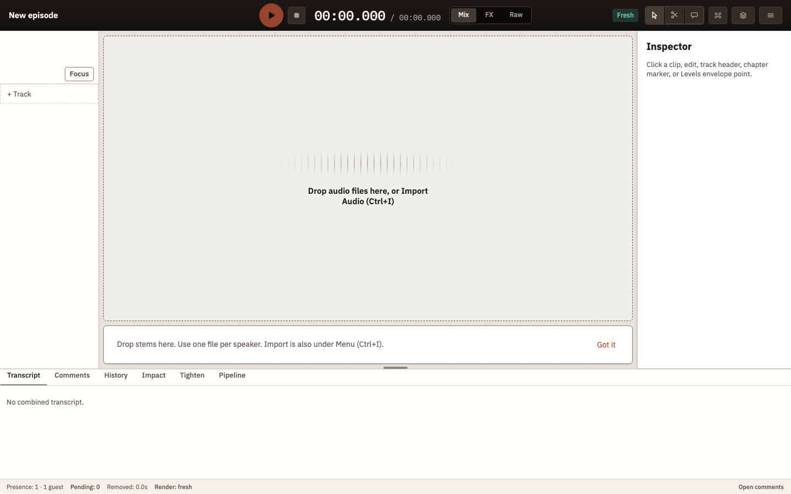 | 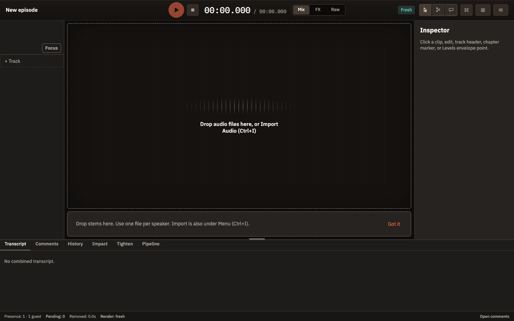 |
| Phone Listen | 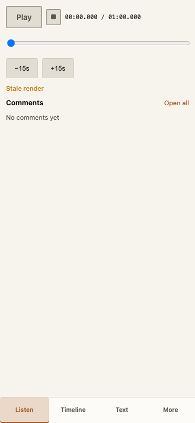 | 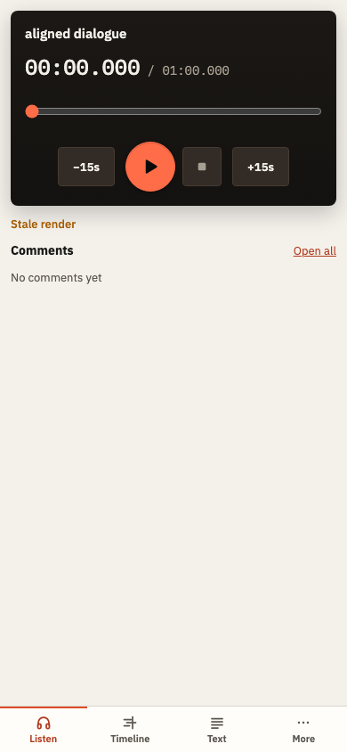 | 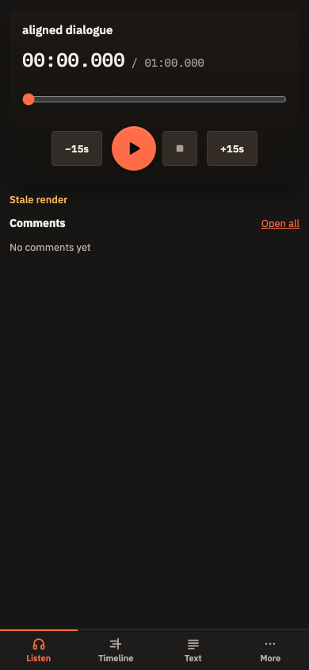 |

Storybook has the reusable pieces behind these views for iteration:
`Atoms/SurfaceLadder` (palette from live tokens), `Templates/Transport`,
`Templates/ListenHero`, `Molecules/SegmentedControl`, `Molecules/Menu`,
`Atoms/Pill`, `Atoms/Timecode`, `Atoms/EmptyState`, and `Atoms/Icon`.
