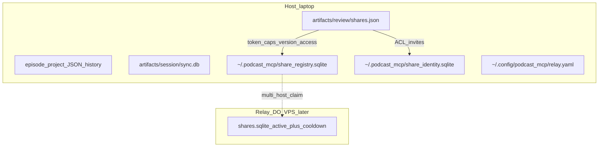

# Persistence catalog

Durable stores used by Podcast MCP. **Before adding a new JSON sidecar or
sqlite file**, read this doc and extend an existing store. Update this file and
[AGENTS.md](../AGENTS.md) in the same change.

## Inventory

| Store | Technology | Role | Agent rule |
|-------|------------|------|------------|
| Episode project + history | JSON + history snapshots | Editorial source of truth; snapshots publish before the atomically replaced `history/index.json` | Use `ProjectWorkspace.mutate` / services. Each commit, history-index write and undo/redo/goto takes `util.project_state.project_commit_lock` (in-process lock plus a file lock at `artifacts/episode.project.json.lock`; after 30 s it raises `filelock.Timeout`). It orders writes only and does not prevent lost updates; see [history.md § Storage layout](history.md#storage-layout) |
| Transcript context | YAML (`transcript_context.yaml`) | Episode glossary and vocabulary revision; each project transcript stores the `vocabulary_revision` it was produced with | Use `TranscriptPrecorrectService`; `artifacts/transcript_context.yaml.lock` coordinates writers (re-entrant, 10 s timeout), and YAML is replaced atomically |
| Align accept gate | JSON sidecar (`artifacts/align_accept_status.json`) | Listen/nudge gate after `align_tracks` | Via `AlignAcceptService` / `edits.align_accept_status`; do not hand-edit |
| Conversation align artifact | JSON (`artifacts/alignment/conversation_align.json`) | Last applied/planned clip offsets | Written by `run_conversation_align` after a successful apply |
| Transcript refine gate | JSON sidecar (`artifacts/transcript_refine_status.json`) | Agent gate after precorrect | Via `TranscriptRefineService` / `edits.transcript_refine_status`; adjacent `.lock` file only coordinates writers and stores no decision |
| Session sync / document log | **sqlite** (`session_sync/`) | DAW command authority | Extend `services/session_sync/`; do not invent parallel logs. Presence (`clients.meta`) is ephemeral in the same DB and is never journaled. All stores sharing `artifacts/session/sync.db` use the shared connection initializer, which serializes WAL setup and skips switching modes when already in WAL before schema setup. |
| **Share registry** | **sqlite** active + cooldown | Globally unique public tokens (host-local now); `kind` / `role` / `session_id` columns | Use `edits/review_shares` + `edits/share_registry`; pin `PODCAST_SHARE_REGISTRY`; backup via `podcast review backup-registry`; do not hand-edit or fork a third index |
| Project `shares.json` | JSON sidecar | Per-episode share metadata (caps, `general_access`, `require_sign_in`, record `kind`/`role`/`session_id`) | Via `ShareService` / `review_shares` APIs only |
| **Share identity** | **sqlite** users + ACL + sessions + passkeys | Restricted-share principals; verified-email merge | Use `services/share_auth/`; pin `PODCAST_SHARE_IDENTITY`; never commit OAuth client JSON |
| **Host prefs (cache)** | YAML (`~/.cache/podcast_mcp/prefs.yaml`) | Machine Whisper model (`whisper_model`) | `whisper_models.persist_whisper_model` / `resolve_whisper_model`; also `PODCAST_WHISPER_MODEL` env |
| **Host relay config** | YAML (`~/.config/podcast_mcp/relay.yaml`) | Relay connection and optional S3-compatible object store | Read through `runtime_config.load_host_runtime_config`; secrets may be overridden by environment; never commit a populated copy |
| Waveform pyramids | Binary `.wfpk` files (`artifacts/peaks/{kind}-{id}.{key}.wfpk`) | Derived, content-addressed min/max/RMS cache per media file ([waveform.md](waveform.md)); the key hashes the media's workspace path, size and mtime, so a file is never stale | Deletable at any time (rebuilt on demand). Write only through `engines/waveform_pyramid` (atomic temp + `os.replace`); per-ref pruning keeps the live and previous key, and `services/waveform.gc_pyramids` drops week-old orphans and week-old legacy `artifacts/peaks/*.json` |
| Render caches + hash sidecars | WAV + one-line hash files (`artifacts/tracks/{id}.wav` + `{id}.hash`, `artifacts/premix.wav` + `premix.hash`, `artifacts/mastered.wav` + `mastered.hash`) | Derived audio. Each `.hash` fingerprints what its WAV was built from (stem: `track_render_hash`; premix: `mix_render_hash` of the tracks and gains it mixed; master: `master_source_hash` of the premix it read), so render status, export and review publish know when to rebuild or refuse | Deletable at any time (rebuilt on demand). Write only through `engines/play_audit` helpers and the pipeline steps; premix and master swap in whole via temp + `os.replace`. Never hand-edit |
| Relay registry (future) | sqlite/Postgres on DO | Multi-host UNIQUE allocator | Same schema + claim API implementing `ShareRegistryProtocol`; see [share-tokens.md](share-tokens.md) |
| Recording session | share registry + `shares.json` (`kind` / `session_id` / role) + prefixed tables in `artifacts/session/sync.db` | Record **links + lobby/consent + local OPFS keepers + mix-minus + chunk ACK + timeline landing + live comments + room-tone beds** shipped. Guest OPFS beds stay local until Accept; host ingest is `kind=room_tone`. Beds land atomically at `raw/room-tone/{session}/{participant}.wav` on `track.room_tone` (the older shared `raw/room-tone/{participant}.wav` path still resolves for projects that used it). Upload rows retain `land_failed_ns` for landing retry and `expected_parts` for finalized WAVs, declared by current clients or inferred from the final sequence for older tabs. OPFS write failures latch a local-capture warning. Keeper metadata records the trusted join offset, explicit `complete` state, and SHA-256 plus byte length for newly finalized WAVs; only `complete:true` files (or older-client metadata whose WAV header length verifies) are uploadable, and pending segments upload only after they close. Readable pending PCM can be recovered explicitly and atomically, while zero-byte or malformed files remain available for export with an accurate loss message. Incomplete local WAVs do not block Leave after complete segments upload. A finalized local WAV is reclaimed only after fresh `file_ack` + confirmed `landed` and a match among the local WAV, metadata fingerprint, and host status; legacy or mismatched WAVs stay available for download. A pending `complete: false` WAV is never reclaimed. Metadata-free WAVs become eligible after seven days; background upload polling prunes only the current stopped room, and their `.json` marker reserves the segment index. Older closed rooms await origin-wide cleanup (#381). The metadata JSON remains as the monotonic segment marker and distinguishes reclaimed, pruned, and missing slots for upload and recovery. Host Start and recorded-guest Accept are blocked until a disposable OPFS write/close/remove preflight succeeds; unavailable OPFS is a safe block with a compatible-browser retry control, not an upload-only fallback. A guest rejoining between takes must preflight and consent again. Landing is not a cross-store transaction between the upload rows in `sync.db` and the project JSON commit, so a re-ACK or revoke racing that commit is compensated by a `record_land_rollback` mutation that reverts the stale item's project registration rather than marking it landed (see [recording-session.md § Timeline landing](recording-session.md#where-state-lives)). | No new sqlite file or host sidecar. Guest/host keepers live in origin-private OPFS (`Sharecut Recordings/`). WebRTC Signal is ephemeral hub fanout. Chunk ACK + `join_offset_ms` + take tombstones + live comments: [recording-session.md](recording-session.md#where-state-lives) |

## When to extend which store

| Need | Prefer |
|------|--------|
| Undoable episode / transcript / clip / comment edits | `ProjectWorkspace.mutate` → project JSON + history |
| Append-only DAW / document commands, session authority | `services/session_sync/` sqlite (`artifacts/session/sync.db`) |
| Public ID that must be unique + cooldown / reuse policy | Share registry pattern (`edits/share_registry.py`) |
| Per-episode share caps / version binding / general access | `artifacts/review/shares.json` via ShareService |
| Record-session roster / consent / takes | `services/record/` on prefixed `SyncStore` tables in `artifacts/session/sync.db` ([session-sync.md § Recording session](session-sync.md#recording-session)) |
| Record-session chunk / ACK manifests | `services/session_sync/` sqlite — dedicated tables ([recording-session.md](recording-session.md#where-state-lives)) |
| Record-session live comments | `record_live_comments` in `artifacts/session/sync.db` ([recording-session.md](recording-session.md#live-comments)) |
| Restricted ACL, sessions, magic links, passkeys, agent credentials | `services/share_auth/` → `share_identity.sqlite` |
| Machine-wide ASR model choice | Cache `prefs.yaml` (`whisper_models.py`) |

**Anti-pattern:** a new ad-hoc `*.json` index or one-off DB under `~/.podcast_mcp/`
or `artifacts/` without updating this catalog, AGENTS.md, and tests.

## Code pointers

| Concern | Module |
|---------|--------|
| Project load / history commit | `services/workspace.py` (`ProjectWorkspace`), `history/session.py` |
| Session sync sqlite | `services/session_sync/` (reference for sqlite access patterns) |
| Share UNIQUE pools | `edits/share_registry.py` (`ShareRegistryProtocol` / `SqliteShareRegistry`) |
| Share create / lookup / revoke / registry backup | `edits/review_shares.py`, `services/share.py`, `podcast review backup-registry` |
| Share identity / Restricted ACL | `services/share_auth/` (`ShareIdentityStore`, OAuth loaders, `/auth/*`) |
| Host Whisper model preference | `whisper_models.py` → `~/.cache/podcast_mcp/prefs.yaml` |
| Algorithm detail | [share-tokens.md](share-tokens.md) |

## Design notes

Introducing the share registry is the start of intentional **host-local durable
registries** beyond episode JSON. Session sync remains the reference for
append-only / command-log sqlite. Share registry is the reference for
**UNIQUE(public_id) + cooldown** registries. Prefer those patterns over
scattering new files.

History snapshots follow the same durable-publication rule: write the unique
snapshot first, then atomically replace `history/index.json`. Readers therefore
see a complete prior or complete current generation while an index update is in
flight.
`ReviewService.publish` checks the canonical project after a late persistence
error: an uncommitted version has its new history entries and media removed,
while a version already saved in the project retains both.
