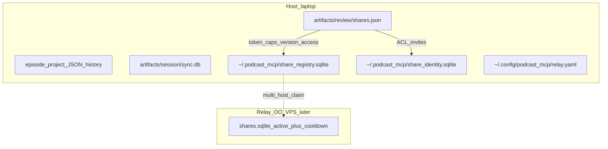

# Persistence catalog

Durable stores used by Podcast MCP. **Before adding a new JSON sidecar or
sqlite file**, read this doc and extend an existing store. Update this file and
[AGENTS.md](../AGENTS.md) in the same change.

## Inventory

```mermaid
flowchart TB
  subgraph host [Host_laptop]
    proj[episode_project_JSON_history]
    syncDb[artifacts/session/sync.db]
    shareJson[artifacts/review/shares.json]
    shareReg["~/.podcast_mcp/share_registry.sqlite"]
    shareId["~/.podcast_mcp/share_identity.sqlite"]
    relayCfg["~/.config/podcast_mcp/relay.yaml"]
  end
  subgraph relayFuture [Relay_DO_VPS_later]
    relayDb[shares.sqlite_active_plus_cooldown]
  end
  shareJson -->|token_caps_version_access| shareReg
  shareJson -->|ACL_invites| shareId
  shareReg -.->|multi_host_claim| relayDb
```

| Store | Technology | Role | Agent rule |
|-------|------------|------|------------|
| Episode project + history | JSON + history snapshots | Editorial source of truth; snapshots publish before the atomically replaced `history/index.json` | Use `ProjectWorkspace.mutate` / services; long jobs call `ProjectWorkspace.checkpoint()` then `save_merged()` instead of `save()` ([architecture.md § Staleness](architecture.md#staleness)). Each commit, history-index write and undo/redo/goto takes `util.project_state.project_commit_lock` (in-process lock plus a file lock at `artifacts/episode.project.json.lock`; after 30 s it raises `filelock.Timeout`). `ProjectWorkspace.transaction()` holds it from the reload through the commit, so a stale workspace never overwrites another process's commit (#213). The index and transcript caches skip identical writes and repair missing or damaged mirrors. A reused `ProjectStore` skips transcript-cache serialization and reads when its deep-copied transcript baseline and cache file signatures remain unchanged; a changed, missing, or damaged mirror and a failed mirror write are retried on a later commit. Canonical project saves and history writes still run for every commit. History trims old undo entries toward a 400-snapshot limit while preserving redo, deleting only explicitly pruned files after canonical replacement. See [history.md § Storage layout](history.md#storage-layout). `document_sync.last_command` rides the same commit as the document-plane command it records, for crash recovery — see [session-sync.md § Command identity and retries](session-sync.md#command-identity-and-retries) — and is not part of history snapshots (undo/redo never touch it). Its `payload` is stored unredacted: guest `ProjectView` is an allowlist that never includes `document_sync`, and any path that dumps the whole project for another audience (export, backup, debug endpoint) must drop it or reduce it as `sanitize_guest_document_event` does (`podcast info` omits it) |
| Transcript context | YAML (`transcript_context.yaml`) | Episode glossary and vocabulary revision; each project transcript stores the `vocabulary_revision` it was produced with | Use `TranscriptPrecorrectService`; `artifacts/transcript_context.yaml.lock` coordinates writers (re-entrant, 10 s timeout), and YAML is replaced atomically |
| Transcript ASR cache | JSON (`transcripts/{id}_{audio16}_{inputs16}.json`) | Derived Whisper output keyed by audio hash, model, language and prompt; ASR also reads the older `{id}_{audio16}.json` name (never migrated) when no prompt is set and caches are in use (a forced re-transcribe reads neither). Not authoritative: the project JSON wins | Deletable at any time. Write only through `TranscriptionEngine.transcribe_job`; written atomically, and an unreadable cache counts as a miss; pruning is #392 |
| Align accept gate | JSON sidecar (`artifacts/align_accept_status.json`) | Listen/nudge gate after `align_tracks`; a person's done / waive also records per-clip relative drift (`accepted_drift`) for export QC | Via `AlignAcceptService` / `edits.align_accept_status`; do not hand-edit |
| Conversation align artifact | JSON (`artifacts/alignment/conversation_align.json`) | Last applied/planned clip offsets (incl. `candidate_offset_sec` / `acoustic_confirmed`, each clip's placement after apply as `source_id` / `source_start` / `source_end` / `rel_drift_sec`, and the `large_move_sec` the scorer ran with) | Written by `run_conversation_align` after a successful apply |
| Transcript refine gate | JSON sidecar (`artifacts/transcript_refine_status.json`) | Agent gate after precorrect | Via `TranscriptRefineService` / `edits.transcript_refine_status`; adjacent `.lock` file only coordinates writers and stores no decision |
| Session sync / document log | **sqlite** (`session_sync/`) | DAW command authority | Extend `services/session_sync/`; do not invent parallel logs. Snapshot read-modify-writes (`append_and_apply`, `mutate_snapshot`, `reset`) are one `BEGIN IMMEDIATE` transaction for every table prefix. Write transactions use `util.sqlite_tx.immediate_transaction`. Lock order is the project lock (`ProjectWorkspace.transaction()`), then the sqlite write lock, never the reverse. Presence (`clients.meta`) is ephemeral in the same DB and is never journaled. All stores sharing `artifacts/session/sync.db` use the shared connection initializer, which serializes WAL setup per database file within the process (dropping that in-process lock once the file is in WAL), runs the one-time switch with the busy handler off and retries it every 50 ms for up to 10 s while another process holds the lock (busy/locked), then restores the shared 5 s busy timeout (`util.sqlite_tx.DEFAULT_BUSY_TIMEOUT_PRAGMA`) for the store's writes, and skips switching modes when already in WAL before schema setup. `GET /api/session/meta` and `GET /api/project/meta` never parse the project or create `sync.db` / `document.db`: session meta reports the snapshot row's `updated_at_ns` and serialized-snapshot byte length as `mtime_ns` / `size` (not a WAL-aware file stat, since presence heartbeats and Acks write the WAL without a durable commit) and project meta reads `document.db`'s journal `server_seq` directly. sync.db and document.db stores share one process cache (`session_sync/log.py` `cached_sync_store`); read-only meta paths use `cached_sync_store_if_exists`, which never creates the file (it opens with a sqlite `mode=rw` URI with an empty authority, so a Windows UNC workspace works and even a concurrent delete from another process is not undone). Read errors on these meta paths go through `session_sync.service.best_effort_meta`: they report the store as missing, and a corrupt file logs one warning per resolved store path (re-armed after a successful read). Out-of-band mutations append an `ExternalMutate` row to `document.db` via `publish_document_changed`, so every announced change advances `server_seq` (#661). The document `commands` table is append-only: it grows with DAW edits and with every MCP mutating tool call, record land/discard and host/guest/REST comment action (one `ExternalMutate` row each). Nothing prunes, compacts or deletes it (`SyncStore.reset` wipes a store's commands, but only the record-session store calls it, in `services/record/service.py`). While a GUI socket is open, the GUI process's cross-process watcher (`services/cross_process_sync.py`) reads both journals' `server_seq` every 0.5 s through the same `cached_sync_store_if_exists` / `best_effort_meta` path as the meta routes (it never creates either file), and fans out a foreign advance through the in-process hub (#695). It adds no store. |
| **Share registry** | **sqlite** active + cooldown | Globally unique public tokens (host-local now); `kind` / `role` / `session_id` columns | Use `edits/review_shares` + `edits/share_registry`; pin `PODCAST_SHARE_REGISTRY`; backup via `podcast review backup-registry`; do not hand-edit or fork a third index. Write transactions use `util.sqlite_tx.immediate_transaction`. |
| Project `shares.json` | JSON sidecar | Per-episode share metadata (caps, `general_access`, `require_sign_in`, record `kind`/`role`/`session_id`) | Via `ShareService` / `review_shares` APIs only |
| **Share identity** | **sqlite** users + ACL + sessions + passkeys | Restricted-share principals; verified-email merge | Use `services/share_auth/`; pin `PODCAST_SHARE_IDENTITY`; never commit OAuth client JSON |
| **Host prefs (cache)** | YAML (`~/.cache/podcast_mcp/prefs.yaml`) | Machine Whisper model (`whisper_model`) | `whisper_models.persist_whisper_model` / `resolve_whisper_model`; also `PODCAST_WHISPER_MODEL` env |
| **Desktop CLI offer** | Marker (`cli-tools-prompted-v1`) in Tauri's app config directory | Records that the packaged app showed its one-time native command-line-tool offer | Native desktop host only; the Install/Remove menu actions remain available |
| **Host relay config** | YAML (`~/.config/podcast_mcp/relay.yaml`) | Relay connection and optional S3-compatible object store | Read through `runtime_config.load_host_runtime_config`; secrets may be overridden by environment; never commit a populated copy |
| Waveform pyramids | Binary `.wfpk` files (`artifacts/peaks/{kind}-{id}.{key}.wfpk`) | Derived, content-addressed min/max/RMS cache per media file ([waveform.md](waveform.md)); the key hashes the media's workspace path, size and mtime, so a file is never stale | Deletable at any time (rebuilt on demand). Write only through `engines/waveform_pyramid` (atomic temp + `os.replace`); per-ref pruning keeps the live and previous key, and `services/waveform.gc_pyramids` drops week-old orphans and legacy `artifacts/peaks/*.json` (at once when that track has a pyramid, else week-old) |
| Review publication staging and failure quarantine | `artifacts/review/.staging-review-*`, `.failed-review-*` | Complete review WAV/MP3 media is promoted atomically with a no-replace rename while holding `project_commit_lock`; the WAV is hashed outside that lock through a pinned descriptor and checked by file identity after promotion. The owned, non-shared-writable review root is validated before media writes; each stage is mode 0700 and holds an active directory lease. Cleanup uses pinned descriptors. Outside both project locks, each publish streams all review entries in O(N) time, retains at most 32 oldest eligible names, and deletes at most 32. Private stages or owned, identity-matched quarantines older than 24 hours are reclaimed; active stages are skipped regardless of age. Untrusted markers, writable review roots, legacy and mismatched entries require manual inspection. Review publishing through CLI, MCP and share surfaces is unavailable on Windows: the current safe path needs descriptor-relative traversal and an atomic no-replace directory rename, and no equivalent Windows implementation has been validated. | Do not reference staging or quarantine paths from project JSON |
| Render caches + hash sidecars | WAV + hash files (`artifacts/tracks/{id}.wav` + `{id}.hash`, `artifacts/premix.wav` + `premix.hash`, `artifacts/mastered.wav` + `mastered.hash`) | Derived audio. Each `.hash` fingerprints what its WAV was built from (stem: `track_render_hash`; premix: `mix_render_hash` of the mix semantics rev, the premix peak ceiling and the tracks and gains it mixed, followed on a second line by the ceiling it was mixed under so render status and review publish, which have no run config, judge the premix against its own ceiling; master: `master_source_hash` of the premix it read), so render status, export and review publish know when to rebuild or refuse | Deletable at any time (rebuilt on demand). Write only through `engines/play_audit` helpers and the pipeline steps; stems, premix and master swap in whole via a sibling temp + `os.replace` (`util.atomic_render.render_atomic`), each dropping its `.hash` before the swap and rewriting it after (#356). Every writer holds the `artifacts/render.lock` coordination file (stores nothing; #482); undo/redo's `invalidate_stem_hashes` only deletes stem hashes and runs without it. `<name>.<pid>.<hex>.partial.wav` files are a writer's temps; one a crash left is deleted by the next writer of that file. Never hand-edit |
| Relay registry (future) | sqlite/Postgres on DO | Multi-host UNIQUE allocator | Same schema + claim API implementing `ShareRegistryProtocol`; see [share-tokens.md](share-tokens.md) |
| Recording session | share registry + `shares.json` (`kind` / `session_id` / role) + prefixed tables in `artifacts/session/sync.db` | Record **links + lobby/consent + local OPFS keepers + mix-minus + chunk ACK + timeline landing + live comments + room-tone beds** shipped. Landing hashes keepers outside the project lock (#365). Guest OPFS beds stay local until Accept; host ingest is `kind=room_tone`. Beds land atomically at `raw/room-tone/{session}/{participant}.wav` on `track.room_tone` (the older shared `raw/room-tone/{participant}.wav` path still resolves for projects that used it). Upload rows retain `land_failed_ns` for landing retry and `expected_parts` for finalized WAVs, declared by current clients or inferred from the final sequence for older tabs. OPFS write failures latch a local-capture warning. Open keeper segments write in place through a per-segment worker's `createSyncAccessHandle` (flushed every 2 s), so a hard tab kill leaves recoverable PCM; browsers without it fall back to `createWritable()`, committed only on close. Keeper metadata records the trusted join offset, explicit `complete` state, `clippingRegions` (segment-relative sample-peak clip spans from the encoder), and SHA-256 plus byte length for newly finalized WAVs; only `complete:true` files (or older-client metadata whose WAV header length verifies) are uploadable, and pending segments upload only after they close. Readable pending PCM can be recovered explicitly and atomically, while zero-byte or malformed files remain available for export with an accurate loss message. Incomplete local WAVs do not block Leave after complete segments upload. A finalized local WAV is reclaimed only after fresh `file_ack` + confirmed `landed` and a match among the local WAV, metadata fingerprint, and host status; legacy or mismatched WAVs stay available for download. A pending `complete: false` WAV is never reclaimed. Metadata-free WAVs become eligible after seven days; background upload polling prunes only the current stopped room, and their `.json` marker reserves the segment index. Older closed rooms await origin-wide cleanup (#381). The metadata JSON remains as the monotonic segment marker and distinguishes reclaimed, pruned, and missing slots for upload and recovery. Host Start and recorded-guest Accept are blocked until a disposable OPFS write/close/remove preflight succeeds; unavailable OPFS is a safe block with a compatible-browser retry control, not an upload-only fallback. A guest rejoining between takes must preflight and consent again. Landing is not a cross-store transaction between the upload rows in `sync.db` and the project JSON commit, so a re-ACK or revoke racing that commit is compensated by a `record_land_rollback` mutation that reverts the stale item's project registration rather than marking it landed (a rollback that fails is persisted in `record_land_rollbacks` in `sync.db`, retried by a later land (failed retries back off exponentially, up to 30 min), and purged on take discard or room revoke, under the room's land lock); land and discard are serialized across processes by `artifacts/record/land-<session_id>.lock`, which only coordinates and stores nothing, is deleted when the room is revoked unless a land still holds it, and times out after 120 s with `RecordLandingError` "land in progress" (the ACK auto-land records it as land-failed for Retry) (see [recording-session.md § Timeline landing](recording-session.md#where-state-lives)). | No new sqlite file or host sidecar. Guest/host keepers live in origin-private OPFS (`Sharecut Recordings/`). WebRTC Signal is ephemeral hub fanout. Chunk ACK + `join_offset_ms` + take tombstones + deferred land rollbacks + live comments: [recording-session.md](recording-session.md#where-state-lives) |

## When to extend which store

| Need | Prefer |
|------|--------|
| Undoable episode / transcript / clip / comment edits | `ProjectWorkspace.mutate` → project JSON + history |
| Append-only DAW / document commands, session authority | `services/session_sync/` sqlite (`artifacts/session/sync.db`) |
| Public ID that must be unique + cooldown / reuse policy | Share registry pattern (`edits/share_registry.py`) |
| Per-episode share caps / version binding / general access | `artifacts/review/shares.json` via ShareService |
| Record-session roster / consent / takes | `services/record/` on prefixed `SyncStore` tables in `artifacts/session/sync.db` ([session-sync.md § Recording session](session-sync.md#recording-session)) |
| Record-session chunk / ACK manifests | `services/session_sync/` sqlite — dedicated tables ([recording-session.md](recording-session.md#where-state-lives)) |
| Record-session live comments | `record_live_comments` in `artifacts/session/sync.db` ([recording-session.md](recording-session.md#live-comments)) |
| Restricted ACL, sessions, magic links, passkeys, agent credentials | `services/share_auth/` → `share_identity.sqlite` |
| Machine-wide ASR model choice | Cache `prefs.yaml` (`whisper_models.py`) |

**Anti-pattern:** a new ad-hoc `*.json` index or one-off DB under `~/.podcast_mcp/`
or `artifacts/` without updating this catalog, AGENTS.md, and tests.

## Code pointers

| Concern | Module |
|---------|--------|
| Project load / history commit | `services/workspace.py` (`ProjectWorkspace`), `history/session.py`, `history/rollback.py` |
| Session sync sqlite | `services/session_sync/` (reference for sqlite access patterns) |
| Share UNIQUE pools | `edits/share_registry.py` (`ShareRegistryProtocol` / `SqliteShareRegistry`) |
| Share create / lookup / revoke / registry backup | `edits/review_shares.py`, `services/share.py`, `podcast review backup-registry` |
| Share identity / Restricted ACL | `services/share_auth/` (`ShareIdentityStore`, OAuth loaders, `/auth/*`) |
| Host Whisper model preference | `whisper_models.py` → `~/.cache/podcast_mcp/prefs.yaml` |
| Algorithm detail | [share-tokens.md](share-tokens.md) |

## Design notes

Introducing the share registry is the start of intentional **host-local durable
registries** beyond episode JSON. Session sync remains the reference for
append-only / command-log sqlite. Share registry is the reference for
**UNIQUE(public_id) + cooldown** registries. Prefer those patterns over
scattering new files.

History snapshots follow the same durable-publication rule: write the unique
snapshot first, then atomically replace `history/index.json`. Readers therefore
see a complete prior or complete current generation while an index update is in
flight. `test_document_submit_crash_recovery.py` kills a document submit at every
handoff between history, `episode.project.json` and `document.db` (and under
project-lock contention) to check exactly what a restart sees survive.
`ReviewService.publish` checks the canonical project after a late persistence
error: an uncommitted version has its new history entries and media removed,
while a version already saved in the project retains both.
An index left ahead of the saved project by a writer killed before its commit is not adopted
by an empty saved history, on load or in a failed mutation's rollback; the next commit
rewrites it ([history.md § Storage layout](history.md#storage-layout), #576).

## Public diagnostics reports (relay)

A configured public relay stores consented diagnostics reports under
`PODCAST_REPORT_STORE`. `reports.sqlite3` records opaque report IDs, source IP,
UTC intake day, description, issue URL, and publisher queue state. ZIPs live in
`bundles/<opaque-id>.zip` on the same persistent volume. The relay writes and
fsyncs a ZIP before committing its queued row; SQLite `BEGIN IMMEDIATE`
serializes the daily global and per-IP admission caps across workers. Schema
migration takes that lock only when columns are missing; status and bundle
reads on a current store do not take a writer lock. The
background publisher holds a per-store file lock through GitHub publication and
fences local updates by a durable claim token. The `post_started` field prevents
automatic duplicate POST after a crash or ambiguous response; such rows remain
`publish_uncertain` until the GitHub marker appears or an operator intervenes.
Definitive rate-limit responses clear the post marker and retry; other
permanent client errors become `failed`; pre-POST failures retry with
capped backoff. Both status
and public ZIP access expire after 30 days, and the publisher deletes expired
rows/files. Keep the volume private and durable; only opaque ZIP links are
public. The GitHub token stays in the relay environment, never in report rows.
