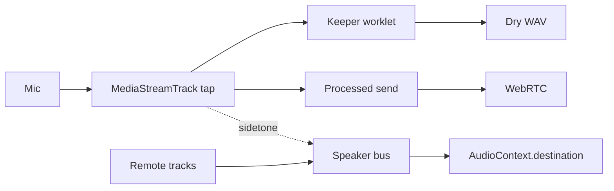
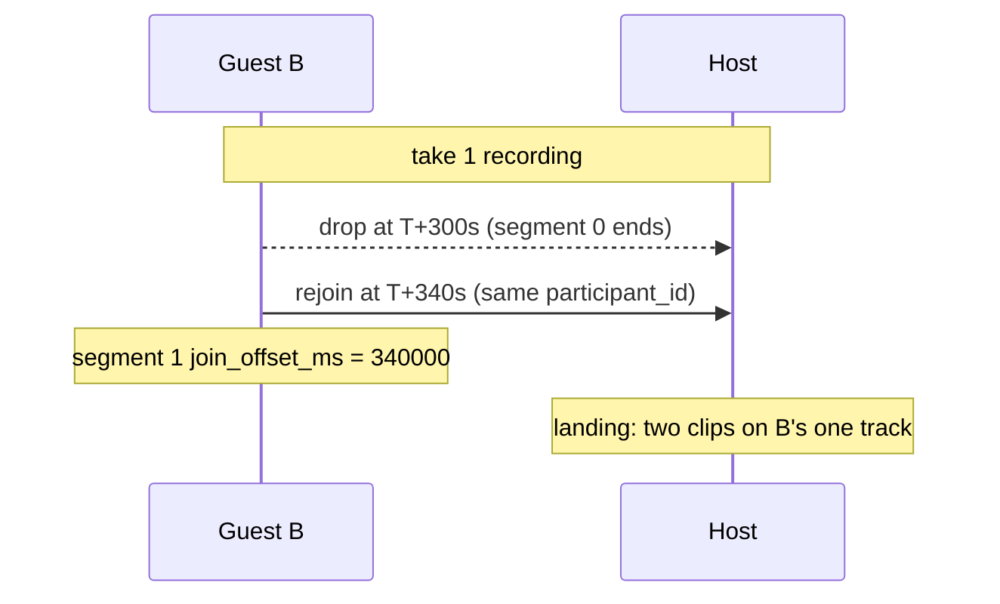
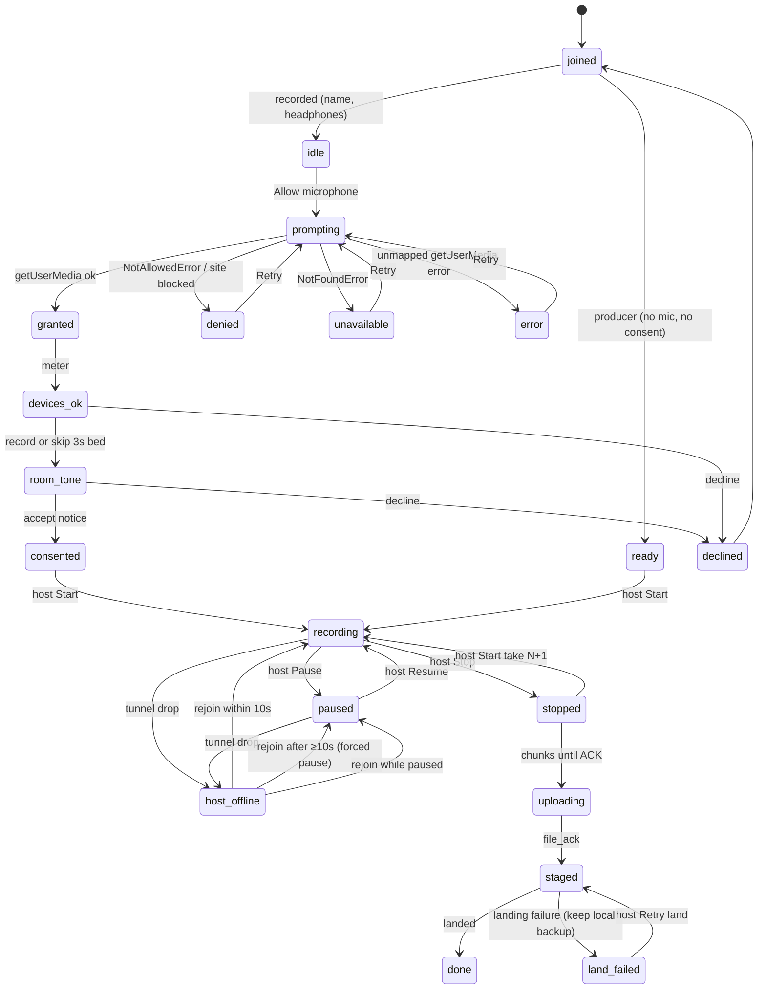

# Recording session (design)

Status: **links + lobby/consent + local keepers + mix-minus + chunk upload +
timeline landing + live comments + host live-room reconnect + room-tone beds shipped**. Owner row: [ROADMAP.md § Recording session](../ROADMAP.md#recording-session).
Audio-first MVP; beta still requires a **host laptop online**. Mint `/rec/`
URLs with `podcast review share --kind record` (or Share dialog / MCP
`create_record_room_tool`). `build.capture`, `build.monitor`, and `build.upload`
are on. After file ACK, keepers copy into `raw/` as one clip per segment.
Optional 3 s room-tone beds land at `raw/room-tone/{participant}.wav`.

## Scope and non-goals

MVP is **audio**. Later work is on the ROADMAP — do not start it without a
leftover plan. [Follow-up](../ROADMAP.md#follow-up): producer push-to-talk
(`talk`), producer `control`, room text chat, Tauri native mic (cpal), host
admit, restricted record shares. [Beta recording](../ROADMAP.md#recording-session)
remaining: video phase 2,
mic/camera grant UX, external import. Mix-minus (MM1–MM9, including the
producer bus) shipped in `feat/recording-monitor-mixminus`. Timeline landing
(one clip per segment at `join_offset_ms`, 2 s take gap, skip `ingest suggest`)
shipped in `feat/recording-landing`. Live comments shipped in
`feat/recording-producer-live-comments`. Room-tone beds shipped in
`feat/record-room-tone-bed`.

Non-goals: hosted SFU, cloud lossy backup on the relay, video MVP, external
Riverside/Zencastr/Zoom importers (those stay a parallel ROADMAP track and must
not mint `record` URLs).

## Prior art

Category SOTA is **Riverside / Zencastr / SquadCast / Descript Rooms**, not Zoom:

- Live conversation over **WebRTC** (lossy, echo-cancelled, headphones).
- Keeper stems recorded **locally per participant** as uncompressed **PCM/WAV**
  (Riverside: 16-bit linear PCM, 44.1/48 kHz), independent of the network.
- **Progressive upload** during the session, plus a local backup if host/cloud
  disappears.
- After stop: **upload status until confirmed**, then tracks on one timeline;
  late joiners **padded at the start**.
- Join link is a **studio/room**, not a review/listen link.
- Lobby: **name, headphones check, mic test, device picker, optional 3 s room
  tone** before the host hits Record.
- While recording: persistent **REC** indicator and a start notification.
- **Live timestamped notes** are table stakes: Riverside markers (`M` key →
  dots on the editor timeline), Zencastr Footnotes (host-only), Descript Rooms
  Editor Comments (host/co-host/producer; private from guests; land in the
  project).
- **Non-recorded producer** is the premium tier at all three: Descript Control
  Room (hears all, silent unless push-to-talk, can start/stop, leaves comments;
  listed under "Not recorded"), Riverside Producer (heard by others, manages
  lobby/levels, cannot start/stop; Business plan), Riverside Audience (chat
  only). Roles are fixed once recording starts (Descript).

Naive `MediaRecorder` → WebM/Opus as the keeper is **not** what those users
download; it is at most a lossy backup. Keepers must target WAV/PCM.

**Honest gaps vs expectation:**

- Riverside is always-on cloud. Sharecut beta needs the **host laptop online**.
  Mitigation: keep recording locally + resume chunked upload; guest copy
  "Host offline — still recording locally."
- Video-first creators expect cameras on day one. **Audio-first MVP**; external
  import covers "recorded video elsewhere."
- No cloud lossy backup (relay stores nothing on disk; keeper chunks may transit
  while a share is active). Recovery = guest local files +
  rejoin on the same link.

## Vocabulary

| Term | Meaning |
|------|---------|
| **Record link** | Public URL `{base}/rec/{token}` for a record session (not `/r/{token}`). |
| **Room** | One `session_id` with a guest token and a producer token, both `{base}/rec/{token}`. |
| **Take** | One host Start → Stop. Lands sequentially on the timeline. |
| **Pause** | Host freezes the recording clock for everyone; monitor stays live; paused time collapses. |
| **Segment** | One continuous stretch of a participant's keeper; leave/rejoin/pause starts a new one → one clip each. |
| **Recording clock** vs **wall offset** | `recording_ms = wall_ms − Σ(resume − pause)`. `join_offset_ms` is always recording-clock. |
| **Participant** | Anyone in the room (guest, producer, or host-as-talent). |
| **Guest** | Recorded role: `join monitor comment`. |
| **Producer** | Listen + comment, not recorded; shown in the "Not recorded" roster group. |
| **Host** | Owns the episode; starts/stops/pauses; is also a recorded participant. |
| **Live marker (comment)** | Same `TimelineComment` as review notes. `M` posts `body` `"Marker"` — a live marker comment, **not** a `ChapterMarker` or a second type. Lands in `review.comments[]`. |
| **Keeper** | Local dry WAV per recorded participant. |
| **Monitor** | WebRTC send/receive graph (lossy, may use AEC). |
| **Mix-minus** | Speaker bus plays remotes only; local capture never to destination. |
| **Sidetone** | Optional 0 ms dry tap into headphones (gain-limited), never the WebRTC round-trip. |
| **Chunk** | Progressive upload unit (5 MB or 30 s, whichever first). |
| **ACK** | Host ingest confirmation (sha256 + byte length per chunk, then per file). |
| **Lobby** | Name, headphones, mic test, device picker, optional 3 s room tone — before consent. |
| **Consent gate** | Per-person blocking step before any encoder, keeper chunk, or room-tone PUT to the host. Lobby may capture a 3 s bed into OPFS; those bytes stay local until Accept. |
| **Recovery window** | 7 days to resume upload on the same `/rec/` link. |

## Session kind and URLs

A record session is a **second share kind**, not a review-share capability.
Public URL `{base}/rec/{token}` (review stays `/r/{token}`). Same coolname
registry with a `kind` column (`review` | `record`); same active +
cooldown pools and rate limits. No third token index. See
[share-tokens.md](share-tokens.md) § Record sessions.

One **room** has a `session_id` and **two tokens** (guest and producer), both
`kind=record` and both served at `/rec/{token}`. Caps are frozen on the token
from `RECORD_ROLE_PRESETS` (never client-chosen). Opening the guest link is how
a producer becomes recorded next take. Prefix ↔ kind is enforced: `/r/` 404s a
`record` row; `/rec/` 404s a `review` row.

Shipped record caps: `join` (be recorded), `monitor` (hear the room), `comment`
(live notes — **same create path as review comments**, kind-scoped ACL: guests
see only their own until landing). Later: `control` (start/stop/pause), `talk`
(producer push-to-talk), `video`. Roles are a **kind-scoped** map
(`RECORD_ROLE_PRESETS` in `share_capabilities.py` / `contracts/caps.json`), not
keys stuffed into review `ROLE_PRESETS`: **guest** = `join monitor comment`;
**producer** = `monitor comment`; **host** = all.

Chunk upload is on for `join` tokens (`build.upload: true`). Producer tokens
advertise `build.upload: false` (no `join` cap). `build.capture` and
`build.monitor` are **on**: consented recorded clients write dry 48 kHz/16-bit
mono WAV keepers to origin-private OPFS (`Sharecut Recordings/…`), and the
browser mix-minus mesh plays remote tracks only. Capture and upload still
authorize `join` / `monitor` from the frozen token caps — never from
client-supplied flags. Lobby/consent/host Start, local keepers, mix-minus, and
chunk resume already ship. After ACK, landing copies assembled WAV into `raw/`
and registers clips. Live comments land in the same mutate as keepers (or on
their own if no new clips).

A crash after the guest mint and before the producer mint can leave a one-token
room. `revoke_room` / End room / `podcast review revoke-share --session-id`
still clear it.

Capture, ingest, host lobby, mix-minus graph: FOSS core. Public `/rec/` guest
routes: collaboration extension + relay allowlist, exactly like `/r/`.

While a local keeper is actively writing, the browser registers a native
`beforeunload` confirmation so an accidental refresh or navigation can be
cancelled before the current WAV is abandoned. The listener is removed when
capture pauses, stops, errors, or unmounts; lobby and completed-recording
navigation is not blocked. Browsers only show this native prompt after the
page has received sticky user activation, and they control its wording and
whether it is displayed. This is a best-effort loss warning, not a replacement
for the OPFS recovery path.

| | Review | Record |
|--|--------|------------------|
| Prefix | `/r/{token}` | `/rec/{token}` |
| Caps | `play` `view` `comment` `reply` `action` `suggest` `edit` `mcp` | `join` `monitor` `comment`; later `control` `talk` `video` |
| Served by | Host via tunnel + collaboration extension | Same (`/rec/` + `/api/rec/` on the allowlist) |
| Registry | Coolname active + cooldown | Same pools; `kind` column |

## Roles

| | Host | Guest | Producer |
|--|------|-------|----------|
| Recorded | Yes | Yes | No |
| Hears room | Yes | Yes | Yes |
| Heard by room | Yes | Yes | No (silent MVP; `talk` later) |
| Consents | Yes | Yes | No (not recorded) |
| Start / stop / pause | Yes | No | No (`control` later) |
| Adds live comments | Yes | Yes | Yes |
| Sees live comments (pre-landing) | All | Own only | All |
| Sees upload states | All participants | Own | None (no keeper) |
| Counts toward | Recorded cap (4) | Recorded cap (4) | Producer cap (2) |

Prior art: Descript Control Room (silent producer + editor comments) is the
model. Riverside's heard-by-guests producer and Descript push-to-talk are later
rows. A producer opens the **producer** `/rec/{token}` as a **receive-only**
mesh peer — no `getUserMedia`, no send track, no keeper. **Transparency is
mandatory:**
every client's roster shows a **"Not recorded"** group listing producers; the
consent copy says "producers/listeners may be present and are shown in the
roster"; a producer joining mid-take triggers the same join notification as a
guest.

## Two graphs

Monitor (WebRTC send/receive) and keeper (local dry WAV) are separate graphs
fed by the same `MediaStreamTrack`. Keeper = 48 kHz, 16-bit linear PCM, **mono
per participant**; 24-bit later. No AEC/NS/AGC/mix on the keeper. Chromium
guests: PCM/WAV encoder (Worklet or `extendable-media-recorder`); Tauri host:
native mic path; Safari/Firefox: documented caveat.



Keeper `getUserMedia` requests:

```json
{
  "audio": {
    "echoCancellation": false,
    "autoGainControl": false,
    "noiseSuppression": false
  }
}
```

and asserts `track.getSettings()` matches. Chromium defaults those **on** and
they run WebRTC APM on the capture track. The monitor/send path may use a
processed clone or browser AEC; the WAV tap must not.

## Mix-minus (mesh N−1)

Audio mesh for **2–4 recorded participants** plus **≤ 2 producers**
(receive-only peers), so ≤ 6 mesh peers and each recorder sends to at most 5.
No hosted SFU in FOSS. No program bus. Each listener's speaker bus plays
**only inbound remote tracks**. Local capture is never connected to `AudioContext.destination`. That *is* mix-minus; it does not need phase
inversion (OpenStudio invert-against-program-bus is for a single summed mix /
SFU). Optional **sidetone**: 0 ms dry tap, gain-limited (−12 dB default, max
0 dB), labeled in the graph — never the WebRTC round-trip. Headphones
recommended; open speakers + open mic is acoustic echo and is a lobby warning,
not something mix-minus can fix.

If an SFU ever lands, server mix-minus is specified then, and MM1–MM9 bars
still apply.

**Same-room bleed is not fixed by mix-minus.** Bleed is B's voice in A's
capsule on the keeper. Mix-minus changes only what each person hears. Studio
rules: headphones; never play other local mics on speakers (that *adds*
delayed bleed into every capsule). Post stays reconcile +
[`podcast-mute-bleed`](../.agents/skills/podcast-mute-bleed/SKILL.md). A later,
separate idea is AEC-style reference cancellation (other close-mic as far-end)
on a *processed* stem — same adaptive-filter family as AEC3, not N−1 routing,
and never overwrite dry `raw/`.

## Keeper file spec

WAV 48 kHz / 16-bit / mono. Files are keyed
`{session_id}/{take_index}/{participant_id}/{segment_index}.wav`. Chunk parts
are `{session_id}/{take_index}/{participant_id}/{segment_index}.part-{NNNN}` —
**never** reuse `part-{NNNN}` across segments or takes. Host ACK is
`(session_id, take, participant, segment, part_seq)` plus sha256 and byte length.

At segment end the byte stream **freezes**; the last payload is a `final`
part. The WAV header is written only after every part for that segment is
ACK'd. Never mutate an ACK'd prefix. Mute writes zeros (see
[Mute semantics](#mute-semantics)); file length does not change. Each keeper
is tagged `session_start`, `join_offset_ms`, `sample_rate`, `samples_written`.

## Mute semantics

Mute stops the monitor send **and** the keeper writes **zeros** for the muted
span. File stays continuous (no length change), so clocks still line up. No
separate "pause my recording" button in MVP. Host cannot unmute a guest. Test
MM4 asserts the monitor drop; keeper mute zeros are covered by keeper session tests.

## Progressive upload and recovery

Relay never stores audio, but keeper chunks may transit the tunnel. Keeper + local backup live on each device until
chunked upload and host ingest **ACK** (sha256 + byte length per chunk, then
per file). Assembled WAV lands in `artifacts/record/acked/` until landing copies it into
`raw/` and registers clips.

Chunks (target 5 MB or 30 s, whichever first) `POST` to a **dedicated record
upload route** gated by `join` (not `edit`, not `POST …/daw/media/upload`).
Tunnel pass-through to the host only — no relay disk, no object-store
keeper backup in MVP. Stop shows a **blocking upload panel** (host sees all
participants; guest sees own) until ACK or stall. Resume on the **same
`/rec/` token** inside a **7-day recovery window**. Lossy host-side backup mix
is **not** in audio MVP.

```mermaid
sequenceDiagram
  participant G as Guest
  participant H as Host
  G->>H: POST chunk (token, take, participant, segment, part_seq, sha256, bytes)
  H->>H: verify bind + sha256
  H-->>G: ack
  Note over G,H: repeat until segment final
  G->>H: POST final + file hash
  H-->>G: file_ack
  H-->>G: landed or land_failed
  Note over G,H: stall: retry/backoff; rejoin same token within 7 days
```

## Clock and landing on the timeline

Host beacons `session_start` (host wall clock + monotonic) on the existing
session/presence WS. Each keeper is tagged `session_start`, `join_offset_ms`,
`sample_rate`, `samples_written`. **Happy path:** write each segment file to
`raw/` and register **one clip per segment** at
`timeline_s = take_offset_s + join_offset_ms / 1000` with
`duration_s = samples_written / sample_rate`, **without** `ingest suggest`.
Later segments are **not** padded with leading zeros in the file (that would
double-offset). In-file pad is only an optional encoding of **segment 0** when
you insist on a clip that starts at take origin.

Late-join bar (first segment of a late guest):

```text
pad_samples = round(join_offset_ms * sample_rate / 1000)
```

applies **only** when that first segment is encoded as clip@0 with leading
zeros. Default landing is clip@`join_offset_ms` with no in-file pad.

Land places clips at `join_offset_ms` from `session_start` + sample counts.
It does **not** run [`align_tracks`](../src/podcast_mcp/edits/conversation_align.py)
(no transcripts yet; bleed/VAD plans would be identity). `align_fallback`
in land JSON is a **hint** to run pipeline `align_tracks` after transcribe:
missing `session_start`, or a sample-count vs recording-clock error over
50 ms (`ALIGN_DRIFT_MS`). Isolated dry keepers are independent close-mics —
GCC-PHAT (`engines/align.py` `gcc_phat_result`) is TDOA for a shared
wideband source, not a clock-drift meter here. Land compares each recorded
participant's file duration to that segment's recording-clock span (join to
the next file-acked segment or take end), using the first pair of segments
whose recording-clock intervals overlap — not `min(segment_index)`.
`drift_ms` / per-row `duration_error_ms` is that duration error; `null` means
unknown (one recorded ACK, no overlap, or I/O), never a fail-open 0.
`confidence` stays on each `drift` row (1.0 when a span was measured).
Single-participant takes skip the check. GCC-PHAT's 0.25 peak-to-sidelobe
gate over ±1 s at 8 kHz on a 60 s window is a constant-lag TDOA helper for
shared-source tests, not rate-offset coverage (~50 ppm is ~3 ms in 60 s).
Users expect "stop → tracks on the timeline," not a 20-minute align workshop.
Video files still wait for video track ingest.

## Roster changes: join, leave, rejoin, pause, takes

```json
{
  "token": "fantastic-acoustic-whale",
  "takes": [
    {
      "take_index": 0,
      "session_start": "…",
      "pauses": [{ "pause_wall_ms": 600000, "resume_wall_ms": 900000 }],
      "participants": [
        {
          "participant_id": "p_b",
          "segments": [
            { "segment_index": 0, "join_offset_ms": 0, "samples_written": 14400000, "sha256": "…" },
            { "segment_index": 1, "join_offset_ms": 340000, "samples_written": 480000, "sha256": "…" }
          ]
        }
      ]
    }
  ]
}
```

Two clocks per take: **wall offset** (`now − session_start`) and **recording
clock** (`recording_ms = wall_ms − Σ(resume − pause)`). `join_offset_ms` is
always recording-clock.

Each participant gets a `participant_id` **minted by the host** at lobby
entry, bound to that token, and leased to one tab. The client may cache it in
`record:{token}:participant` (same token-scoped pattern as guest
`queue:{token}`) but uploads of another id, `..` segments, or a second tab
without the lease are rejected. Rejoin on the same device with a live lease
reuses the id so audio appends to the **same** track. Live `Join` commands are
keyed per WebSocket connection (`record-join:{connection_id}:{client_id}`) so a
tab reload that resends seq 1 is not collapsed as the original Join. A new device = a new
participant (documented; host can merge in post later, not MVP).

A participant's keeper within one take is a list of **segments**.

**Disconnect tree (host owns open/closed):**

| Event | Segment | Monitor / upload |
|-------|---------|------------------|
| Tunnel / host offline (mic still held) | **Stays open**; WAV keeps growing | Monitor ends; upload retries |
| Intentional leave, tab close, or lost mic | **Ends** (file frozen, upload continues) | — |
| Host pause | **Ends** for everyone | Monitor stays live |
| Host returns after ≥ `HOST_OFFLINE_PAUSE_MS` (10 s) while REC | **Forced PAUSED** (`pause_reason: "host_reconnect"` on the `PauseEntry` and live snapshot); host must Resume | Mesh closes that peer's PC and re-offers |
| Host returns within 10 s while REC | Take stays **recording** (brief WS blip) | Mesh re-offers |
| Host returns while already PAUSED | Stay paused; do **not** stack a second pause | Mesh re-offers |
| Rejoin, segment still open, no pause in the drop window, mic never lost, ≤ 30 s | Resume **same** segment | — |
| Otherwise rejoin | **New** segment at current recording-clock `join_offset_ms` | — |

From `paused`, host-offline writes **no** PCM (clock is frozen); both PAUSED
and host-offline copy may show. Landing places one **clip per segment** on
that participant's track at `join_offset_ms`. No trailing pad.

An involuntary microphone loss is distinct from an intentional track stop: the
browser `ended` event freezes the current keeper segment and clears the live
stream. The host and guest show a persistent "Microphone disconnected. Local
recording is paused." warning with a Reconnect microphone action. Retry is
explicit (there is no unbounded auto-retry); repeated clicks during acquisition
are ignored. If a selected device has been removed, reconnect tries the
default available input once after that exact device fails. A successful
reacquisition opens the next segment at the current recording-clock offset,
extrapolated from the last room snapshot when the stream changes. Keeper gate
transitions are applied in order so a quick reconnect cannot skip the
loss/segment close. The host record dialog reopens if necessary and stays open
while the microphone is lost. A normal unmount or application stop removes the
listener before stopping tracks and does not show the warning.



**Pause / Resume is host-only.** Host Pause appends a versioned pause-log
entry `{seq, pause_wall_ms}` on the session WS: every keeper ends its current
segment (byte stream frozen, upload continues); the monitor **keeps running**
so people can talk off the record; indicator flips REC → **PAUSED** on every
client. Host Resume appends `{seq, resume_wall_ms}`; every consented recorded
client starts a new segment whose `join_offset_ms` is the **recording-clock**
value at resume. Clients apply the log **by seq** (ignore duplicates); every
reconnect snapshots `pauses[]`. A late `pause` uses the same reconcile:
truncate/discard samples with wall time ≥ `pause_wall_ms`. Landing places
segments at recording-clock offsets, so paused time **collapses** to zero on
the timeline — no gap, no zeros written. No re-consent on resume; a guest who
arrives during a pause consents and starts on resume. Audio captured while
the host was paused is discarded; audio missed after resume is a documented
gap. Guests cannot pause. **Pause wins** over the 30 s same-segment resume: if
a pause interval intersects the drop, finalize/trim and open a new segment at
resume.

```mermaid
sequenceDiagram
  participant H as Host
  participant A as Guest A
  H->>A: pause wall_ms=600000 (recording 600s)
  Note over A: segment 0 ends; monitor still live; PAUSED
  H->>A: resume wall_ms=900000
  Note over A: segment 1 join_offset_ms = 600000
  Note over H: clips abut at 600s; no gap, no zeros
```

**Stop → Start again = takes.** The room (`session_id`) holds `takes[]`; each
take has its own `session_start`, `pauses[]`, and roster. Host Stop ends take
N (upload panel); host Start may begin take N+1 **without** re-consent for
anyone already consented **while take N is still uploading**. Manifest, ACK,
and segment rows are partitioned by `take_index` with one mutating owner per
take. Landing appends takes **sequentially** on the timeline with a fixed
**2 s** gap (`take_gap_ms`, host-editable later), tracks = **union** of
participants across takes; a participant absent from a take simply has no
clip there. Deleting a bad take before landing is refused while that take's
manifest is non-terminal; otherwise a take-tombstone aborts in-flight upload
and voids ACK. "Safe to delete" local backup only after ACK **and** the take
is still alive / landed. Same-room retakes are not auto-spliced into the
previous take — that is an edit.

Peer add/remove renegotiates only the affected `RTCPeerConnection`s; the
mix-minus matrix adds/removes one input with a **≤ 20 ms** gain ramp.
Recorded peers attach the local send track **before** the first offer
(`replaceTrack` on a negotiated null sender does not fire remote `ontrack`).
Inbound `Signal` frames are queued per `(from, to)` pair (up to 64, dropping
oldest ICE candidates first) and replayed once if they arrive before the mesh
subscribes. A second offer is not sent after answering when
the send track was already included. Others'
keepers are never touched by a roster change (keeper graph has no dependency
on remote tracks). Pause/Resume never touches the monitor graph. Test bar
**MM8**. Roles are frozen **on the token** for the take: a producer who wants
to be recorded waits for Stop and opens the **guest** link in the next take.

When 4 recorded participants (host included) are present, a 5th guest opening
the link sees a **full room** page (copy in [Lobby, consent, REC](#lobby-consent-rec);
no `getUserMedia` prompt); a 3rd producer sees the same page. Host cannot
raise either cap in MVP. A participant who **declines consent** returns to the
lobby and cannot enter as a guest while REC or PAUSED is on; the host may
re-invite them as a **producer** (not recorded) instead.

| | Mute | Pause | Stop / Start |
|--|------|-------|--------------|
| Who | Per person | Host, everyone | Host, new take |
| Clock | Runs | Recording clock freezes | New `session_start` |
| Bytes written | Zeros for the span | None during pause | Previous take finalised |
| Monitor | Send stops for that person | Stays live | Ends with the take |
| Indicator | Mute badge | PAUSED on every client | REC off, then REC on take N+1 |
| Timeline | Continuous file; zeros | Clips abut (paused time collapses) | Sequential takes + 2 s gap |

## Live comments

**Everyone** in the room can add a timeline comment **during** REC or PAUSED
(same `comment` cap and the same create path). `M` is that path with
`body` `"Marker"` — not a chapter marker, not a second type, not a `title`
field. Typed notes use the same path with a real `body`.

```json
{
  "id": "client-generated-idempotency-key",
  "take_index": 0,
  "recording_ms": 123400,
  "pressed_wall_ms": 125000,
  "author": "p_guest_a",
  "body": "Marker"
}
```

`recording_ms` is the **host** recording clock. Clients may estimate it via
the WS clock offset (± 250 ms); the **host rewrites** it on ingest from
`pressed_wall_ms` + authoritative `pauses[]` / `session_start`. **Visibility
before landing is host-enforced** (not a client-only filter): host and
producers receive all live comments; a guest receives only their own. Session
WS must not fan out other guests' rows to a guest.

Stored in `record_live_comments` (same `sync.db`) until landing, keyed by
client idempotency `id` (`live-…`). Comment commands are also appended to the
record command log; the snapshot attaches unlanded sqlite rows. At landing each
becomes a normal `review.comments[]` entry through `add_comment` under
`ProjectWorkspace.mutate()`
(undoable) at

```text
timeline_s = take_offset_s + recording_ms / 1000
```

**No lead correction.** Do not invent `TimelineComment.title` or free-form
`metadata`. If a later PR needs the raw press, **extend** `TimelineComment` +
schema + `CommentService` first. Comments made while PAUSED land at the pause
point. Comments from a deleted take are deleted with it. After landing they
are indistinguishable from other comments (replies, action items, MCP/CLI —
see [timeline-comments.md](timeline-comments.md) and skill
[`podcast-timeline-comments`](../.agents/skills/podcast-timeline-comments/SKILL.md)).

Pending comments queue in `record:{token}:comments` with the client
idempotency `id`; host **upserts** by that key. Flush after reconnect is
exactly-once.

```mermaid
sequenceDiagram
  participant G as Guest
  participant H as Host
  G->>H: comment id=… body=Marker wall 125.0s
  H->>H: upsert; recording_ms from pressed_wall_ms + pauses[]
  H->>H: landing: add_comment under ProjectWorkspace.mutate() at take_offset + recording_ms
```

## Lobby, consent, REC

**Shipped** in `feat/recording-lobby-consent` (lobby/consent) and
`feat/recording-keeper-capture` (dry WAV). Device permission is an **explicit
grant step** before the meter: recorded clients click **Allow microphone**,
which is the only `getUserMedia` call (`useMicPermission` → `useMicStream`).
Safari has no `permissions.query({name:"microphone"})`; Chromium can
pre-detect `denied`. After the mic is granted, recorded clients see an optional
**Record 3 seconds of room tone** step (skip allowed) that uses keeper
constraints and the PCM→WAV tap — not `MediaRecorder`. The bed is written to
OPFS only; the `kind=room_tone` PUT waits until **Accept**. Skip or Decline
discards the local bed. Recording consent is a **separate blocking step** per
recorded person; Accept stays disabled with `aria-describedby` until the mic
is granted **and** headphones are checked. The keeper encoder is armed on Accept
and writes **zero bytes** until host Start (room-tone PUT is also zero bytes
until Accept). Host **Start** is enabled
when **every recorded guest currently in the lobby** has consented (not every
invitee, not producers; the host auto-consents). Host Start does
**not** require the host to record or skip room tone — idle is an implicit skip.
Producers skip consent, `getUserMedia`, and room tone; they auto-satisfy the
Start gate. Persistent **REC** indicator +
clock; mute writes zeros on the keeper. Consent copy is product notice, not legal advice.
Host admit / waiting room is **not** in this PR (ROADMAP Follow-up).



| Situation | Copy |
|-----------|------|
| Open speakers | "Use headphones. Playing the room on speakers will echo into every mic." |
| Mic grant | "Allow microphone" |
| Mic blocked | "Microphone is blocked for this site. Allow it in your browser's site settings, then Retry." |
| No input device | "No microphone was found. Connect an input device, then Retry." |
| Mic required for consent | "Allow the microphone before you accept recording." |
| Room tone | "Record 3 seconds of room tone" |
| Room tone too loud | "Too loud — is something playing?" |
| Room tone saved | "Room tone saved" |
| Consent | "This session will be recorded locally on your device. Files stay on this browser until they finish uploading to the host after you Accept. Producers/listeners may be present and are shown in the roster. [Accept] [Decline]" |
| REC | "REC" persistent indicator + start notification |
| PAUSED | "PAUSED — still listening, not recording" |
| Host reconnect pause | "Paused — the host was offline for {N}s. Resume when everyone is ready." (host DAW only; guests keep the PAUSED indicator) |
| Host offline | "Host offline — still recording locally." |
| Upload panel | "Uploading your take… {n}/{total} chunks. Keep this tab open." |
| Safe to delete | "Uploaded. Safe to delete local backup while this take is still on the host." (only after ACK **and** the take is still alive) |
| Full room | "This room is full (4 recorded / 2 producers)." |
| Declined | "You declined recording. You can wait in the lobby, or the host can invite you as a producer (listen only)." |

## Host offline and disconnect

Guest keeps recording locally **when the segment is still open** (tunnel/host
offline, mic held); monitor tracks end; upload retries; rejoin the same
token. Copy: "Host offline — still recording locally." Intentional leave /
lost mic uses **segments** ([Roster changes](#roster-changes-join-leave-rejoin-pause-takes)).
Producers simply lose audio and reconnect. Pending live comments queue with
idempotency keys and upsert on reconnect.

On the **last** host connection drop (`disconnect` / `release_connection`)
while `state ∈ {recording, paused}`, the service stamps
`host_offline_since_wall_ms` from that socket's last beat (same sqlite
`record_snapshot` row; no sidecar). A Leave command also stamps if the field
is still empty. Host Join clears that field. If in-memory `_HOST_CONNS` is
empty on the next host Join (sidecar crash without Leave) or the last host
heartbeat is older than `HOST_OFFLINE_PAUSE_MS`, Join treats that as last-host
Leave (stamp from `host_last_beat_wall_ms` / snapshot time, or force the 10s
pause) before applying the reconnect. If the take is
still `recording` and `now − host_offline_since_wall_ms ≥ HOST_OFFLINE_PAUSE_MS`
(10 000 ms, `services/record/state.py`), the reducer appends one
`PauseEntry` with `pause_reason: "host_reconnect"` and sets live snapshot
`pause_reason` / `host_offline_gap_ms` so the host DAW can show the reconnect
copy. A blip shorter than 10 s stays `recording`. An already-paused take stays
paused (no second pause). Resume clears the live `pause_reason`. After a sidecar
restart, in-memory WebSocket maps are empty but the snapshot field (and last
host beat) survives, so the same Join rule applies. Reminting a room while
REC/PAUSED is refused under the same `SyncStore` lock as the log reset
(`RecordStateError` / HTTP 409): "A take is open (REC/PAUSED). Stop it before
minting a new room." `revoke_room` is unchanged and does not wipe sqlite;
`begin_record_session` still wipes a leftover snapshot when no usable record
share remains (revoke then remint). Stop-first is the 409 gate, not the only
wipe. Host keepers remount on an open `host_reconnect` pause generation, not on
a WS `connected` blip.

## Ownership and retention

See [Progressive upload and recovery](#progressive-upload-and-recovery) for relay
store-versus-transit (nothing stored on the relay; keeper chunks may transit).
Keeper + local backup live on each device until chunked upload and host ingest ACK.
Assembled WAV is stored under
`artifacts/record/acked/` until landing writes `raw/` + clips. Guest
device keeps keepers under `Sharecut Recordings/` (OPFS, plus optional
download) until host ACK; UI says "safe to delete" only after ACK **and** the
take is still alive. Host keeps
`raw/` forever (existing rule) once landing copies files there. Beta still requires a live host; that is a
category gap — say it in lobby copy.

## Where state lives

Token metadata: share registry + `artifacts/review/shares.json` hold `kind`,
`session_id`, and role. Live-room state lives in existing
`artifacts/session/sync.db` via `services/record/` on a prefixed `SyncStore`
(`record_commands`, `record_snapshot`, `record_clients`) plus
`record_participants` (lease **hashes** only). All record stores share the
session-sync SQLite initializer so concurrent room startup cannot race while
switching `sync.db` into WAL mode. **No new sqlite file, no new
sidecar JSON.**

| Data | How |
|------|-----|
| Roster, consent, take clock, `pauses[]`, `host_offline_since_wall_ms`, `host_last_beat_wall_ms`, live `pause_reason` | `RecordSessionService` + pure `apply_record_command` reducer; hub key `record:{workspace}`. `pause_reason: "host_reconnect"` is stored on the `PauseEntry` (pause log) and mirrored on the snapshot while that pause is open. |
| WebRTC Signal | Ephemeral hub fanout (`type: "Signal"`); never written to `record_commands` |
| Host Start/Pause/Resume/Stop | HTTP `POST /api/record/command` (not the session WS; Signal burst must not block transport) |
| Participant leases | `RecordParticipantStore` (`record_participants`); Echo-only plaintext lease |
| Live comments | `record_live_comments` in the same sqlite (`sync.db`); PK `(session_id, comment_id)` |
| Local keeper WAV | Guest/host OPFS `Sharecut Recordings/{session}/{take}/{participant}/{segment}.wav` (+ `.json` tags). Not a host sidecar. |
| Room-tone bed | OPFS `Sharecut Recordings/{session}/room-tone/{participant}.wav` (local until Accept); upload `kind=room_tone` after consent (storage take `2147483647`); assembled `artifacts/record/acked/{session}/room_tone/{participant}.wav` until landing copies `raw/room-tone/{participant}.wav` and sets `track.room_tone` |
| Chunk / ACK manifests | `record_upload_parts` / `record_upload_files` in the same `sync.db`; part bytes in `artifacts/record/uploads/`; assembled WAV in `artifacts/record/acked/` until landing copies to `raw/`. `land_failed_ns` records a failed landing attempt and keeps the staged WAV available for retry. |
| Timeline landing | `RecordLandingService` copies ACK'd WAV into `raw/`, one clip per segment at `take_offset_s + join_offset_ms/1000`, 2 s take gap. `join_offset_ms` is stored on `record_upload_files`. The UI distinguishes staged/uploaded/landed/land-failed; only confirmed `landed` permits deleting the local keeper. Host `Retry land` reuses the existing `record.land` command. |

Locked for the lobby PR: roles from the token; host-only Start/Pause/Resume/Stop;
Start blocked until connected guests have `consented is True` (`None` pending;
`False` declined does not block; `"No one has joined"` when no connected guest);
room caps 4 recorded / 2 producers; host Join auto-consents as `p_host`; no host
admit step.

See [persistence.md](persistence.md) and
[session-sync.md § Recording session](session-sync.md#recording-session).

## Platform support

| Platform | Support |
|----------|---------|
| Chromium desktop | PCM/WAV keeper encoder + mix-minus mesh (`build.monitor: true`) |
| Safari | WAV via Worklet only; AEC constraint caveat |
| Firefox | Same caveat as Safari |
| Tauri host | Browser Worklet in the webview (same as Chromium). Mic grant: macOS `NSMicrophoneUsageDescription` + hardened-runtime `audio-input` entitlement; WebView handler allows **microphone only** for `http://127.0.0.1:{engine-port}` (WKWebView `requestMediaCapturePermissionForOrigin`, WebView2 `PermissionRequested`). Full deny-by-default WebView policy is [v1](../ROADMAP.md#packaging-trust). Native cpal/coreaudio mic is [Follow-up](../ROADMAP.md#follow-up). |
| Mobile browsers | Join + monitor; keeper best-effort, documented. Producer role fully supported (no keeper). |

## Security and threat notes

The token **is** the capability. Monitor uses browser DTLS-SRTP
([RFC 3711](https://www.rfc-editor.org/rfc/rfc3711.html)); chunk upload is
HTTPS to the host on the **record upload route**, never the relay disk, never
object storage. No encoder, keeper chunk, or room-tone PUT before consent (lobby may
capture a 3 s bed into origin-private OPFS; Skip/Decline discards it).
Host-minted `participant_id`; a stolen id
alone cannot upload. Reuse
[host-online-relay.md § Rate limiting](host-online-relay.md#rate-limiting).
Guest JSON has no host paths. SFrame / E2EE through an SFU
([RFC 9605](https://datatracker.ietf.org/doc/html/rfc9605)) only if an SFU
appears. A **producer token** is a silent monitor (not recorded). The mix-minus graph
plays every recorded peer on the producer's speaker bus; producers never call
`getUserMedia`, never send, and never write a keeper (`build.monitor: true`).
Keepers still write locally (`build.capture: true`) on recorded clients. Share
the producer link only with the producer. GUI mints have no expiry; prefer CLI
`--expires-at` for producer links.

## Literature and FOSS

Do **not** transcode WebRTC AEC3, libwebrtc, or RNNoise into Python/React. Use
the browser/native build or a maintained binding. Mix-minus for a mesh is a
routing matrix, not a model.

| Concern | Science / spec | FOSS to use | Do not |
|---------|----------------|-------------|--------|
| **Mix-minus / IFB (N−1)** | Broadcast foldback: each talent hears program minus self. Mesh equivalent: play only remote tracks. Phase inversion (OpenStudio) is for a **single program bus**. Reference impl of the matrix idea: [oximedia-routing mix_minus](https://docs.rs/oximedia-routing/latest/oximedia_routing/mix_minus/index.html). W3C [Web Audio](https://www.w3.org/TR/webaudio-1.1/). **Not** same-room bleed removal. | Own `mixMinus.ts` (O(N) GainNode matrix, ~20 lines). OpenStudio is a reference, not a dependency. | Invert-against-delayed-self; "DSP mix-minus" nets; N−1 to clean keepers. |
| **Acoustic echo (speakers → mic)** | Adaptive filter + residual suppression. Production FOSS: **WebRTC AEC3** (`modules/audio_processing/aec3`, 10 ms frames). Packaged as webrtc-audio-processing / Chromium APM. | Browser APM on the **monitor/send path only**. Keeper constraints all `false`; verify `getSettings()`. Headphones are the primary defense. | Python AEC; AEC/NS/AGC on the WAV tap; WASM-porting AEC3. |
| **Noise suppression (monitor)** | Valin, *A Hybrid DSP/Deep Learning Approach to Real-Time Full-Band Speech Enhancement*, MMSP 2018 ([arXiv:1709.08243](https://arxiv.org/pdf/1709.08243.pdf)); [xiph/rnnoise](https://github.com/xiph/rnnoise) BSD-3. | Post already has FFmpeg `arnndn` ([audio-engineering.md](audio-engineering.md)). Live monitor only: [jitsi/rnnoise-wasm](https://github.com/jitsi/rnnoise-wasm) in a Worklet **after** the dry tap. | RNNoise on keepers; rewriting the GRU in TS. |
| **Keeper PCM/WAV** | Linear PCM 16-bit 48 kHz. Worklet quantum 128 samples (~2.7 ms). | MIT [extendable-media-recorder](https://github.com/chrisguttandin/extendable-media-recorder) + [wav-encoder](https://github.com/chrisguttandin/extendable-media-recorder-wav-encoder), or a ~100-line owned Worklet → Int16 chunks ([wavtools](https://github.com/keithwhor/wavtools) idea). Tauri: cpal/coreaudio. | Default `MediaRecorder` Opus/WebM as primary. |
| **Live transport** | DTLS-SRTP [RFC 3711](https://www.rfc-editor.org/rfc/rfc3711.html) + [RFC 5764](https://www.rfc-editor.org/info/rfc5764). Cáceres & Chafe, *JackTrip* (ICMC 2009) is tighter than podcast talk needs. | Browser `RTCPeerConnection`; signaling on the existing session WS. NAT fallback: [coturn](https://github.com/coturn/coturn) as ops. Scale-up later: [LiveKit](https://github.com/livekit/livekit) / mediasoup — never on the guest laptop for beta. | Reimplement ICE/DTLS; JackTrip as the monitor. |
| **Clock / align** | RTP NTP ≠ shared media clock ([RFC 7273](https://datatracker.ietf.org/doc/html/rfc7273)). Sample sync without word clock drifts. Post-hoc: Knapp & Carter 1976 (**GCC-PHAT**, shared source); Clifford & Reiss JAES 2013. | `session_start` + sample counts; **pad late joiners**. Land reports sample-count vs recording-clock `drift_ms` (`null` if unknown). `align_fallback` hints pipeline [`conversation_align.py`](../src/podcast_mcp/edits/conversation_align.py) after transcribe; land does not invoke it. GCC-PHAT stays a shared-source TDOA helper (`gcc_phat_result`). | Pretend WS beacons give sample-accurate sync; GPS word clock for beta; PHAT of two dry keepers as a clock meter. |
| **Security** | SRTP confidentiality/auth/replay (RFC 3711). Hop-by-hop only; E2EE through an SFU = Insertable Streams + SFrame [RFC 9605](https://datatracker.ietf.org/doc/html/rfc9605). | Mesh MVP: browser DTLS-SRTP; HTTPS chunk upload with hash + resume; token = capability; no encoder, keeper chunk, or room-tone PUT without consent. | Home-grown RTP crypto; WAV on the relay. |
| **Fast** | Worklet off main thread; mix-minus is adds, not FFT. | WAV encode + OPFS in a worker; MM tests via `OfflineAudioContext`. | Main-thread `ScriptProcessorNode`. |

**Library policy:** prefer **use/bind** over transpile. Allowed later deps:
`extendable-media-recorder` (+ wav encoder) *or* a 100-line owned Worklet;
`@jitsi/rnnoise-wasm` on the monitor graph only; coturn as ops. Forbidden:
vendoring libwebrtc, rewriting AEC3, LiveKit in FOSS core for a 2–4 mesh.

## Test contract

Keeper capture has Vitest coverage under `gui/web/src/record/keeper/`. Mix-minus
ships `gui/web/src/audio/mixMinus.ts` + `mixMinus.test.ts` with MM1–MM9 (synthetic
tones, rendered spectra). Signaling is ephemeral (`services/record/signal.py`)
and must not appear in `record_commands`. Same as join continuity: numeric CI
bars, then a short human listen-through ([e2e-fixture-manual.md](e2e-fixture-manual.md)
pattern).
Python-side WAV assertions reuse
[`engines/audio_audit.py`](../src/podcast_mcp/engines/audio_audit.py) (`rfft`,
`measure_window_rms_db`); the live graph is Vitest next to
[`gui/web/src/audio/proxyEngine.test.ts`](../gui/web/src/audio/proxyEngine.test.ts).

**Why mix-minus is the hard one.** Electrical leak (local mic → own speakers,
or subtracting a delayed self from a program mix) is a graph bug and **must
fail CI**. Acoustic leak (speakers → room mic) is AEC on the monitor and
cannot be fully automated. The mesh rule "never play local" makes the
electrical case a **connectivity assertion**.

### Mix-minus + keeper bars (CI, `OfflineAudioContext`, synthetic tones)

Tone participants A=220 Hz, B=440 Hz, C=880 Hz, 48 kHz, −18 dBFS. No real
`getUserMedia` in unit tests.

| ID | Assertion | Bar |
|----|-----------|-----|
| MM1 | Listener A's speaker bus | 220 Hz ≤ **−50 dB** relative to A's mic tap; 440/880 within **±1.5 dB** of B/C taps. |
| MM2 | Permute for B and C | Same bars; N=2, 3, 4. |
| MM3 | Graph law | Local capture node not connected to `destination`; remote tracks are; sidetone (if present) is a labeled dry tap at documented gain. |
| MM4 | Mute B | A's bus: 440 Hz drops ≥ **40 dB**, 880 unchanged. B's keeper span during mute is **all zeros** (`keeper/session.test.ts`); file length continuous. |
| MM5 | Keeper ≠ monitor | A's WAV: 220 Hz within **3 dB** of dry tap; 440/880 ≤ **−50 dB**. |
| MM6 | No feedback | Impulse into local tap; speaker-bus energy does not grow over 1 s. |
| MM7 | Encoder does not duck monitor | Start "record": MM1 bars unchanged vs pre-roll. |
| MM8 | Roster change does not glitch | Start N=2 (A, B); add C at t=1 s; remove B at t=2 s. A's bus: 880 Hz reaches its MM1 level within **20 ms** of add, 440 Hz falls ≥ 40 dB within 20 ms of remove, 220 Hz stays ≤ −50 dB throughout; no sample-to-sample step > **−30 dBFS** at either transition (ramped, not cut). A's keeper is **bit-identical** to a run with no roster change. Pause at t=3 s / Resume at t=4 s: MM1 bars on A's bus unchanged throughout (monitor is not paused). |
| MM9 | Producer bus | Producer P joins N=3 (A, B, C): P's speaker bus has 220/440/880 each within **±1.5 dB** of the taps; P has **no** send track, **no** keeper file, and never called `getUserMedia`; A/B/C buses are unchanged vs MM1 (P adds nothing to anyone's mix). |

Ship MM1–MM9 **in the same PR as the graph** (`gui/web/src/audio/mixMinus.ts` +
`mixMinus.test.ts`). Prefer rendered spectra over `connect()` spies alone —
spies miss a second accidental connection.

### Wiring e2e (Playwright, once `/rec/` exists)

Two, then three browser contexts. Inject oscillators via a test-only
`MediaStream` hook behind `?e2e=1` **and** `window.__SHARECUT_E2E` (Playwright
`addInitScript` in `e2e/record-lobby.spec.ts`; wired in `record/monitor/e2eHook.ts`).
Read speaker-bus and keeper-tap spectra with `page.evaluate` on exposed
AnalyserNodes when asserting MM1/MM5. Lives in `gui/web/e2e/` next to
presence-follow. Lobby e2e uses the same hook so "Hearing the
room." does not depend on ICE completing under the shared GUI server, and also
asserts inbound `Signal` frames (`window.__recordSignalCount`).

### Acoustic / golden-ear (not CI)

Headphones on; 2 then 3 people; "do I hear myself delayed?" must be **no**;
mute/unmute; host Start does not change monitor timbre; open-speaker lobby
warning appears; sidetone level sane.

### Rest of the contract (CI when those PRs land)

| Area | How |
|------|-----|
| Consent vs lobby | Explicit **Allow microphone** before the meter (`useMicPermission`; one `getUserMedia` path). Accept disabled with `aria-describedby` until granted **and** headphones are checked. WAV tap + keeper chunks **and** room-tone PUT **zero bytes** to the host until consent (local OPFS bed capture is allowed; Skip/Decline discards it); Start disabled while any **recorded** in-lobby client lacks consent; producers skip the gate and never call `getUserMedia`. Host Start does not require the host to record or skip room tone (idle is an implicit skip). |
| Room tone | After mic granted, optional 3 s keeper-constraint PCM→WAV (skip allowed); RMS > −35 dBFS warns "Too loud — is something playing?" and does not upload; guest PUT `kind=room_tone` only after Accept (403 before consent), 403 for producer, reject > 10 s 48 kHz mono; Retry replaces the prior ACK; landing sets `track.room_tone` under the land lock; `filler_pad_mode: room_tone` prefers the bed then stem-steal; undo restores and re-lands. Producers omit the step. |
| Late-join pad | Joiner at T+10 s → clip at `join_offset_ms` = 10 s ± 1 frame (default, no in-file pad). Optional origin encoding of **segment 0 only**: leading zeros 10 s ± 1 frame at 48 kHz. Later segments never padded in-file. |
| Progressive upload | Fake transport + HTTP resume; keys `(session_id, take, participant, segment, part_seq)`; chunk hashes; kill mid-session; resume on same token completes; stop panel stays until ACK; host GET lists all participants. |
| Host offline | Monitor tracks end; if the segment is still open, local WAV length **keeps growing**; copy string asserted. Intentional leave / lost mic finalizes the segment. |
| Microphone loss | Test-only ended track reference: stale ended events are ignored, listeners are cleaned up, devicechange refreshes devices without declaring loss by itself, retry reacquires explicitly; the open keeper segment finalizes and the next segment resumes at the current recording-clock offset. A browser test ends the guest track before consent, blocks Accept, and verifies retry; no warning appears after an intentional stop. |
| Host reconnect | Last host conn drop during REC/PAUSED persists `host_offline_since_wall_ms` (Leave or last-socket pop). Join after ≥ 10 s while REC → `paused` + one `PauseEntry.pause_reason == "host_reconnect"`; Join below 10 s stays recording; already paused → no second entry; sidecar crash without Leave (empty `_HOST_CONNS`, same sqlite) still pauses; Resume clears live `pause_reason`; remint while REC/PAUSED is 409 / CLI non-zero / MCP error; landing after that pause places clips abutting. Host keeper `resetKey` follows the open host-reconnect pause seq (Vitest), not WS `connected`. |
| Landing | After ACK: `raw/` + one clip per **segment** per track at `join_offset_ms`; happy path skips `ingest suggest`; pad math unit-tested. Sample-count vs recording-clock on first overlapping file-acked pair: `|duration_error| > 50 ms` or missing `session_start` sets `align_fallback` hint (pipeline `align_tracks` after transcribe; not run at land). Unknown overlap / one recorded ACK → `drift_ms` null. |
| Leave / rejoin | B leaves at T+300 s, rejoins at T+340 s (same `participant_id`): two segments, two clips on **one** track, second clip starts at 340 s ± 1 frame; no trailing pad on segment 1. New device = new track. |
| Pause / Resume | Host pauses at recording 60 s (wall 60 s), resumes at wall 70 s: every participant has segment 1 ending at 60 s and segment 2 starting at recording **60 s ± 1 frame** (clips abut, no gap, no zeros); keeper bytes written during the pause = **0**; PAUSED indicator asserted on all clients; a guest joining during the pause consents and gets `join_offset_ms` = 60 s; a late `pause` (or reconnect) truncates/discards samples ≥ `pause_wall_ms` from the versioned pause log; a drop that intersects a pause does **not** resume the same segment. Guest cannot trigger pause. |
| Takes | Stop then Start: take 2 lands after take 1 + `take_gap_ms` (2 s) **even if take 1 is still uploading**; a participant absent from take 2 has no clip there; tracks = union; no re-consent prompt shown to already-consented clients; deleting take 1 is refused while its manifest is non-terminal; a tombstone voids in-flight ACK and leaves take 2 at offset 0. |
| Cap / decline | 5th guest (or 3rd producer) gets the full-room page and never calls `getUserMedia`; a client that declines consent is returned to lobby and cannot enter as a guest while REC or PAUSED is on. |
| Producer transparency | With one producer present, every guest's roster shows a "Not recorded" group containing the producer; the consent copy contains the listeners sentence; producer joining mid-take fires the same join notification as a guest; roles cannot change during a take. |
| Live comments | Guest adds a comment (`body` `"Marker"` or a note) at host recording clock 123.4 s in take 1: after landing, `review.comments[]` has one `TimelineComment` at `123.4 s ± 0.25 s` (no lead, no `title`/`metadata`) created through `add_comment` under `ProjectWorkspace.mutate()` (undo removes it); host rewrote `recording_ms` from `pressed_wall_ms` + `pauses[]`; a comment during PAUSED lands at the pause point; before landing the host and producer lists contain it, the other guest's list does not (host-enforced); deleting take 1 deletes its comments; a comment queued while a client was disconnected upserts once on reconnect (no duplicate). |

## Next PR: recording links (checklist)

Shipped in `feat/recording-links`:

- [x] `kind` column migration in `edits/share_registry.py` (`review` | `record`).
- [x] `review_version_id` sentinel `""` for record rows + `create_share`
  branches by `kind` (record shares have no review mix).
- [x] `/rec/{token}` + `/api/rec/{token}` in the collaboration extension.
- [x] Relay allowlist prefix `/rec/` and `/api/rec/`.
- [x] Prefix ↔ kind: `/r/` 404s a `record` row; `/rec/` 404s a `review` row.
- [x] `podcast review share --kind record` (room mint) and `--session-id --role guest|producer` (re-invite).
- [x] Kind-scoped `RECORD_ROLE_PRESETS` (`guest`, `producer`) **beside** review
  `ROLE_PRESETS` — resolver takes `kind`.
- [x] `contracts/caps.json` + `ALL_CAPABILITIES` for `join` / `monitor`;
  `comment` stays one name with kind-scoped ACL.
- [x] `shares.json` `kind` + role + `session_id`.
- [x] Docs / UX updates (this file, [share-tokens.md](share-tokens.md),
  [host-online-relay.md](host-online-relay.md), UX pack).
- [x] Tests in the `tests/test_share_registry*.py` / `tests/test_record_links.py` pattern.
- [x] Do **not** add capture, mix-minus, or upload in that PR.

Locked for this PR (also in the implementation): two API namespaces
(`/api/review/` vs `/api/rec/`); registry columns `kind`/`role`/`session_id`;
CLI stays on `podcast review share`; MCP `create_record_room_tool` /
`revoke_record_room_tool`; record
shares are **link-access only**.

## Next PR: recording lobby + consent (checklist)

Shipped in `feat/recording-lobby-consent`:

- [x] Prefixed `SyncStore` (`record_*`) + `RecordParticipantStore` leases.
- [x] Pure reducer + `RecordSessionService`; hub `record:{workspace}`.
- [x] Guest/producer `WS /api/rec/{token}/ws`; host record plane on `/api/session/ws`.
- [x] Host `GET /api/record/state` + `POST /api/record/command`; CLI/MCP twins.
- [x] Lobby / DeviceCheck / ConsentGate / Room / FullRoom / Declined.
- [x] Host Record panel, transport REC chip, Share **Open room panel**.
- [x] Relay bridges `WS /api/rec/{token}/ws`.
- [x] Docs / UX pack / skill `podcast-record-session`.
- [x] Do **not** add keeper capture, mix-minus, or upload in this PR.

## Next PR: recording keeper capture (checklist)

Shipped in `feat/recording-keeper-capture`:

- [x] Dry keeper constraints (`echoCancellation` / `autoGainControl` / `noiseSuppression` false) and `getSettings()` warning.
- [x] Owned AudioWorklet tap → 48 kHz 16-bit mono PCM (not `MediaRecorder` Opus).
- [x] `KeeperSession` segments: lobby 0 bytes, write on REC, mute zeros, pause freeze, resume new segment, producer never writes.
- [x] OPFS backup under `Sharecut Recordings/{session}/{take}/{participant}/{segment}.wav`.
- [x] Host DAW `p_host` uses the same keeper graph (browser Worklet; Tauri cpal still deferred).
- [x] `build.capture: true`; host-offline copy while a segment is open.
- [x] Do **not** add mix-minus, chunk upload, timeline landing, or live comments in this PR.

## Shipped: recording mix-minus monitor

Shipped in `feat/recording-monitor-mixminus`:

- [x] `mixMinus.ts` GainNode matrix: remotes only to `destination`; local tap never to speakers except labeled sidetone.
- [x] MM1–MM9 Vitest bars (Offline-style rendered spectra, including producer bus + 20 ms roster ramps).
- [x] Ephemeral WebRTC `Signal` fanout on the record hub (not `record_commands`).
- [x] Mesh `RTCPeerConnection` per peer; producer recvonly / no `getUserMedia`.
- [x] Mute stops the send track and ramps that remote off the speaker bus; keeper still writes zeros.
- [x] Pause/Resume does not rebuild the monitor graph. Host-offline still ends live tracks.
- [x] `build.monitor: true`; Room/Record panel "Hearing the room."
- [x] Do **not** add chunk upload, timeline landing, or live comments in this PR.

## Shipped: recording upload + resume

Shipped in `feat/recording-upload-resume`:

- [x] Dedicated record upload route gated by `join` (`POST /api/rec/{token}/upload`); host twin `POST /api/record/upload`. Room-tone revoke is `DELETE` with `kind=room_tone`. Not `POST …/daw/media/upload`.
- [x] Keys `(session_id, take, participant, segment, part_seq)`; sha256 + byte-length ACK; final `file_sha256` writes the WAV header after all parts ACK.
- [x] Resume on the same `/rec/` token (7-day lease window); kill mid-session then complete.
- [x] Stop panel stays until file ACK; guest sees own progress, host sees all; producer never uploads.
- [x] `build.upload` follows `join` (producers stay `false`); fake-transport Vitest + pytest contract.
- [x] Do **not** add timeline landing or live comments in this PR.

## Shipped: recording timeline landing

Shipped in `feat/recording-landing`:

- [x] After file ACK, copy assembled WAV from `artifacts/record/acked/` into `raw/`.
- [x] One clip per segment per recorded participant at `timeline_s = take_offset_s + join_offset_ms / 1000` (`duration_s = samples / sample_rate`); default no in-file pad.
- [x] Same `participant_id` → one track (leave/rejoin = two clips); new device = new track.
- [x] Sequential takes + 2 s `take_gap_ms` even if an earlier take is still uploading; absent participant has no clip that take.
- [x] Happy path skips `ingest suggest`; land JSON `align_fallback` when `session_start` is missing or sample-count vs recording-clock `|drift_ms| > 50 ms` (`feat/record-land-drift`). Pipeline `align_tracks` after transcribe — not invoked at land (no transcripts).
- [x] Deleting a take is refused while its upload manifest is non-terminal; a tombstone voids ACK and re-lands later takes at offset 0.
- [x] Host `POST /api/record/land`, CLI `podcast record land`, MCP `record_land_tool`.
- [x] Do **not** add live comments in this PR.

## Shipped: live comments

Shipped in `feat/recording-producer-live-comments`:

- [x] Everyone in the room can add a timeline comment during REC or PAUSED (same `comment` cap). Host does not need `comment` on the default join/monitor cap list.
- [x] `M` posts `body` `"Marker"` (guest RecordApp window listener; host DAW listener exception while the record panel is open — not a second DAW window listener). Typed notes use the same Comment command.
- [x] Client idempotency `id`; host rewrites `recording_ms` from `pressed_wall_ms` + `pauses[]` / `session_start`; PAUSED comments land at the pause point.
- [x] Visibility is host-enforced: host + producer see all; a guest sees only their own (WS Echo/Snapshot/Applied).
- [x] Stored in `record_live_comments` in `sync.db`; snapshot attaches unlanded rows. Landing uses `add_comment` under `ProjectWorkspace.mutate()` at `take_offset_s + recording_ms/1000` (no lead/title/metadata).
- [x] Discard take deletes sqlite rows and `review.comments[]` with those ids. Reconnect queue `record:{token}:comments` upserts once.
