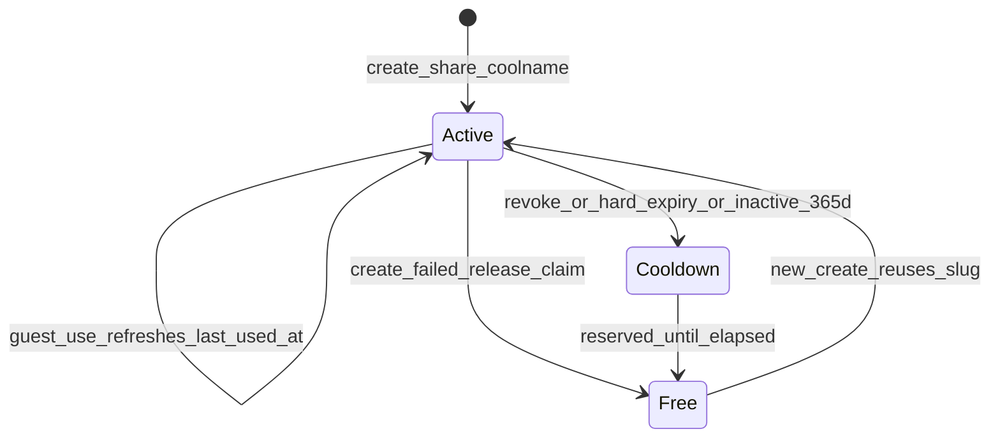

# Share tokens

Public review URLs are `{base}/r/{token}`. New tokens are **coolname** word slugs
from `coolname.generate_slug(3)` (e.g. `fantastic-acoustic-whale`, or
`spiffy-urchin-of-forgiveness` when a connector word is included).

Uniqueness and reuse are enforced by a **host sqlite registry** with two pools.
Episode-bound metadata (capabilities, review version, workspace) stays in the
project sidecar `artifacts/review/shares.json`. See also [persistence.md](persistence.md).

## State diagram



| Pool | Guest `/r/{token}` | Mint collision? |
|------|--------------------|-----------------|
| **Active** | Usable (caps apply) | Yes — blocked |
| **Cooldown** | **404** | Yes — blocked until `reserved_until` |
| Free (absent) | 404 | May mint |

## Algorithm

| Step | Behavior |
|------|----------|
| **Mint** | `claim_with_mint_retry`: coolname slug → `claim_active` under `BEGIN IMMEDIATE`; remint on reservation race; then write project sidecar; `last_used_at = created_at` |
| **Guest use** | `lookup_share` only if usable; touch `last_used_at` (throttle **1 hour**); refresh registry + sidecar |
| **Demote** | On revoke, hard `expires_at`, or `now ≥ last_used_at + 365d` → move to cooldown with `reserved_until = last_used_at + 365d` (single transaction) |
| **Create rollback** | Sidecar write failure → `release_claim` (delete active, **no** 365d cooldown) so flaky disk does not burn coolnames |
| **Remint** | Allowed only if token absent from active and (absent from cooldown or `reserved_until` passed) |
| **Tunnel** | Advertise **usable** active tokens only (`list_usable_shares`) |

### Clocks

- `SHARE_COOLDOWN_DAYS = 365` (`edits/share_registry.py`)
- Hard expiry: optional ISO `expires_at` on the share row
- Activity window: sliding via `last_used_at`. Registry rows always carry it (NOT NULL column); project sidecar rows are not schema-enforced, so `share_last_used_at` falls back to `created_at` and, when neither parses, fails **closed** (the share reads inactive / unusable)
- Touch throttle: `LAST_USED_TOUCH_MIN_INTERVAL = 1h` (avoids write storms on poll)

Demotion is **lazy** (on mint / lookup). There is no background sweeper in this release.

## Host registry (sqlite)

| | |
|--|--|
| Default path | `~/.podcast_mcp/share_registry.sqlite` |
| **Pin (recommended)** | `export PODCAST_SHARE_REGISTRY="$HOME/.podcast_mcp/share_registry.sqlite"` so GUI, CLI, and tunnel share one file. The path is used verbatim (no suffix rewrite), so point it at the sqlite file itself |

Tables (portable schema contract for a future relay backend):

- `active_shares(token PRIMARY KEY, project_workspace, review_version_id, created_at, last_used_at, expires_at, capabilities)` — planned: `kind` (`review` \| `record`; default `review`)
- `cooldown_shares(token PRIMARY KEY, last_used_at, reserved_until, reason, project_workspace)`

Access layer: `ShareRegistryProtocol` in `edits/share_registry.py` (`get_active`,
`is_reserved`, `claim_active`, `release_claim`, `upsert_active_metadata`,
`touch_last_used`, `demote_to_cooldown`, `purge_expired_cooldown`, `backup_to`,
`close`). Host backend: `SqliteShareRegistry` (WAL, `busy_timeout=5000`,
`BEGIN IMMEDIATE` on claim/demote/release). Wired through `edits/review_shares.py`
and `services/share.py`. Do **not** hand-edit the DB or invent a third index.

File mode: parent dir `0700`, DB `0600` when the OS allows. Treat the file as
**capability-adjacent** (tokens are capabilities).

### Backup / restore

```bash
podcast review backup-registry
# or
podcast review backup-registry --dest ~/Backups/share_registry.sqlite
```

Uses sqlite online `Connection.backup()` (safe with WAL). To restore: stop GUI /
tunnel / CLI using the registry, replace the file at `PODCAST_SHARE_REGISTRY`
(or the default path), then restart. Prefer Time Machine / restic of
`~/.podcast_mcp/` in addition to explicit backups before OS upgrades.

## Project sidecar

`artifacts/review/shares.json` — list of share rows for one episode (token, caps,
version id, revoked, timestamps). Rich record for the host; the registry is the
**global UNIQUE(token)** authority on one laptop.

## Record sessions

A second share **kind** (`review` | `record`) lives on the same coolname
registry — same active + cooldown pools and rate limits, no third token index.
Record URLs are `{base}/rec/{token}` (review stays `/r/{token}`). Registry
columns: `kind`, `role` (record role or NULL), `session_id` (NULL for review).
Sidecar rows stay in `artifacts/review/shares.json` with the same fields.
Mint a room (`session_id` + guest + producer tokens) with
`podcast review share --kind record` or `POST /api/shares/record`; end it with
`podcast review revoke-share --session-id` / `POST /api/shares/rooms/{session_id}/revoke`
/ MCP `revoke_record_room_tool`. Remint is refused while the active room is
`recording` or `paused` (`RecordStateError`, HTTP 409, CLI non-zero, MCP error:
"A take is open (REC/PAUSED). Stop it before minting a new room."). Stop the
take first, or `revoke_room` as an explicit owner action. Re-invite (`--session-id`) requires that room
to already exist. A crash after the guest mint can leave a one-token room;
the same revoke path still clears it. Prefix↔kind is enforced by
`lookup_share(..., kind=)`. Recorded clients (`join`) upload keeper chunks on
`GET`/`POST /api/rec/{token}/upload` (lease + sha256 resume) and may
`DELETE` `kind=room_tone` to revoke an ACK'd bed; the host twin is
`/api/record/upload`. After file ACK, landing copies assembled WAV into `raw/`
and registers one clip per segment (`POST /api/record/land`,
`podcast record land`). Record rooms are **link-access only**
(`require_sign_in` is rejected); restricted (sign-in) record shares are
[Follow-up](../ROADMAP.md#follow-up). Decisions and capture follow-up:
[recording-session.md § Session kind and URLs](recording-session.md#session-kind-and-urls).

## Multi-host future (relay)

Today the UNIQUE allocator is **host-local**. `ShareRegistryProtocol` is ready for
a relay/HTTP adapter. When multiple laptops share one public origin, the
durable relay deployment should own the active + cooldown tables (same schema) on a
named Docker volume (or Managed Postgres later) and expose a claim API. Hosts
keep episode sidecars; they ask the relay to mint/claim. **Not implemented** —
blocked on multi-host need. See [ROADMAP.md](../ROADMAP.md) and
[persistence.md](persistence.md).

## Roles and general access

Shares have two independent axes (like Google Drive):

| Axis | Values | Default |
|------|--------|---------|
| **General access** | `link` (Anyone with the link) · `restricted` (ACL + sign-in) | `link` |
| **Role** | `viewer` · `commenter` · `editor` (presets over caps) | commenter-like caps |

Role presets expand in `edits/share_capabilities.py` (`ROLE_PRESETS` /
`resolve_share_capabilities`). Raw `--capabilities` still works when `--role`
is omitted. Browser and share MCP always share one capability set — see
[host-online-relay.md](host-online-relay.md) § Share capabilities.

**Login policy:** production public shares are **link only**. Restricted /
`require_sign_in` minting is refused unless `PODCAST_SHARE_ACCOUNTS=1` (stub
testing). Optional provider account UI is installed and documented separately.
MCP SDK OAuth is **not** the document ACL.

## Identity (Restricted shares) — not production

Backend stubs exist under `share_auth/` and `/auth/*`, but by default `/auth` is
**not mounted** and Restricted shares cannot be minted. Leftover Restricted
tokens still 401 via `ShareIdentityMiddleware`. Escape hatch:
`PODCAST_SHARE_ACCOUNTS=1` remounts `/auth` and allows minting for tests.

Host sqlite `~/.podcast_mcp/share_identity.sqlite` (override
`PODCAST_SHARE_IDENTITY`) holds `users`, `share_acl`, sessions, magic-link tokens,
passkeys, and agent credentials when accounts are enabled. See
[persistence.md](persistence.md) and `deploy/relay/SECRETS.md`.

## Security notes

- On **link** shares the token **is** the capability set (`play` / `view` /
  `comment` / `reply` / `action` / `suggest` / `edit` / `mcp`). Treat URLs as
  secrets (forwardable, same threat model as Docs link sharing).
  `view` includes the live presence roster and canvas ghosts (cursor, selection,
  playhead, viewport). `play` is required to follow-with-audio. Anyone with
  `view` can see the host's cursor and viewport — the Share dialog states this.
- On **restricted** leftovers the coolname alone does not grant powers; identity
  middleware keeps them 401 until accounts ship.
- Prefer short `expires_at` for public demos; revoke with
  `podcast review revoke-share --token …`.
- Guest JSON never includes host absolute paths; episode JSON stores
  workspace-relative paths only (`workspace_dir: "."` on disk). Rate limits:
  [host-online-relay.md](host-online-relay.md) § Rate limiting.
- Coolname slugs are guessable in theory; the large namespace plus cooldown and
  rate limits are the practical controls. Do not publish token lists.
- **Tunnel binding (not the mint registry):** when a host advertises a share to the
  relay it signs an HMAC claim with its tunnel secret. The relay keeps
  `token → host_id` across disconnect so another host cannot steal an offline
  coolname. This is separate from the future relay-owned mint/claim API above.

## Operator quick path

**Sharecut Studio (host):** Menu → **Share…** (`share.manage`) lists live links, mints a coolname URL (role viewer / commenter / editor, optional MCP), and stops sharing. If no review mix exists, Create link publishes **Share mix** first. That publish refuses a premix that's behind the project (edits, volume or mute since the last Refresh), and the dialog shows the error: Refresh (**Mod+B**), then create the link again. Same `ShareService` as CLI.

CLI:

1. `export PODCAST_SHARE_REGISTRY="$HOME/.podcast_mcp/share_registry.sqlite"` (optional pin)
2. `podcast review publish-version --label "Guest pass"`
3. `podcast review share --role commenter --version <vid> --base-url https://share.example.com`
4. Guest opens `https://share.example.com/r/fantastic-acoustic-whale`
5. Prefer relay + `podcast tunnel` ([host-online-relay.md](host-online-relay.md))
6. Periodic: `podcast review backup-registry`
