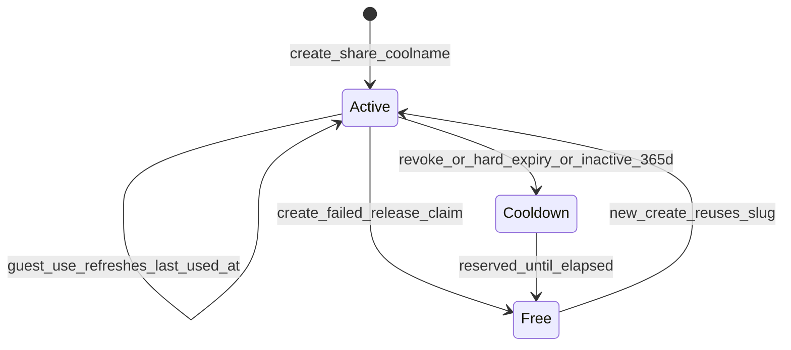

# Share tokens

Public review URLs are `{base}/r/{token}`. New tokens are **coolname** word slugs
from `coolname.generate_slug(3)` (e.g. `fantastic-acoustic-whale`, or
`spiffy-urchin-of-forgiveness` when a connector word is included).

Uniqueness and reuse are enforced by a **host sqlite registry** with two pools.
Tokens are live credentials, so only that registry stores them, outside every
project workspace. Episode-bound metadata (share `id`, capabilities, review
version, access policy, revoked state) stays in the project sidecar
`artifacts/review/shares.json`, keyed by the share `id`. See also
[persistence.md](persistence.md).

Local host and guest review media responses open the authorized file through
no-follow directory descriptors before streaming. Byte ranges, HEAD, and cache
headers use that pinned file, so a later symlink swap cannot redirect a read.
Review MP3 retries give FFmpeg a private, separate-inode clone or copy from the pinned WAV descriptor;
object-store uploads pass the pinned MP3 file object to the client. Windows has no
descriptor-relative no-follow opens, so `util/pinned_media.py` uses a weaker path-based
fallback there. The path must not traverse a symlink or junction. After opening, the
descriptor's `fstat` must report a non-zero file ID and match the path's `lstat` (same
device and inode, regular file), and the parent link check and a `realpath` comparison are
repeated. An open file cannot be deleted or renamed on Windows. A parent swapped for a
junction before the open and restored between those checks is not detected, and a
filesystem that reports no file IDs (some FAT volumes and network shares) refuses these
reads. The path must already be resolved (`Path.resolve()`, as `project.workspace_path()`
does): an unresolved spelling such as an 8.3 short name or a `subst` drive fails the
`realpath` comparison and is refused. Every other platform without the descriptor
operations fails closed. Ranged responses read with a lock-guarded seek because `os.pread`
is missing on Windows. `PinnedFileResponse` overrides Starlette's private `FileResponse`
hooks, so `starlette>=0.47.0` (and `fastapi>=0.116.1`, the first release that accepts it)
is required. In `tests/test_pinned_media.py`, a signature-drift test and a test that forbids
opening the path fail on the next incompatible change; the `pinned-media-windows` CI job
runs that file on Windows with Python 3.11 (the `requires-python` floor) and 3.12 (the
desktop sidecar's version).

## State diagram


```mermaid
stateDiagram-v2
  [*] --> Active: create_share_coolname
  Active --> Active: guest_use_refreshes_last_used_at
  Active --> Cooldown: revoke_or_hard_expiry_or_inactive_365d
  Active --> Free: create_failed_release_claim
  Cooldown --> Free: reserved_until_elapsed
  Free --> Active: new_create_reuses_slug
```

| Pool | Guest `/r/{token}` | Mint collision? |
|------|--------------------|-----------------|
| **Active** | Usable (caps apply) | Yes — blocked |
| **Cooldown** | **404** | Yes — blocked until `reserved_until` |
| Free (absent) | 404 | May mint |

## Algorithm

| Step | Behavior |
|------|----------|
| **Mint** | `claim_with_mint_retry`: coolname slug → `claim_active` under `BEGIN IMMEDIATE`; remint on reservation race; then write project sidecar; `last_used_at = created_at` |
| **Guest use** | `lookup_share` checks the active registry row on each request, touches `last_used_at` (throttle **1 hour**), and reads the project `shares.json` row with the registry row's `id` directly for current access policy. The project JSON need not be parsed for this lookup |
| **Demote** | On revoke, hard `expires_at`, or `now ≥ last_used_at + 365d` → move to cooldown with `reserved_until = last_used_at + 365d` (single transaction) |
| **Create rollback** | Sidecar write failure → `release_claim` (delete active, **no** 365d cooldown) so flaky disk does not burn coolnames |
| **Remint** | Allowed only if token absent from active and (absent from cooldown or `reserved_until` passed) |
| **Tunnel** | Advertise **usable** active tokens only (`list_usable_shares`) |

### Clocks

- `SHARE_COOLDOWN_DAYS = 365` (`edits/share_registry.py`)
- Hard expiry: optional ISO `expires_at` on the share row
- Activity window: sliding via `last_used_at`. Registry rows always carry it (NOT NULL column); project sidecar rows are not schema-enforced, so `share_last_used_at` falls back to `created_at` and, when neither parses, fails **closed** (the share reads inactive / unusable)
- Touch throttle: `LAST_USED_TOUCH_MIN_INTERVAL = 1h` (avoids write storms on poll)

Demotion is **lazy** (on mint / lookup). There is no background sweeper in this release.

### Decision: Share links never expire; the host revokes them

<!-- decision
id: D-share-links-never-expire
status: accepted
date: 2026-10-06
decided-by: calebn
evidence:
- #80 owner: "Links stay non-expiring with manual revoke. The per-row Extend proposal is dropped."
- #80 owner: "Share copy and docs must say this consistently."
- #1038 put the wording in docs/communication-philosophy.md (Stop sharing)
enforcement: pending #1027
-->

A review link works until the host stops sharing it. There is no per-link
Extend. Product copy says links do not expire and calls revoking **Stop
sharing** ([communication philosophy](communication-philosophy.md#terminology)).
The code still accepts an optional hard `expires_at`, and the 365-day
inactivity demotion above still applies. Whether either one stays is open in
#1027, which also removes the Share dialog's "keeps the original expiry" copy.

## Host registry (sqlite)

| | |
|--|--|
| Default path | `~/.podcast_mcp/share_registry.sqlite` |
| **Pin (recommended)** | `export PODCAST_SHARE_REGISTRY="$HOME/.podcast_mcp/share_registry.sqlite"` so GUI, CLI, and tunnel share one file. The path is used verbatim (no suffix rewrite), so point it at the sqlite file itself |

Tables (portable schema contract for a future relay backend):

- `active_shares(token PRIMARY KEY, id, project_workspace, review_version_id, created_at, last_used_at, expires_at, capabilities, kind, role, session_id)`: `id` is the random per-share id (`EditDecision.author`); `kind` is `review` \| `record` (default `review`)
- `cooldown_shares(token PRIMARY KEY, last_used_at, reserved_until, reason, project_workspace)`

Access layer: `ShareRegistryProtocol` in `edits/share_registry.py` (`get_active`,
`list_active_for_workspace`, `is_reserved`, `claim_active`, `release_claim`, `upsert_active_metadata`,
`touch_last_used`, `demote_to_cooldown`, `purge_expired_cooldown`, `backup_to`,
`close`). Host backend: `SqliteShareRegistry` (WAL, `busy_timeout=5000`,
`BEGIN IMMEDIATE` on claim/demote/release). Wired through `edits/review_shares.py`
and `services/collaboration/share.py`. Do **not** hand-edit the DB or invent a third index.

File mode: parent dir `0700`, DB `0600` when the OS allows. Treat the file as
**capability-adjacent** (tokens are capabilities).

### Backup / restore

```bash
podcast review backup-registry
# or
podcast review backup-registry --dest ~/Backups/share_registry.sqlite
```

Uses sqlite online `Connection.backup()` (safe with WAL). To restore: stop GUI /
tunnel / CLI using the registry, replace the file at `PODCAST_SHARE_REGISTRY`
(or the default path), then restart. Prefer Time Machine / restic of
`~/.podcast_mcp/` in addition to explicit backups before OS upgrades.

## Project sidecar

`artifacts/review/shares.json` — list of share rows for one episode, keyed by the
share `id`: caps, version id, `general_access` / `require_sign_in`, record `kind` /
`role` / `session_id`, revoked state and timestamps. It never holds a token, so a
copied workspace (backup, collaborator, bug report) carries no working link. Every
sidecar write drops a `token` field, and readers ignore one left in an older file.
The registry is the **global UNIQUE(token)** authority on one laptop and the only
place a token lives.

The host's share list (`ShareService.list` / `list_presented`, `GET /api/shares`,
`podcast review list-shares`) joins each row's token from the registry's active
rows for that workspace (`list_active_for_workspace`), and Copy link uses the URL
built from it. A revoked or demoted share has no active row, so it has no token or
link; the Share dialog lists only live links. Revoke and drop map a token to its
`id` through the registry before touching the sidecar.

## Record sessions

Removing a participant closes the record token they joined through to new
identities (`invite_closed`); existing leases keep working. When several guests
share the link, an unaffected guest who loses their lease also needs the
replacement. Re-invite by minting a replacement for the same role with
`podcast review share --kind record --session-id <id> --role guest` (or
`--role producer`).
The host Share dialog also identifies closed record invites, prevents copying
them for new participants, and replaces one from its source token. The new link
keeps the same room, role, and expiry; established leases on the old token keep
working.
See [recording-session.md](recording-session.md).

A second share **kind** (`review` | `record`) lives on the same coolname
registry — same active + cooldown pools and rate limits, no third token index.
Record URLs are `{base}/rec/{token}` (review stays `/r/{token}`). Registry
columns: `kind`, `role` (record role or NULL), `session_id` (NULL for review).
Sidecar rows stay in `artifacts/review/shares.json` with the same fields (no token).
Mint a room (`session_id` + guest + producer tokens) with
`podcast review share --kind record` or `POST /api/shares/record`; end it with
`podcast review revoke-share --session-id` / `POST /api/shares/rooms/{session_id}/revoke`
/ MCP `revoke_record_room_tool`. Remint is refused while the active room is
`recording` or `paused` (`RecordStateError`, HTTP 409, CLI non-zero, MCP error:
"A take is open (REC/PAUSED). Stop it before minting a new room."). Stop the
take first, or `revoke_room` as an explicit owner action. Re-invite (`--session-id`) requires that room
to already exist. A crash after the guest mint can leave a one-token room;
the same revoke path still clears it. Prefix↔kind is enforced by
`lookup_share(..., kind=)`. Recorded clients (`join`) upload keeper chunks on
`GET`/`POST /api/rec/{token}/upload` (lease + sha256 resume) and may
`DELETE` `kind=room_tone` to revoke an ACK'd bed; the host twin is
`/api/record/upload`. After file ACK, landing copies assembled WAV into `raw/`
and registers one clip per segment (`POST /api/record/land`,
`podcast record land`). Record rooms are **link-access only**
(`require_sign_in` is rejected); restricted (sign-in) record shares are
[Follow-up](../ROADMAP.md#follow-up). Decisions and capture follow-up:
[recording-session.md § Session kind and URLs](recording-session.md#session-kind-and-urls).

## Multi-host future (relay)

Today the UNIQUE allocator is **host-local**. `ShareRegistryProtocol` is ready for
a relay/HTTP adapter. When multiple laptops share one public origin, the
durable relay deployment should own the active + cooldown tables (same schema) on a
named Docker volume (or Managed Postgres later) and expose a claim API. Hosts
keep episode sidecars; they ask the relay to mint/claim. **Not implemented** —
blocked on multi-host need. See [ROADMAP.md](../ROADMAP.md) and
[persistence.md](persistence.md).

## Roles and general access

Shares have two independent axes (like Google Drive):

| Axis | Values | Default |
|------|--------|---------|
| **General access** | `link` (Anyone with the link) · `restricted` (ACL + sign-in) | `link` |
| **Role** | `viewer` · `commenter` · `editor` (presets over caps) | commenter-like caps |

Role presets expand in `edits/share_capabilities.py` (`ROLE_PRESETS` /
`resolve_share_capabilities`). Raw `--capabilities` still works when `--role`
is omitted. Browser and share MCP always share one capability set — see
[host-online-relay.md](host-online-relay.md) § Share capabilities.

### Decision: Review-link roles follow Google Docs

<!-- decision
id: D-share-roles-follow-google-docs
status: accepted
date: 2026-10-06
decided-by: calebn
evidence:
- #1038 owner review: "These follow Google Docs: a Commenter can suggest."
- #1050: "Make Commenter grant comment and suggest. Delete the standalone suggest-only level."
enforcement: pending #1050
-->

A Viewer can view and play. A Commenter can also comment and suggest. An
Editor can also edit directly and approve or reject suggestions. There is no
suggest-only level. Until #1050 lands, the `commenter` preset
(`COMMENTER_CAPABILITIES`) still lacks `view` and `suggest`, and
`docs_role_for_capabilities` labels a suggest-only share Editor.

### Decision: Guest powers follow the share's capabilities

<!-- decision
id: D-guest-powers-follow-capabilities
status: accepted
date: 2026-10-06
decided-by: calebn
evidence:
- #6 owner: "`edit` guests can edit through every surface they have, including the DAW, MCP, and transcript word selection."
- #1004 owner: "if someone has edit ability, they are trusted to approve." and "the host can undo it from History."
- #1006, #1011: a 2026-10-03 Chromium run found no guest transcript Select and guest MCP cuts that only proposed; both fixed
enforced-by:
- tests/test_guest_document_gate.py::test_only_edit_guests_decide_pending_suggestions
- tests/test_guest_document_gate.py::test_host_undoes_each_edit_guest_mcp_change
- tests/test_guest_document_gate.py::test_selected_range_mode_follows_capabilities_on_every_surface
- tests/test_selected_range.py::test_view_play_comment_guest_cannot_edit_or_suggest
- docs-sync: decision-sharing
supersedes: D-exact-range-guests-propose
-->

An `edit` guest edits and approves, a `suggest` guest only suggests, and a
`view`, `play` or `comment` guest does neither, on every surface. No new
permission level exists for this.

Selected-range edits (transcript words or a timeline range) follow the same
capabilities. No separate transcript permission exists. Every document command
needs `view`, on the browser route and the guest MCP alike: a share with
`suggest` or `edit` but no `view` can run none. The guest MCP derives its
tool list from the same gate: `guest_submit_document_command` needs a command
the gate allows, and the `edit` tools (render preview, media upload) need every
`edit` command (`edit_commands_allowed`), so an `edit` share without `view` is
offered neither. The browser render preview, render job, boundary context and
media upload routes call the same `edit_commands_allowed` (through
`require_share_edit`), so both surfaces refuse an `edit` share without `view`.

| Capabilities | Transcript **Select** and timed words | Range Cut / Mute (DAW, transcript, guest MCP) | Retime a pending edit | Approve / Reject pending edits |
|--------------|----------------------------------------|-----------------------------------------------|-----------------------|--------------------------------|
| `view` + `edit` | Yes | **Cut** / **Mute** apply at once, one History step | Any pending edit | Any, exact range proposals included |
| `view` + `suggest` (no `edit`) | Yes | **Suggest cut** / **Suggest mute** create a pending edit for review | Only its own suggestions (pending edits its share authored) | Refused |
| `view` / `play` / `comment` / `reply` only | No (untimed utterance text) | Refused by the document-command gate | Refused | Refused |

An `edit` guest is trusted to approve: approving applies an edit. The host can
undo every change an `edit` guest makes (applied cut or mute, approval,
rejection, retime) with one History Undo each.

The document-command gate (`authorize_document_command` plus
`policy.resolve_range_mode`, `policy.may_decide_exact_range` and
`policy.authorize_pending_update`) enforces the table from the share's
capabilities, whatever the surface; the Studio reads it from `rangeEditMode` and `canRetimePendingEdit` in
`gui/web/src/shareMode.ts`, plus `canReviewPendingEdit` for Approve / Reject,
only to choose affordances. Every pending edit a guest's document command creates
records `EditDecision.author`, `share:` plus the share's opaque registry `id`
(`share_capabilities.share_author`), on the browser route and the guest MCP alike.
`create_share` mints that id at random and the registry stores it beside the
token, so nothing in the author is derived from the token and a copied project
leaks no share credential. The id belongs to one share, not its slug: revoking and
recreating a link, or a coolname recycled after cooldown, gets a new id, and the
old suggestions belong to no guest. Host and agent edits, and edits saved before
authorship, have no author and belong to no guest. A `suggest` guest retimes only
edits whose author is its own share, and coalescing never merges pending edits
with different authors (`transcript_cuts.coalesce_edits`). Every pending-edit row
in the projection carries its `author`, the same row for every guest, and the guest
bootstrap (`GET /api/review/{token}/project`) returns the guest's own `author`.
The Studio shows Retime on a suggestion only when the two match
(`canRetimePendingEdit`), so a `suggest` guest sees it on its own suggestions and
nowhere else. The id is random and grants nothing: every guest route and the guest
MCP look a share up by its token, never by `id`, so another guest who sees an
author learns only which suggestions came from the same share.

### Superseded decision: Every guest proposes exact range edits

<!-- decision
id: D-exact-range-guests-propose
status: superseded
date: 2026-10-03
decided-by: calebn
evidence:
- #532, shipped in #932: "The host applies and exports; all edit/suggest guests and supported agents propose."
superseded-by: D-guest-powers-follow-capabilities
-->

The first exact range release (#532) let only the host apply a range edit.
The decision above replaced that for `edit` guests on 2026-10-06. Agents
still propose, and export stays host-only
([daw-editing.md § Exact selected ranges](daw-editing.md#exact-selected-ranges)).

### Login policy

Production public shares are **link only**. Restricted /
`require_sign_in` minting is refused unless `PODCAST_SHARE_ACCOUNTS=1` (stub
testing). Optional provider account UI is installed and documented separately.
MCP SDK OAuth is **not** the document ACL.

## Identity (Restricted shares) — not production

Backend stubs exist under `share_auth/` and `/auth/*`, but by default `/auth` is
**not mounted** and Restricted shares cannot be minted. Leftover Restricted
tokens still 401 via `ShareIdentityMiddleware`. Escape hatch:
`PODCAST_SHARE_ACCOUNTS=1` remounts `/auth` and allows minting for tests.

Host sqlite `~/.podcast_mcp/share_identity.sqlite` (override
`PODCAST_SHARE_IDENTITY`) holds `users`, `share_acl`, sessions, magic-link tokens,
passkeys, and agent credentials when accounts are enabled. See
[persistence.md](persistence.md) and `deploy/relay/SECRETS.md`.

## Security notes

- On **link** shares the token **is** the capability set (`play` / `view` /
  `comment` / `reply` / `action` / `suggest` / `edit` / `mcp`). Treat URLs as
  secrets (forwardable, same threat model as Docs link sharing).
  `view` includes the live presence roster and canvas ghosts (cursor, selection,
  playhead, viewport). `play` is required to follow-with-audio. Anyone with
  `view` can see the host's cursor and viewport — the Share dialog states this.
- On **restricted** leftovers the coolname alone does not grant powers; identity
  middleware keeps them 401 until accounts ship.
- Links do not expire
  ([decision](#decision-share-links-never-expire-the-host-revokes-them)); end
  one with `podcast review revoke-share --token …`.
- Guest JSON never includes host absolute paths; episode JSON stores
  workspace-relative paths only (`workspace_dir: "."` on disk). Rate limits:
  [host-online-relay.md](host-online-relay.md) § Rate limiting.
- Coolname slugs are guessable in theory; the large namespace plus cooldown and
  rate limits are the practical controls. Do not publish token lists.
- **Tunnel binding (not the mint registry):** when a host advertises a share to the
  relay it signs an HMAC claim with its tunnel secret. The relay keeps
  `token → host_id` across disconnect so another host cannot steal an offline
  coolname. This is separate from the future relay-owned mint/claim API above.

## Operator quick path

**Sharecut Studio (host):** Menu → **Share…** (`share.manage`) lists live links, mints a coolname URL (role viewer / commenter / editor, optional MCP), and stops sharing. If no review mix exists, Create link publishes **Share mix** first. If the premix is behind the project (edits, volume or mute since the last Refresh), the typed conflict offers **Refresh mix**; the dialog waits for the existing render job to finish successfully, then retries the captured Create link request once. A failed or cancelled refresh leaves the recovery action available, and a second stale response requires another explicit refresh. A stale master instead explains that it must be re-mastered; preview refresh does not claim to fix it. Same `ShareService` as CLI.

CLI:

1. `export PODCAST_SHARE_REGISTRY="$HOME/.podcast_mcp/share_registry.sqlite"` (optional pin)
2. `podcast review publish-version --label "Guest pass"`
3. `podcast review share --role commenter --version <vid> --base-url https://share.example.com`
4. Guest opens `https://share.example.com/r/fantastic-acoustic-whale`
5. Prefer relay + `podcast tunnel` ([host-online-relay.md](host-online-relay.md))
6. Periodic: `podcast review backup-registry`
