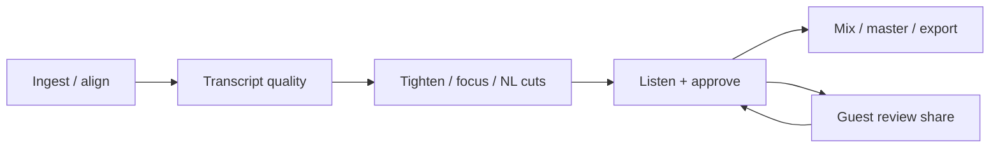

# UX brief — Podcast MCP / Sharecut Studio

Shareable product framing for UX partners. Engineer detail lives in repo `docs/`; this pack stays in product language.

---

## What this product is

**Podcast MCP** is a FOSS podcast production toolkit: multitrack episode projects, transcript-driven editing, FFmpeg cleanup/mix/master, and an agent-friendly tool surface (CLI + MCP skills).

**Sharecut Studio** is the web DAW / review UI for an episode: listen, inspect timeline and transcript, approve agent-suggested cuts, leave time-anchored comments, and (on share links) collaborate as a guest.

**ReviewApp** is the lighter share surface (default): frozen review mix + comments — no full timeline.

It is **not** a full Pro Tools replacement. It is closer to **Descript + a Reaper-style session inspector**, with an AI agent that proposes the same kinds of mutations a human can approve.

---

## Who it’s for (personas)

Personas are **jobs**, not demographics.

### Host editor — “Maya”

| | |
|--|--|
| **Goal** | Ship a clean, dense episode without losing trust in cuts |
| **Fears** | Clicky joins, accidental deletes, guest feedback she can’t find |
| **Surface** | Local Sharecut Studio (desktop/tablet/phone) + CLI/MCP agents |
| **Scenario** | On the train: open Listen, tap Pending, audition around a filler cut, Approve |

### Guest reviewer — “Jordan”

| | |
|--|--|
| **Goal** | Leave useful feedback without installing tooling |
| **Fears** | “Am I allowed to edit?”; link dead because host laptop slept |
| **Surface** | Share link `/r/{token}` — default **ReviewApp**; Sharecut Studio guest when `view` is granted |
| **Scenario** | Phone: play review mix, leave a note at 11:02, optionally suggest a cut if the host allowed it |

### Remote agent — “Cursor on the share”

| | |
|--|--|
| **Goal** | Same powers as the human share recipient, via tools |
| **Fears** | Over-privileged tools; silent failure when host is offline |
| **Surface** | `{base}/mcp/{token}/mcp` (requires share `mcp` + host `PODCAST_REMOTE_MCP=1`) |
| **Scenario** | Host grants `play,view,comment,mcp`; agent lists comments and proposes a suggest-cut |

### Local agent (Cursor, etc.)

Propose tighten/focus/transcript fixes via host MCP/CLI → same project file the GUI reads.

---

## Jobs to be done

| Situation | Motivation | Outcome |
|-----------|------------|---------|
| Remote takes start/stop at different times | Align into one session | Per-speaker tracks on one clock |
| ASR wrong-mic / garbled names | Trust transcript enough to cut by words | Bleed suppressed; names fixed |
| Episode feels slow | Tighten / focus without losing meaning | Dense dialogue, natural joins |
| About to approve a cut | Hear before commit | Audition Mix / FX / Raw around the decision |
| Collaborator has no DAW | Review with others | Comments / actions; optional suggest or edit |
| Ready to publish | Export for hosts | Masters + transcripts for Spotify / Apple / etc. |

---

## Success signals (product)

**Qualitative**

- Reviewer can leave useful feedback in under five minutes on a phone share link.
- Host can find, audition, and resolve a pending cut without opening the full Reaper-style grid.
- Agent proposals show up in the same inspectors humans use (no “shadow” edit world).
- Non-destructive history: undo never deletes raw audio.

**Measurable (targets to instrument)**

| Metric | Target |
|--------|--------|
| Time to first comment on a cold share link | &lt; 5 minutes for 4/5 hallway testers |
| Mode understanding | ≥ 4/5 guests correctly say what they can do after reading the banner / ReviewApp header |
| Offline conflict recovery | Guest can dismiss/recover from **Needs attention** without host coaching |

---

## Design principles

1. **Listen-first** — every edit surface keeps play/seek around the selection.
2. **Non-destructive** — raw files stay; edits live in project + history snapshots.
3. **Phone ≠ shrunk desktop** — four modes + sheet; do not force the four-pane grid onto small screens.
4. **One job per phone mode** — Listen / Timeline / Text / More.
5. **Same project, many clients** — GUI, CLI, and agent mutate one episode project.
6. **Progressive complexity** — guests only see capabilities their share token allows (ReviewApp vs Sharecut Studio).
7. **Primary chrome stays reachable** — on narrow widths, Comment/Fit icons stay visible; secondary controls go under Menu.

---

## End-to-end journey

| Stage | Actor | Pain if UX fails |
|-------|--------|------------------|
| Ingest | Host | Tracks feel “out of sync”; talking over each other |
| Transcript | Host + agent | Wrong-mic bleed, garbled names, fear of cutting |
| Edit | Host + agent | Clicky joins, over-tightening, opaque “why cut?” |
| Approve | Host (often phone) | Can’t audition / approve without laptop DAW density |
| Review | Guest | Unclear ReviewApp vs Sharecut Studio; unclear powers; host offline; offline edit conflicts |
| Export | Host | Loudness / chapters / transcript mismatch |

Guest step flows: [Guest journeys](#/journeys).

---

## Surfaces overview

| Surface | Audience | Notes |
|---------|----------|-------|
| **Sharecut Studio host** | Editor | Full project; document commands + pipeline |
| **ReviewApp** | Guest (default share) | Mix + comments; published review MP3 (often CDN) |
| **Sharecut Studio guest** | Guest with `view` | Mode banner; capability gates; proxy MP3 when available; no Impact/History/Pipeline |
| **CLI / MCP** | Agent + power user | Same domain services; not a parallel product |
| **Remote MCP (share)** | Agent as guest | Same caps as the share; `{base}/mcp/{token}/mcp` |

See [Screen inventory](#/screens), [Guest journeys](#/journeys), [Domain glossary](#/glossary), and [See the UI](#/demo).

---

## Competitive references (steal / avoid)

| Reference | Steal | Avoid |
|-----------|-------|-------|
| **Descript** | Transcript-as-timeline mental model | Assuming one mixed track is enough for bleed |
| **Reaper** | Dense multitrack truth for power users | Shipping that density as the only phone UI |
| **Riverside / Zencastr** | Guest-simple review listening | Hiding edit provenance |
| **CapCut** | Fixed-center scrub on phone Timeline | Bringing that metaphor to desktop |

---

## Out of scope (for now)

- Full concurrent multi-cursor OT editing
- iZotope-class repair (true de-click / de-reverb)
- Video social export (audio clip candidates exist; video is roadmap)
- Always-on SaaS project hosting (relay + laptop host is today’s model)
- In-app MCP connect UI (URL is printed by share-create CLI/docs)

---

## Related engineer docs

- [gui-mobile.md](https://github.com/calebn/sharecut-studio/blob/main/docs/gui-mobile.md) — responsive shells (implementation)
- [episode-format-v2.md](https://github.com/calebn/sharecut-studio/blob/main/docs/episode-format-v2.md) — project file truth
- [daw-editing.md](https://github.com/calebn/sharecut-studio/blob/main/docs/daw-editing.md) — modifier / document-command model
- [host-online-relay.md](https://github.com/calebn/sharecut-studio/blob/main/docs/host-online-relay.md) — share links, proxy media, object storage, remote MCP
- [session-sync.md](https://github.com/calebn/sharecut-studio/blob/main/docs/session-sync.md) — live sync, presence, guest offline queue
- [ROADMAP.md](https://github.com/calebn/sharecut-studio/blob/main/ROADMAP.md) — shipping backlog
