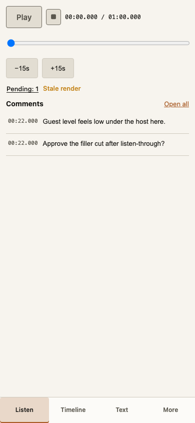
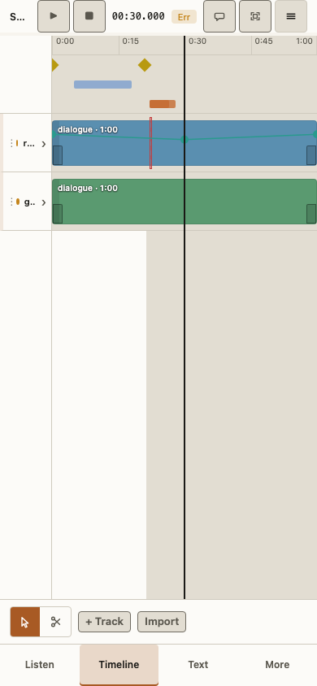
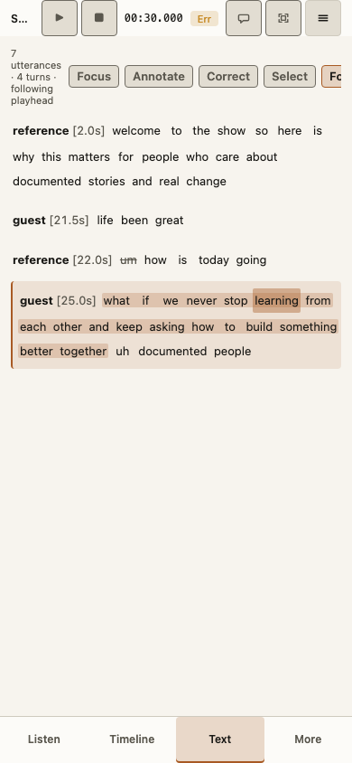
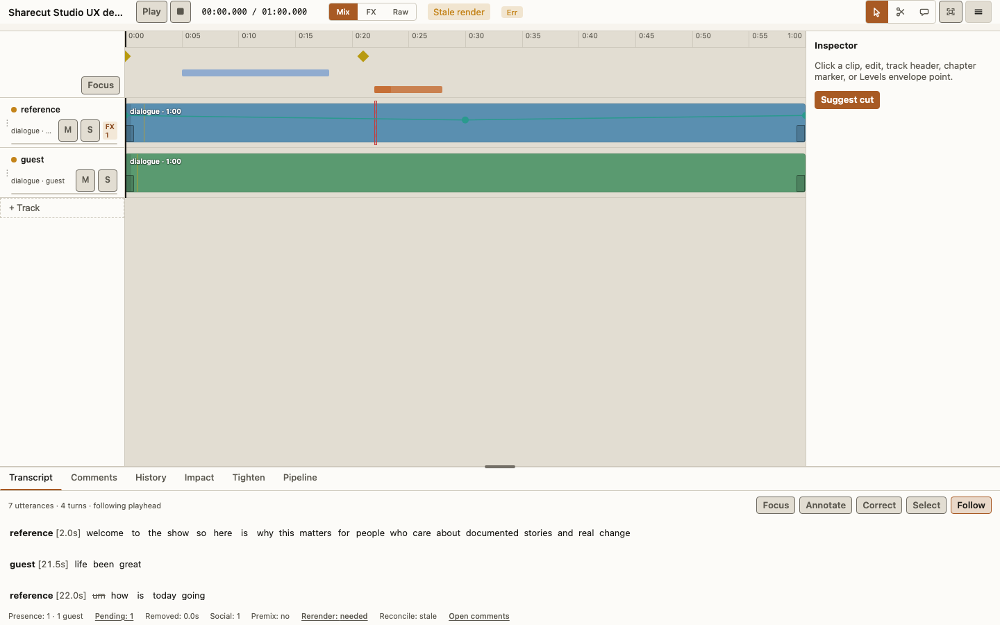
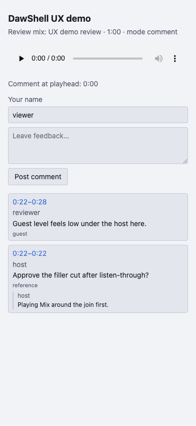
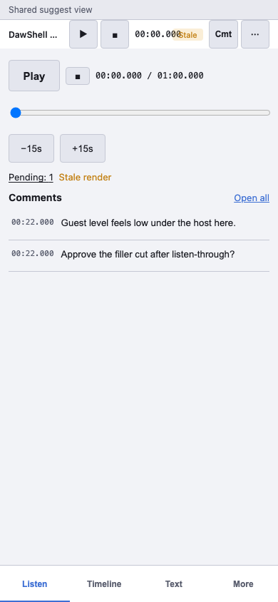
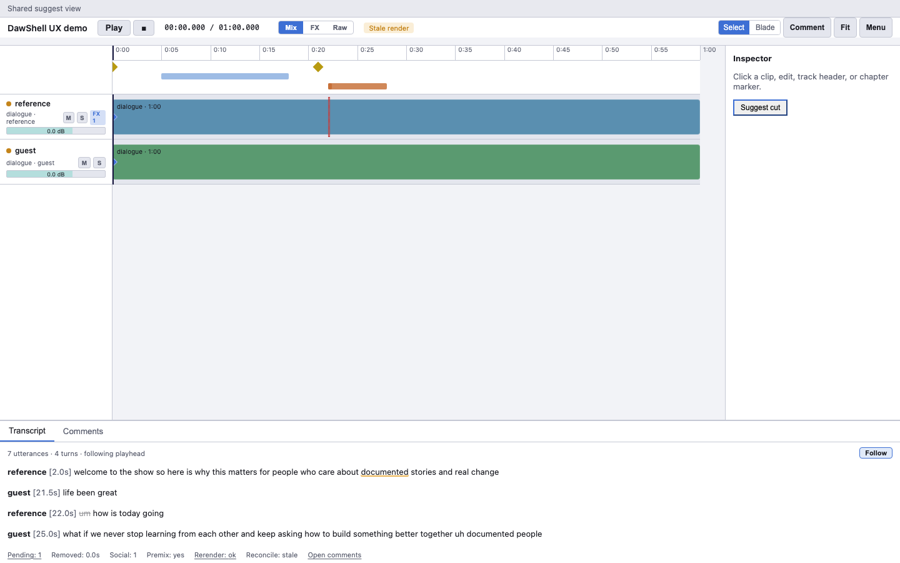

# See the UI — Sharecut Studio UX demo

Always-on reference for what Sharecut Studio shows. Two layers:

1. **Screenshots on this site** (below) — visible without installing anything.
2. **Live fixture in the repo** — open locally to click through the real shell.

> Host screenshots cover phone Listen / Timeline / Text and desktop. Guest screenshots show **ReviewApp** (default share) and **Sharecut Studio guest** (when `view` is granted).

## Open the live demo (local)

```bash
git clone https://github.com/calebn/sharecut-studio.git
cd sharecut-studio
./install.sh && uv sync --extra gui
cd gui/web && npm install && npm run build && cd ../..
podcast gui --project tests/fixtures/sharecut_ux_demo/episode.project.json
```

Fixture path: [`tests/fixtures/sharecut_ux_demo/`](https://github.com/calebn/sharecut-studio/tree/main/tests/fixtures/sharecut_ux_demo)

### Guest share against the fixture

```bash
# Terminal A — GUI with a shares index (use a free port)
export PODCAST_SHARE_REGISTRY=/tmp/podcast_ux_demo_shares.json
podcast gui --project tests/fixtures/sharecut_ux_demo/episode.project.json --port 8777

# Terminal B — publish review mix + create tokens
PODCAST_SHARE_REGISTRY=/tmp/podcast_ux_demo_shares.json \
  python3 scripts/ux_demo_prepare_shares.py --base-url http://127.0.0.1:8777
# Open the printed ReviewApp URL and Sharecut Studio guest URL
```

Or refresh all Pages PNGs (host + guest): `make ux-demo-screens` (defaults to port **8777** so a local `:8766` GUI does not block Playwright).

Regenerate showcase data:

```bash
python3 scripts/build_ux_demo_fixture.py
make ux-demo-screens   # refresh Pages screenshots
```

## What the demo seeds

| Surface | Seeded data |
|---------|-------------|
| Listen | Two timeline comments + action item |
| Timeline | Pending filler cut overlay, chapters, levels envelope |
| Text | Low-confidence “documented”, suppressed “um” |
| Impact / More | Pending review cut |
| Mix / FX | Audition Mix/FX/Raw in transport; volume envelope on Levels |
| Social | One clip candidate |

Audio is **symlinked** from `aligned_dialogue/raw` so the demo stays on the same stems as CI smoke.

## Screenshots — host









## Screenshots — guest share







If images are missing after a fresh clone, run `make ux-demo-screens` (needs GUI extra + Playwright Chromium).

Annotated FigJam wireframes are optional; until a linked board exists, use [Screens](#/screens) ASCII + [Guest journeys](#/journeys).

## Related

- [Screen inventory](#/screens) — display schemas
- [Guest journeys](#/journeys) — step flows
- [Domain glossary](#/glossary) — field map
- Engineer mobile IA: [docs/gui-mobile.md](https://github.com/calebn/sharecut-studio/blob/main/docs/gui-mobile.md)
