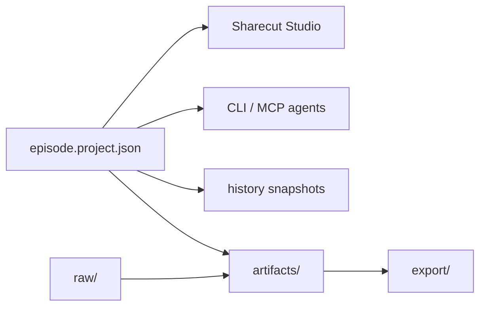
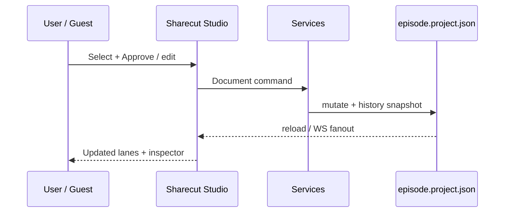

# Domain glossary — concepts, files, screens

Two layers: **Partner terms** (plain language) and **Schema map** (for people who will touch the project file). Engineer canonical: [episode-format-v2.md](https://github.com/calebn/sharecut-studio/blob/main/docs/episode-format-v2.md).

---

## Partner terms (start here)

| Term | What it means for a host or guest |
|------|-----------------------------------|
| **Episode / project** | The session you’re editing or reviewing |
| **Track** | One speaker mic (or music bed) |
| **Clip** | A kept stretch of audio on the session |
| **Pending cut** | A suggested remove not yet approved |
| **Approve / Reject** | Commit or discard a pending cut |
| **Comment** | A note at a time on the mix |
| **Review mix** | Frozen listen file for guests (ReviewApp) |
| **Share link** | `/r/…` URL with limited powers |
| **ReviewApp** | Light guest UI: play mix + comments (default share) |
| **Sharecut Studio guest** | Full-ish timeline UI when the share includes “view” |
| **Mode banner** | Top strip naming Shared edit / suggest / read-only / comment view |
| **Proxy listen** | Short MP3 chunks for guest playback (faster than full WAVs) |
| **Needs attention** | Guest banner when offline edits conflicted with the host |
| **Offline queue** | Guest edits waiting until the network returns |
| **Presence** | Who is in the session (avatars, ghost cursors). Click to follow. |
| **Follow** | Slave viewport (desktop/tablet) or listen-along with a centered playhead (phone); Esc or local navigation (including keyboard seek) stops |
| **Remote agent link** | MCP URL for an external agent: `{base}/mcp/{token}/mcp` |
| **Mix / FX / Raw** | What you’re hearing (session mix, with effects, or raw take) |
| **Source vs timeline time** | Original recording time vs “when you hear it on the mix” |
| **Stale render** | Mix preview is behind recent edits — refresh/re-render |
| **Bleed / suppress** | Wrong-mic words hidden so cuts don’t follow bleed |

---

## Two clocks (critical UX concept)

| Clock | Meaning | Examples in UI |
|-------|---------|----------------|
| **Source** | Seconds into a track’s raw file | Cut ranges, word timestamps, pending edit math |
| **Timeline** | Seconds on the edited session listeners hear | Playhead, comments, chapters, social clips, premix |

**Rule of thumb for copy:** “When you hear it on the mix” → timeline. “Where it sits in the original recording” → source.

Clips are the bridge. The product should rarely ask users to convert clocks manually.

---

## Schema map (concept ↔ storage ↔ screens)

| Concept | User-facing meaning | Storage | Screens |
|---------|---------------------|---------|---------|
| **Episode / project** | The session being edited | `episode.project.json` (`meta`, …) | All |
| **Host home** | New / Open before a project is loaded | `POST /api/project/create\|open\|pick` | Loopback Sharecut Studio only (not guests) |
| **Track** | One speaker/mic (or bed) | `timeline.tracks` (+ sources) | Timeline headers, Mix, FX inspector |
| **Clip** | Kept audio placed on the session | `timeline.clips` | Timeline lanes, body-drag move, fade/join inspector |
| **Fade / join** | Soft edge between kept regions | `fade_*_ms`, `join_in_mode` | Clip edges, inspector |
| **Pending edit** | Suggested remove/mute not yet approved | `editorial.edit_decisions` | Impact (host), Tighten (host filler/pause), edit overlay, inspector |
| **Applied edit** | Committed cut provenance | `editorial.edit_log` | Impact/history context, “why was this cut?” |
| **Transcript word** | Timed text + confidence / suppress | `transcripts.per_track[].words[]` | Text mode, word inspector |
| **Combined transcript** | Utterance stream for search/NL | `transcripts.combined` | Search / agent; export captions |
| **FX chain** | Per-track cleanup/EQ/etc. | `mix.processing_chains` | Track FX, audition FX vs Raw |
| **Envelope** | Volume automation over time | `mix.automation_envelopes` | Levels overlay, selected-point inspector |
| **Comment** | Time-anchored review note (+ replies, action items) | `review.comments[]` | Listen, Comments, ReviewApp |
| **Review version** | Frozen mix for guests | `review.versions[]` | Share / ReviewApp |
| **Chapter / social clip** | Markers / short-form candidates | chapters / `social` | Markers layer, Mix/marker CRUD |
| **History snapshot** | Undoable full editable state | `history/` + project cursor | History panel (host) |
| **Artifact / premix** | Rendered audio for listen | `artifacts/`, `render` | Transport audition, Listen |
| **Export** | Deliverables + bounce | `export/`, `export/bounces/` | Ship: Pipeline / `Mod+Shift+E`. Lightweight stems/range: Bounce… / `Mod+Shift+B` |
| **Share token** | Guest access + capabilities | relay / review routes (pass-through; audio/media may transit, not stored on the relay; object storage stores mix/proxy when configured) | ReviewApp or Sharecut Studio guest |
| **Guest banner** | Labels Sharecut Studio share mode | share bootstrap `guest_mode` | Top of Sharecut Studio guest / phone shell |
| **Proxy media** | Guest listen chunks (MP3) | `timeline.tracks[].proxy` + CDN/local URLs | Guest transport |
| **Offline edit queue** | Guest commands waiting for reconnect | browser storage `queue:{token}` | Silent until drain; conflicts → Needs attention |
| **Needs attention** | Guest conflict list | browser storage `conflicts:{token}` | Guest attention banner |
| **Presence** | Connected viewers/agents | session `clients[]` | Transport avatar stack, ghost cursors, status bar names, phone More → People |
| **Remote MCP URL** | Agent entry for a share | share row `mcp_url` → `{base}/mcp/{token}/mcp` | External MCP clients only |
| **Record link** | Studio join URL (shipped) | `/rec/{token}` + share `kind` | Record lobby / room (not ReviewApp); keepers + mix-minus + landing shipped |
| **Keeper** | Local dry WAV per recorded participant | guest OPFS / host `raw/` after ACK | Record session; timeline clips after landing |
| **Mix-minus** | Monitor plays remotes only (shipped) | Web Audio speaker bus + WebRTC mesh | Record lobby / live room |
| **Consent gate** | Per-person step before any keeper bytes (shipped) | `record_snapshot` in `sync.db` | Record lobby |
| **Take** | One Start→Stop; lands sequentially | `takes[]` in record snapshot | Record room; timeline after landing |
| **Pause** | Host stops the recording clock; monitor stays live; paused time collapses | `pauses[]` in record snapshot | Record room (PAUSED) |
| **Producer** | Joins to listen and comment; not recorded | record role `producer`; "Not recorded" roster group | Record room roster |
| **Live marker (comment)** | Comment added during recording (`M` → `body` `"Marker"`); not a chapter marker | session sync until landing → `review.comments[]` | Record room; then Listen / Comments |
| **Segment** | One continuous stretch of a keeper; leave/rejoin/pause → one clip each | `segments[]` per participant per take | Timeline clips after landing |

---

## Workspace layout

```text
my_episode/
├── episode.project.json   ← source of truth (v2)
├── raw/                   ← source audio (never overwritten by edits)
├── transcripts/           ← cache only (not authoritative)
├── history/
│   ├── index.json
│   └── snapshots/         ← full editable-state undo points
├── artifacts/             ← stems, premix, intermediates
└── export/                ← masters, MP3, SRT, MD
```



---

## Top-level project sections (cheat sheet)

| Section | Purpose in plain language |
|---------|---------------------------|
| `meta` | Name, workspace path, schema |
| `sources` | Raw files + alignment offsets |
| `timeline` | Tracks, clips, duration |
| `editorial` | Pending decisions + applied edit log (+ chapters as applicable) |
| `transcripts` | Per-track words + combined |
| `mix` | FX chains + envelopes |
| `render` | Pipeline progress (headline + bar) + artifact paths |
| `social` | Social clip candidates |
| `review` | Comments, action items, review mixes |
| `history` | Undo/redo index |

---

## Display field schemas (common rows)

### Transport / playhead

| UI label | Typical field | Clock |
|----------|---------------|-------|
| Now | session playhead | Timeline |
| Duration | `timeline.duration_sec` (or derived) | Timeline |
| Audition | Mix / FX / Raw client mode | — |

### Comment row

| UI label | Field |
|----------|-------|
| Time | `timeline_start` (± `timeline_end`) |
| Body | comment text |
| Tracks | optional `track_ids` |
| Thread | `replies[]` |
| Todos | `action_items[]` |
| Version | optional `review_version_id` |

### Pending edit row

| UI label | Field |
|----------|-------|
| Range | decision `start`/`end` (source) → shown mapped on timeline |
| Reason | agent/tool reason string |
| Track | track id |
| Actions | Approve / Reject / nudge |

### Transcript word chip

| UI label | Field |
|----------|-------|
| Text | `text` |
| Confidence | `confidence` |
| Suppressed | suppress flag (bleed / inaudible) |
| Times | `start`/`end` source sec |

### Clip geometry

| UI label | Field |
|----------|-------|
| When on mix | `timeline_start` … `timeline_end` |
| From raw | `source_start` … `source_end` |
| Fades | `fade_in_ms` / `fade_out_ms` |
| Join | `join_in_mode` |

---

## Mutation model (for UX copy)

Users don’t need tool IDs. They need this story:

1. **Select** something (clip, cut, word, envelope point).
2. **Inspect** — typed modifier with audition footer.
3. **Commit** — same services agents use → history snapshot.
4. **Possibly re-render** — stems/premix may show “stale” until refresh.

If a selected envelope point changes in another tab before Apply or Delete,
the inspector asks the user to select it again instead of editing a different
point at the same timeline position.



---

## Naming watchlist (UX may rename in UI)

| Current UI / code-ish name | Risk | Alternatives to test |
|----------------------------|------|----------------------|
| Impact | Unclear vs “Pending cuts” | Pending, Suggestions, Cut queue |
| Applied / edit log | Jargon | Cut history, Why cut |
| Premix | Engineer term | Mix preview, Session mix |
| Suppress (word) | Sounds punitive | Hide bleed, Mute word |
| Reconcile | Invisible to guests | Transcript out of date |
| Proxy media | Engineer term | Quick listen / Stream preview |
| Needs attention | OK if body stays plain | Avoid raw command.type strings in copy |
| Presence | OK if avatars + names are visible | Avoid “roster” / client_id in copy |
| Pass 1–2 | Eng-only | Approve fades / apply cuts / move clips |

Do **not** rename MCP tool IDs lightly; UI labels can diverge.

---

## Files UX should usually ignore

- `schemas/episode.project.schema.json` — validation for engineers  
- `transcripts/*.json` caches — project JSON wins  
- Internal sqlite session logs — sync plumbing  
- Python package layout — unless designing CLI flows  

Link out when a designer needs depth; keep **Partner terms** as the default handout.
