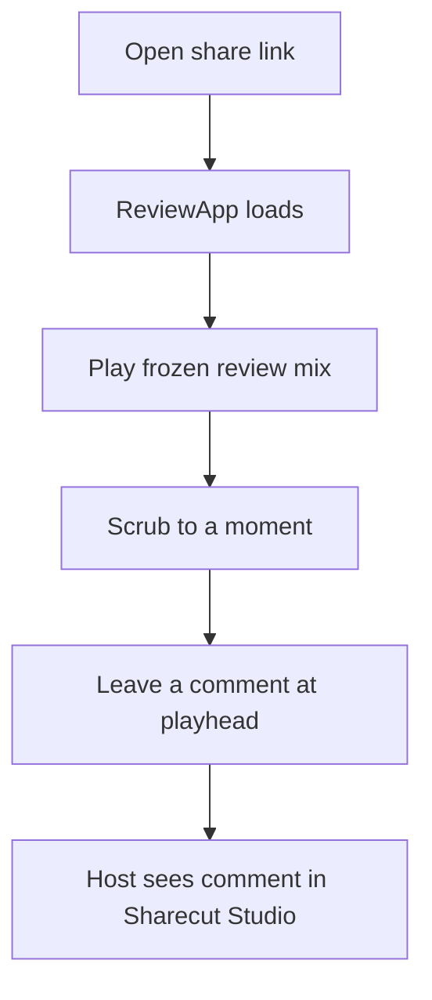
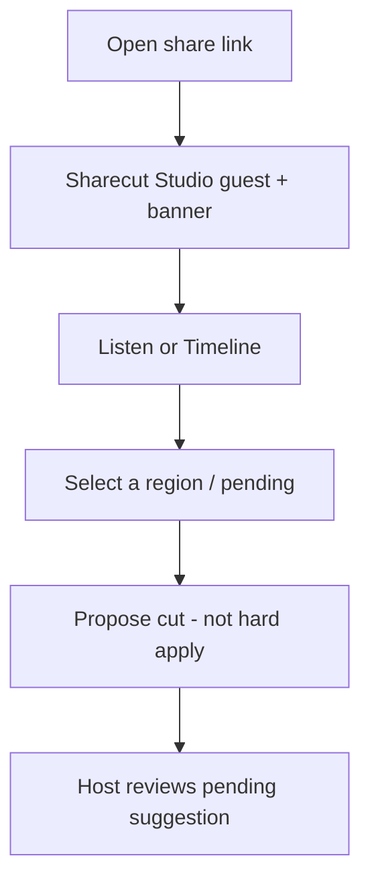
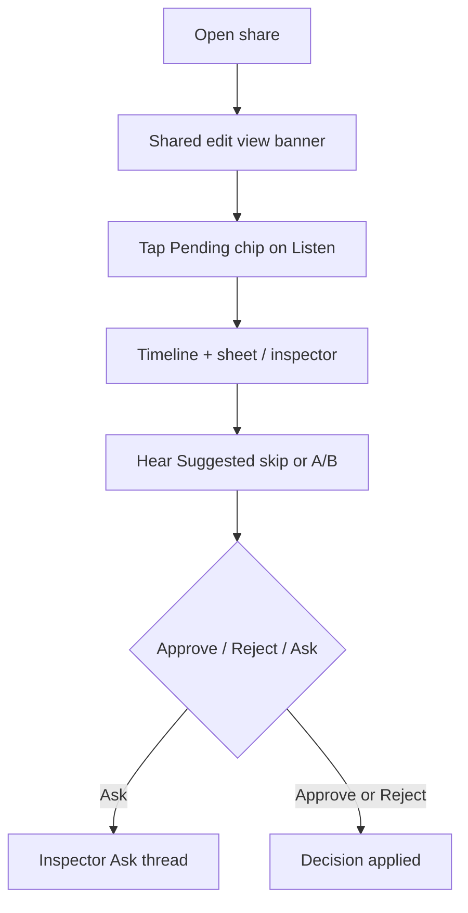
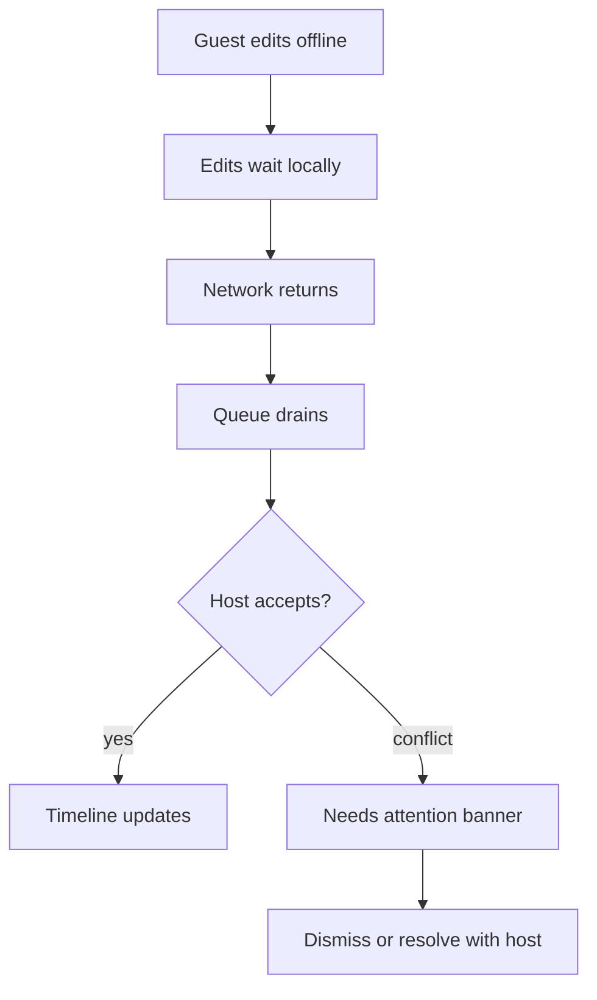
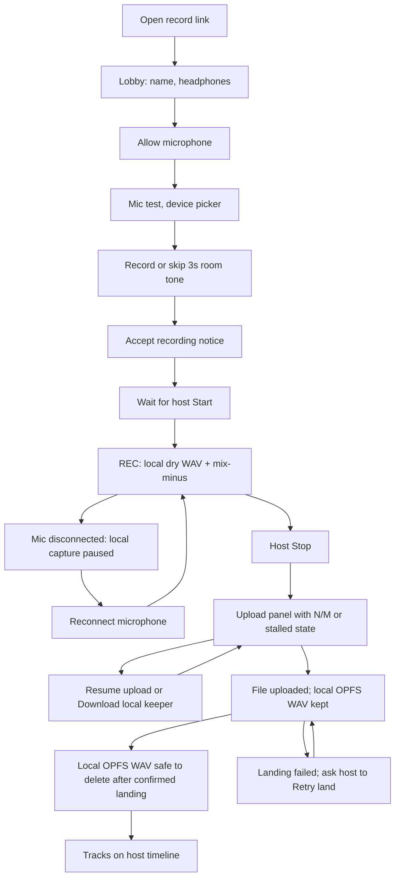
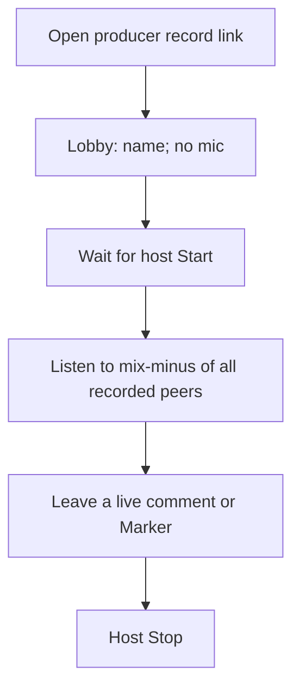

# Guest journeys — share link flows

Plain-language steps for `/r/{token}`. Public share URLs are
`https://sharecut.studio/r/{token}`. No project JSON. Pair with
[Screens → Guest / share](#/screens).

---

## 1. Cold open → listen → comment (default ReviewApp)

**Setup:** Host creates a share with default caps (`play` + `comment`). Guest opens the link on a phone.

1. Guest lands on **ReviewApp** (not the full DAW).
2. Header shows episode name, review mix label, and `mode …`. When the guest (or their remote MCP agent on this token) starts long work, an **Activity** chip appears; status/message are announced in a visually-hidden live region (no elapsed ticks). Same chrome as Sharecut Studio, no host paths.
3. Guest plays audio, scrubs, types a note, posts.
4. If the host laptop sleeps / tunnel drops → offline page (not a broken blank app).

**Success:** First useful comment in under five minutes without explaining “Sharecut Studio.”

---

## 2. Suggest a cut (Sharecut Studio guest)

**Setup:** Share includes `view` + `suggest` (+ usually `play` / `comment`).

1. Banner reads *Shared suggest view* (or similar).
2. Guest can propose structural cuts; they become **pending**, not committed.
3. Guest cannot Approve as if they owned the session (that needs `edit`).

---

## 3. Edit guest approves on phone

**Setup:** Share includes `view` + `edit`.

1. **Impact is hidden** for all guests — approve from Timeline overlay / inspector.
2. Pending chip on Listen routes to Timeline (not Impact) and selects the first review-required pending.
3. Listen-first: hear Suggested (skip the pending band) or A/B before Approve. Ask lives in the pending inspector thread.

---

## 4. Offline edits → Needs attention

**Setup:** Sharecut Studio guest (`view`) loses network while editing; reconnects later.

1. Offline edits queue silently.
2. Structural ops may demote to **propose** when policy requires.
3. Conflicts surface as **Needs attention** (dismissible list) — not a cryptic error toast.

---

## 5. Host offline / revoked link

| Situation | Guest experience |
|-----------|------------------|
| Host / tunnel offline | Relay offline page — retry later |
| Share revoked or expired | Link fails to load project (treat as dead link; copy TBD) |

Product still needs polished “link died” copy and free-tier TTL story ([Backlog](#/backlog) item 8).

---

## Quick reference

| Guest intent | Need on the token | UI |
|--------------|-------------------|-----|
| Listen + comment only | `play`, `comment` | ReviewApp |
| See timeline / transcript | + `view` | Sharecut Studio guest |
| Propose cuts | + `suggest` | Sharecut Studio guest |
| Approve cuts | + `edit` | Sharecut Studio guest (Timeline/inspector) |
| Hear Suggested (agent) | `play` + `view` + `mcp` | `guest_pending_preview` → share HTTP WAV/PNG |
| Hear a span (agent) | `play` + `view` + `mcp` | `guest_audition_context` → captions + windowed hum/clip warnings; optional wave/spec |
| Join a record session | record `join` + `monitor` + `comment` | Record lobby / room (`/rec/{token}`) |
| Produce a record session | record `monitor` + `comment` | Record lobby / room (not recorded) |
| Reply / check off actions | `reply` / `action` | ReviewApp + Sharecut Studio (same HTTP as the agent) |
| Agent tools | + `mcp` | External client → `{base}/mcp/{token}/mcp` (SSE `notifications/progress` when `progressToken` is set + guest WS chip) |

---

## 6. Join a recording session (keepers + mix-minus + upload)

**Setup:** Host mints a record link (`/rec/{token}`, guest role). Guest opens it
on a laptop with headphones. Spec:
[recording-session.md](../../docs/recording-session.md).

1. Guest lands on the record lobby (not ReviewApp).
2. Name and headphones check, then browser **Allow microphone** (explicit
   grant; Consent stays disabled until granted **and** headphones are checked),
   then mic test and device picker.
   The desktop host's **Record room** panel also shows microphone permission
   status and **Retry** after denial. macOS and Windows point to system
   microphone privacy settings; Linux identifies its WebKit prompt and directs
   blocked users to the supported browser recording path.
3. Optional **Record 3 seconds of room tone** (skip allowed). Too-loud beds warn
   if RMS is above −35 dBFS and stay off the host. The bed is captured locally;
   nothing is uploaded until Accept. Producers never see this step.
4. Separate **recording consent** step. Encoder armed on Accept; **zero keeper
   WAV bytes** until host Start. Room-tone PUT waits for Accept (local lobby
   capture is allowed; Skip/Decline discards it).
5. Host Start requires a verified writable local OPFS backup for the host and
   is enabled when every **recorded guest** currently in the lobby has consented
   (producers skip this gate; `"No one has joined"` until a guest connects). A
   guest who rejoins before a new take must retry local backup readiness and
   Accept again. The previous take’s upload and download recovery stays available
   in the lobby. Failed backup readiness offers **Retry local backup**.
6. While REC is on, guest sees the roster, clock, "Recording locally on this
   device," and **Hearing the room.** Press **M** for a Marker or type a note
   (other guests in the record room never see it; after land it is an ordinary
   timeline comment on the host). While the local keeper is writing, a refresh
   or navigation asks for the browser's native leave confirmation; dismissing
   it keeps the guest in the live take. Browsers require prior page activation
   before they may show that prompt, and they control its wording. PAUSED does
   not show this native prompt.
7. If the microphone ends involuntarily, the local keeper closes its current
   segment and a persistent warning offers **Reconnect microphone**. The room
   clock can still show REC, but the local recording copy is paused. Reconnect
   opens a new segment at the current room clock; if a selected device was
   unplugged, recovery can use the default available input. In the lobby,
   microphone loss disables Accept until recovery.
8. Host Stop. The native leave warning stays until the keeper finishes saving
   the final WAV and metadata, then clears. The upload panel warns the guest
   to keep the tab open until the final file ACK, shows N/M chunks where all
   totals are known, and offers **Resume upload** and **Download local keeper**
   for an incomplete or stalled take. Download produces one ZIP containing all
retained WAV segments. The local WAVs stay in
   OPFS (`Sharecut Recordings/`) until the host confirms **Landed. Safe to delete
   the local backup.** If landing fails, the guest sees **Uploaded but not landed
on the host** and keeps the backup while the host uses **Retry land**.
If a rejoin finds a readable pending PCM segment, the panel also offers
**Recover partial take** before upload; zero-byte or malformed files explain
that uncommitted PCM cannot be reconstructed and remain available for export.
9. If the host laptop drops during REC: reconnect the same link (lease reuse);
   the keeper keeps growing ("Host offline — still recording locally.") and
   upload retries. If the host is gone for **10 s or more**, the take is forced
   **PAUSED** when they return (host must Resume; guests see the usual PAUSED
   indicator). A shorter blip stays REC and does not remount the host keeper. A
   sidecar crash that never sent Leave still pauses on the next host Join.
   Reminting a new room while REC/PAUSED is refused until the take is Stopped.
9. In the native desktop app, a host or recorded guest who closes the window
   during REC, PAUSED, or finalizing sees a role-specific confirmation. The
   host warning says closing stops the session for everyone; the guest warning
   says it can lose that guest's local keeper. This protects the native window
   close request while the take is still recoverable, without sending a remote
   close command. On macOS, the app menu and **Cmd+Q** use the native
   confirmation path. Dock **Quit** and OS shutdown can bypass the app menu
   and remain best-effort paths.

   If local OPFS capture fails, the client stops claiming that REC is safely
   backed up, preserves finalized segments, and shows **Retry local recording**.
   The host resumes or starts a take before Retry when needed. Retry starts a
   new segment only after the failed writable is closed best-effort; a failed
   open segment is not treated as durable. Retry places the new segment at the
   current recording clock. After Stop, an incomplete local WAV remains for
   recovery but does not hold Leave once complete segments have uploaded.

**Success:** Guest consents, appears on the host roster, sees REC/PAUSED, hears
the mix-minus, writes a local dry WAV, and uploads chunks until ACK. Timeline
landing copies ACK'd keepers into `raw/` as one clip per segment and reports
staged, uploaded, landed, or land-failed state. Only the landed state permits local
backup deletion; `land_failed_ns` remains in the existing upload manifest across
reconnects, and Retry land does not discard staged parts. Landing also compares
sample-count vs recording-clock duration (`drift_ms`; unknown is `null`).
`|drift| > 50 ms` or a missing `session_start` sets `align_fallback` as a
post-transcribe `align_tracks` hint. Live comments and Markers land as ordinary timeline comments.

---

## 7. Produce a recording session (lobby + silent mix-minus)

**Setup:** Host mints the **producer** `/rec/{token}` for the same room
(`session_id`). Producer opens it on a laptop. Spec:
[recording-session.md](../../docs/recording-session.md).

1. Producer lands on the same record lobby, listed under **Not recorded**.
2. No `getUserMedia`, no consent, no room tone, no keeper, no upload panel.
3. Host Start does not wait on the producer.
4. During REC/PAUSED they see the roster and clock and **Hearing the room.**
   Press **M** for a Marker comment, or type a note — the host and producer see
   all live comments; other guests do not.
5. If the host drops, they reconnect — they are not recording.

**Success:** Talent sees the producer in the roster; the producer never appears
as a recorded track. Live comments from the producer are visible to the host
and stay hidden from guests until landing.

---
