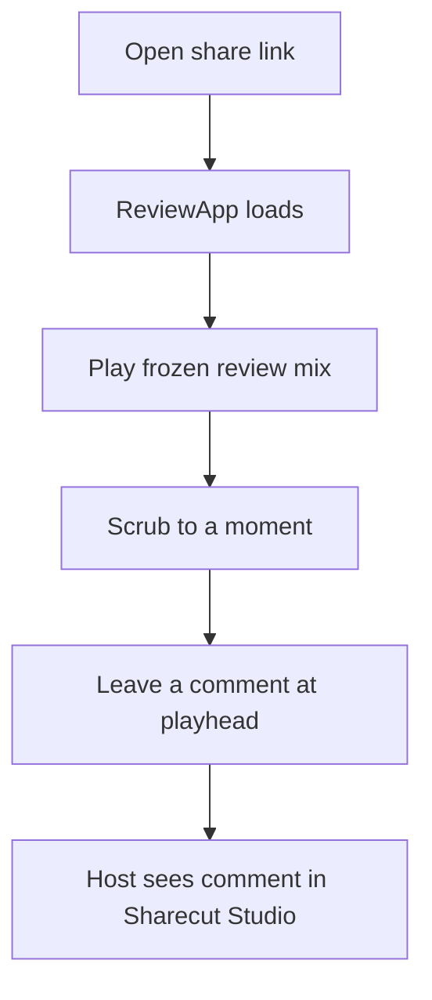
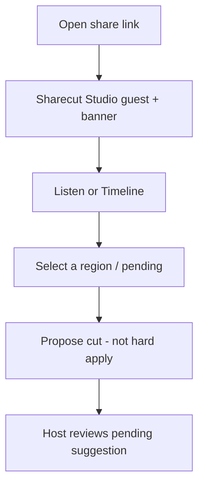
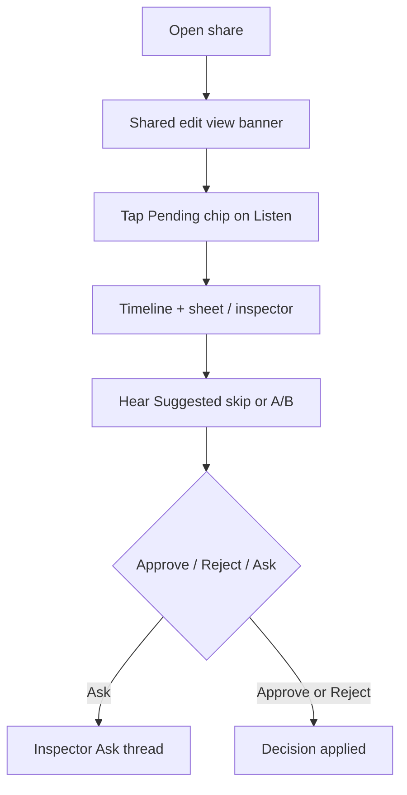
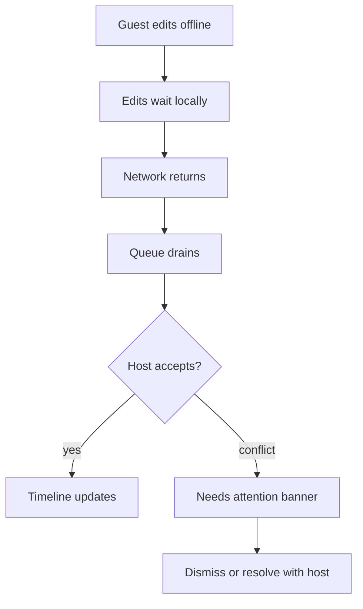
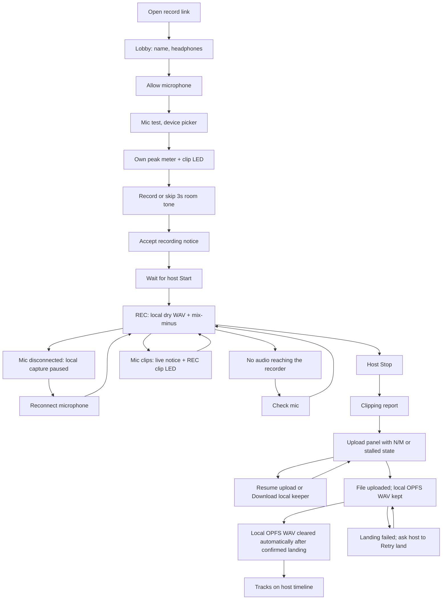
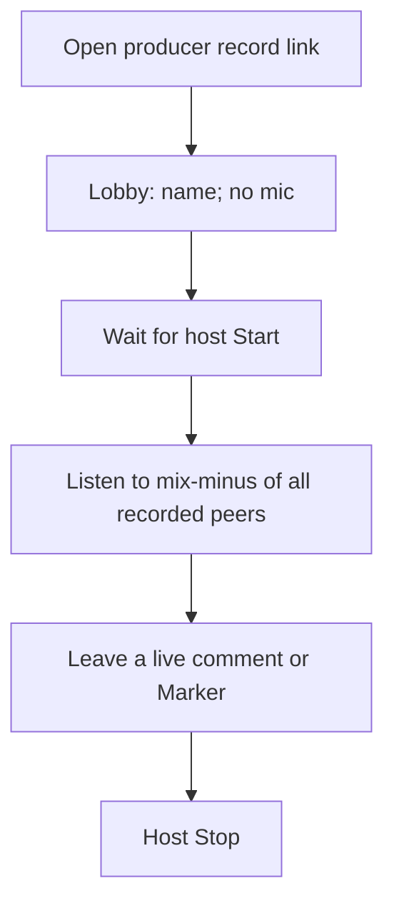

# Guest journeys — share link flows

Plain-language steps for `/r/{token}`. Public share URLs are
`https://sharecut.studio/r/{token}`. No project JSON. Pair with
[Screens → Guest / share](#/screens).

---

## 1. Cold open → listen → comment (default ReviewApp)

**Setup:** Host creates a share with default caps (`play` + `comment`). Guest opens the link on a phone.

1. Guest lands on **ReviewApp** (not the full DAW).
2. Header shows episode name, review mix label, and `mode …`. When the guest (or their remote MCP agent on this token) starts long work, an **Activity** chip appears; status/message are announced in a visually-hidden live region (no elapsed ticks). Same chrome as Sharecut Studio, no host paths.
3. Guest plays audio, scrubs, types a note, posts.
4. After the host resolves feedback in Sharecut Studio, the guest sees its resolved state. **Open comments only** hides addressed threads; clearing it shows the full conversation. The host can reopen a thread. Anonymous guests cannot resolve threads from the share link.
5. If the host laptop sleeps / tunnel drops → offline page (not a broken blank app).

**Success:** First useful comment in under five minutes without explaining “Sharecut Studio.”

---

## 2. Suggest a cut (Sharecut Studio guest)

**Setup:** Share includes `view` + `suggest` (+ usually `play` / `comment`).

1. Banner reads *Shared suggest view* (or similar).
2. Guest can propose structural cuts; they become **pending**, not committed.
3. Guest cannot Approve as if they owned the session (that needs `edit`).

---

## 3. Edit guest approves on phone

**Setup:** Share includes `view` + `edit`.

1. **Impact is hidden** for all guests — approve from Timeline overlay / inspector.
2. Pending chip on Listen routes to Timeline (not Impact) and selects the first review-required pending.
3. Listen-first: hear Suggested (skip the pending band) or A/B before Approve. Ask lives in the pending inspector thread.

---

## 4. Offline edits → Needs attention

**Setup:** Sharecut Studio guest (`view`) loses network while editing; reconnects later.

1. Offline edits queue silently.
2. Structural ops may demote to **propose** when policy requires.
3. Conflicts surface as **Needs attention** (dismissible list) — not a cryptic error toast.

---

## 5. Host offline / revoked link

| Situation | Guest experience |
|-----------|------------------|
| Host / tunnel offline | Relay offline page — retry later |
| Share revoked or expired | Link fails to load project (treat as dead link; copy TBD) |

Product still needs polished “link died” copy and free-tier TTL story ([Backlog](#/backlog) item 8).

---

## Quick reference

| Guest intent | Need on the token | UI |
|--------------|-------------------|-----|
| Listen + comment only | `play`, `comment` | ReviewApp |
| See timeline / transcript | + `view` | Sharecut Studio guest |
| Propose cuts | + `suggest` | Sharecut Studio guest |
| Approve cuts | + `edit` | Sharecut Studio guest (Timeline/inspector) |
| Hear Suggested (agent) | `play` + `view` + `mcp` | `guest_pending_preview` → share HTTP WAV/PNG |
| Hear a span (agent) | `play` + `view` + `mcp` | `guest_audition_context` → captions + windowed hum/clip warnings; optional wave/spec |
| Join a record session | record `join` + `monitor` + `comment` | Record lobby / room (`/rec/{token}`) |
| Produce a record session | record `monitor` + `comment` | Record lobby / room (not recorded) |
| Reply / check off actions | `reply` / `action` | ReviewApp + Sharecut Studio (same HTTP as the agent) |
| Agent tools | + `mcp` | External client → `{base}/mcp/{token}/mcp` (SSE `notifications/progress` when `progressToken` is set + guest WS chip) |

---

## 6. Join a recording session (keepers + mix-minus + upload)

**Setup:** Host mints a record link (`/rec/{token}`, guest role). Guest opens it
on a laptop with headphones. Spec:
[recording-session.md](../../docs/recording-session.md).

1. Guest lands on the record lobby (not ReviewApp).
2. Name and headphones check, then browser **Allow microphone** (explicit
   grant; Consent stays disabled until granted **and** headphones are checked),
   then mic test and device picker. Your own peak meter (sample peak only)
   has a clip light and a headroom hint; nobody else's meter is shown.
   The desktop host's **Record room** panel also shows microphone permission
   status and **Retry** after denial. macOS and Windows point to system
   microphone privacy settings; Linux identifies its WebKit prompt and directs
   blocked users to the supported browser recording path.
3. Optional **Record 3 seconds of room tone** (skip allowed). Too-loud beds warn
   if RMS is above −35 dBFS and stay off the host. The bed is captured locally;
   nothing is uploaded until Accept. Producers never see this step.
4. Separate **recording consent** step. Encoder armed on Accept; **zero keeper
   WAV bytes** until host Start. Room-tone PUT waits for Accept (local lobby
   capture is allowed; Skip/Decline discards it). The upload route re-checks
   consent server-side, per take: a keeper chunk needs the guest in that
   take's consented roster, room tone needs current consent, and either
   miss returns `403 consent required` — never trust the client alone.
5. Host Start requires a verified writable local OPFS backup for the host and
   is enabled when every **recorded guest** currently in the lobby has consented
   (producers skip this gate; `"No one has joined"` until a guest connects). A
   guest who rejoins before a new take must retry local backup readiness and
   Accept again. The previous take’s upload and download recovery stays available
   in the lobby. Failed backup readiness offers **Retry local backup**.
6. While REC is on, guest sees the roster, clock, "Recording locally on this
   device," and **Hearing the room.** Press **M** for a Marker or type a note
   The encoder notes where your mic clipped (sample peak) in the local keeper
   metadata, so the report can survive a reload.
   (other guests in the record room never see it; after land it is an ordinary
   timeline comment on the host). While the local keeper is writing, a refresh
   or navigation asks for the browser's native leave confirmation; dismissing
   it keeps the guest in the live take. Browsers require prior page activation
   before they may show that prompt, and they control its wording. PAUSED does
   not show this native prompt. If the tab is closed or crashes during REC,
   audio already written stays in the local keeper (at most the last couple of
   seconds are lost); after Stop, reopen the room link and use **Recover
   partial take**.
7. If the room reports a non-terminal error (for example an action that is not
   possible in the current state), a persistent alert explains it and offers
   **Dismiss**; ended and full-room screens are unchanged, and a later room
   error never replaces the full-room screen.
   If the saved microphone is no longer available, the lobby falls back to the
   default input, shows a notice, and resets the saved choice to Default.
   Retry then goes straight to the default input while the saved microphone is
   still missing, and the notice stays even if that Retry fails. Declining or
   leaving the room never restores the dead choice, and a microphone that is
   plugged back in is tried again on the next Retry.
   If the microphone ends involuntarily, the local keeper closes its current
   segment and a persistent warning offers **Reconnect microphone**. The room
   clock follows the shared take while REC says local capture failed and has no
   healthy dot. Reconnect changes the local label to waiting for microphone;
   failed retry returns to failed, and a live stream restores healthy REC.
   Revoking browser mic permission also shows failed local capture and a
   reconnect action, even if the stream hook clears its loss flag.
   Stop clears the mic-loss warning but retains incomplete keeper recovery.
   If the microphone stays connected but about 5 seconds of silence or no
   audio reach the recorder while recording (not paused or muted), a persistent
   "No audio is reaching the recorder." alert with **Check mic** appears and REC
   reads "REC: no audio". Real audio, or a Check mic that finds a running,
   unmuted microphone, clears it. A sleeping or throttled tab restarts the
   5-second wait instead of alarming. The wait also starts only once the recorder is attached, and restarts if it reopens. Check mic with no recorder attached reopens it and says so if that fails. If the alert returns after Check mic, it adds unmute-or-reconnect guidance until audio arrives. The host can close the record dialog while the alert shows; the transport chip keeps saying no audio. Hardware checks for this alert are listed in the recording-session golden-ear checklist.
   Reconnect opens a new segment at the current room clock; if a selected device was
   unplugged, recovery can use the default available input. In the lobby,
   microphone loss disables Accept until recovery.
   If the host microphone is denied or missing during REC, the Record room
   panel reopens and stays open with an actionable Retry. Both the panel and
   transport chip show local capture as failed, or waiting while a retry is
   acquiring the microphone. A successful Retry restores the live capture
   state without discarding existing keeper segments.
   On rejoin, a transient local segment scan error halts capture and exposes
   local backup failure; it never resets the cursor to segment zero and
   overwrites a retained keeper.
   During a healthy host take, the persistent transport control has a red dot,
   REC, and a running clock on desktop; phone keeps the same control in a row
   above every mode body. Reduced-motion settings keep
   the dot still. The control opens the Record room panel. PAUSED and local
   capture failure remain explicit states rather than a healthy REC dot.
   If the host's connection to the record room drops mid-take, the control
   reads "REC (reconnecting)" without the dot until the socket returns (not
   while the page is still making its first connection).
   After Stop, microphone loss no longer locks the host dialog. A take with no
   host keeper warns that no local audio was captured, even if the mic never
   became available. If a host record command (Start, Pause, Resume, Stop,
   Land) fails, the Record room panel opens and shows the error; over the
   Share dialog the failure is only announced, and an already open panel shows it
   without announcing it a second time. Closing the panel clears it.
8. Host Stop. The native leave warning stays until the keeper finishes saving
   the final WAV and metadata, then clears. The upload panel warns the guest
   to keep the tab open until the final file ACK, shows N/M chunks where all
   totals are known, and offers **Resume upload** and **Download local keeper**
   for an incomplete or stalled take. Download produces one ZIP containing all
   retained WAV segments. The local WAVs stay in
   OPFS (`Sharecut Recordings/`) until a fresh host status confirms **Landed**.
   The finalized WAV is then reclaimed only when its SHA-256 and byte length
   match both local completion metadata and the landed host status. A mismatch
   or older marker keeps the WAV and shows a download warning alongside upload
   progress or landing errors, with one set of recovery actions. A landed take
   with a retained WAV does not claim that the local backup was cleared. Its small completion
   marker remains to preserve segment numbering; recovery downloads skip
   reclaimed segments rather than reporting them missing. If landing fails, the guest sees
   **Uploaded but not landed on the host** and keeps the backup while the host
   uses **Retry land**. The lobby and host Start panel warn when browser storage
   headroom is low or cannot be estimated; this advisory never blocks recording.
   If a rejoin finds a readable pending PCM segment, the panel also offers
   **Recover partial take** before upload and announces what it recovered;
   zero-byte or malformed files explain that uncommitted PCM cannot be
   reconstructed and remain available for export.
9. If the host laptop drops during REC: reconnect the same link (lease reuse);
   the keeper keeps growing ("Host offline: still recording locally.") and
   segments that already closed retry their upload; the open segment uploads
   once it closes. If the host is gone for **10 s or more**, the take is forced
   **PAUSED** when they return (host must Resume; guests see the usual PAUSED
   indicator). A shorter blip stays REC and does not remount the host keeper. A
   sidecar crash that never sent Leave still pauses on the next host Join.
   Reminting a new room while REC/PAUSED is refused until the take is Stopped.
   If the host removes a guest, that guest's live room connection closes and
   stops receiving room events or sending signal, heartbeat, and comments;
   other guests remain in the room. The browser does not auto-rejoin after a
   removal close, and a reload retains the revoked identity. The host's removal
   closes that invite link to new people ("Invite link closed"); guests who
   already joined keep their saved lease, and new people need a fresh link.
   Removal during REC stops microphone capture and upload, then offers local
   keeper recovery or download. A naturally expired lease can start a fresh
   guest identity in the still-open room, unless someone who joined through the
   same link was removed; then the guest sees "Invite link closed" and needs a
   fresh link from the host. The Join lease check and host removal
   use one room decision so removal cannot look like ordinary lease expiry.
9. In the native desktop app, a host or recorded guest who closes the window
   during REC, PAUSED, or finalizing sees a role-specific confirmation. The
   host warning says closing stops the session for everyone; the guest warning
   says it can lose that guest's local keeper. This protects the native window
   close request while the take is still recoverable, without sending a remote
   close command. On macOS, the app menu and **Cmd+Q** use the native
   confirmation path. Dock **Quit** and OS shutdown can bypass the app menu
   and remain best-effort paths.

   If local OPFS capture fails, the client stops claiming that REC is safely
   backed up, preserves finalized segments, and shows **Retry local recording**.
   The host resumes or starts a take before Retry when needed. Retry starts a
   new segment only after the failed writable closes or its bounded close
   deadline passes, so the leave guard holds until then; a failed open segment
   is not treated as durable and exports as a `-partial` WAV. A storage stall
   reads "Local recording stopped: this device's storage couldn't keep up."
   Retry places the new segment at the current recording clock. After Stop, an incomplete local WAV remains for
   recovery but does not hold Leave once complete segments have uploaded.
   A metadata-free partial is eligible for cleanup seven days after its last
   write. An hourly settled upload poll in that room can expire it; the panel says the local
   audio is no longer available, and its segment number remains reserved.
   Recovery downloads hold an origin-wide Web Lock so another tab cannot prune
   or reclaim the WAV while the browser still reads it; without Web Locks,
   deletion leaves the WAV available.
   Pending metadata and finalized WAVs follow their separate recovery and
   landed-file rules.

**Success:** Guest consents, appears on the host roster, sees REC/PAUSED, hears
the mix-minus, writes a local dry WAV, and uploads chunks until ACK. Timeline
landing copies ACK'd keepers into `raw/` as one clip per segment and reports
staged, uploaded, landed, or land-failed state. Only the landed state permits local
backup deletion; a segment whose staged host copy went missing before reaching raw/
reports land-failed (never landed), so the guest keeps the backup; `land_failed_ns`
remains in the existing upload manifest across reconnects, and Retry land does not
discard staged parts. Landing also compares
sample-count vs recording-clock duration (`drift_ms`; unknown is `null`).
`|drift| > 50 ms` or a missing `session_start` sets `align_fallback` as a
post-transcribe `align_tracks` hint. Live comments and Markers land as ordinary timeline comments.
A keeper or room-tone bed that gets re-uploaded or revoked while landing is registering it is
never reported landed; its earlier project registration is rolled back instead. If that rollback
write itself fails, it is saved and retried automatically on the next land, and the track's media is
moved off the stale file meanwhile. Overlapping lands (an ACK auto-land and a Land click) each re-read the saved project first, so neither drops the clips or live comments the other landed.

**Automated check:** the Playwright US-1 scenario (`gui/web/e2e/record-lobby.spec.ts`, "records a remote interview end to end") walks this journey in three browsers.

---

## 7. Produce a recording session (lobby + silent mix-minus)

**Setup:** Host mints the **producer** `/rec/{token}` for the same room
(`session_id`). Producer opens it on a laptop. Spec:
[recording-session.md](../../docs/recording-session.md).

1. Producer lands on the same record lobby, listed under **Not recorded**.
2. No `getUserMedia`, no consent, no room tone, no keeper, no upload panel,
   no mic meter or clip LED.
3. Host Start does not wait on the producer.
4. During REC/PAUSED they see the roster and clock and **Hearing the room.**
   Press **M** for a Marker comment, or type a note — the host and producer see
   all live comments; other guests do not.
5. If the host drops, they reconnect — they are not recording.

**Success:** Talent sees the producer in the roster; the producer never appears
as a recorded track. Live comments from the producer are visible to the host
and stay hidden from guests until landing.

---
