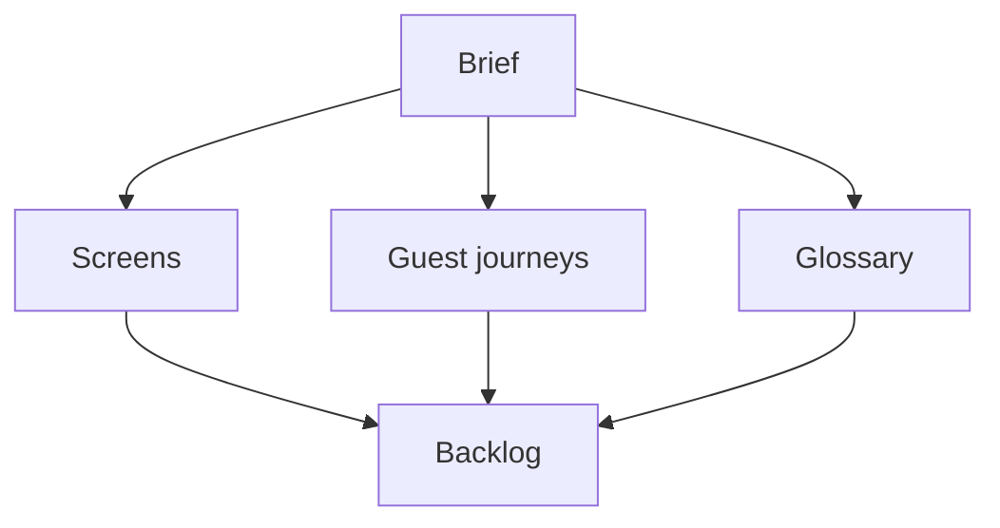

# UX pack home

Welcome. This site is the **shareable UX onboarding kit** for Podcast MCP / Sharecut Studio.

> **Orientation kit** (updated 2026-07-22): product framing for partners — not a Figma design system. Host phone/desktop screenshots are gallery-backed; guest collaboration is documented under [Screens](#/screens) and [Guest journeys](#/journeys), with guest screenshots on [See the UI](#/demo).

## Documents

| Doc | Use when |
|-----|----------|
| [Product brief](#/brief) | Roles, journeys, principles |
| [Brand](#/brand) | Styling guidelines (tokens, type, measure, do/don’t) |
| [See the UI](#/demo) | Screenshots + live demo fixture |
| [Screen inventory](#/screens) | What each mode shows (display schemas) |
| [Guest journeys](#/journeys) | Step flows for share links |
| [Domain glossary](#/glossary) | Concepts ↔ project files ↔ UI |
| [Keyboard shortcuts](#/shortcuts) | Sharecut Studio keys — **Copy Markdown** → Google Docs |
| [UX backlog](#/backlog) | Open design decisions |

## How to use with Google Docs

1. Open any page above.
2. Click **Copy Markdown** (top right).
3. Paste into Google Docs — Docs will keep headings/lists reasonably well; re-draw Mermaid diagrams in FigJam/Lucid if needed, or keep diagrams on this site as source of truth.

Raw sources also live in the repo under [`ux/pages/`](https://github.com/calebn/sharecut-studio/tree/main/ux/pages).

## Live product context

- **UI reference:** [See the UI](#/demo) / fixture [`sharecut_ux_demo`](https://github.com/calebn/sharecut-studio/tree/main/tests/fixtures/sharecut_ux_demo)
- Guest share (ReviewApp vs Sharecut Studio, banners, proxy listen, offline conflicts): [Screens → Guest / share](#/screens) · [Guest journeys](#/journeys)
- Engineer mobile IA: [docs/gui-mobile.md](https://github.com/calebn/sharecut-studio/blob/main/docs/gui-mobile.md)
- Share / proxy / relay: [docs/host-online-relay.md](https://github.com/calebn/sharecut-studio/blob/main/docs/host-online-relay.md)
- API & contracts: [docs.sharecut.studio](https://docs.sharecut.studio/) (document commands, share HTTP, remote MCP)
- Project format: [docs/episode-format-v2.md](https://github.com/calebn/sharecut-studio/blob/main/docs/episode-format-v2.md)
- Shipping roadmap: [ROADMAP.md](https://github.com/calebn/sharecut-studio/blob/main/ROADMAP.md)

