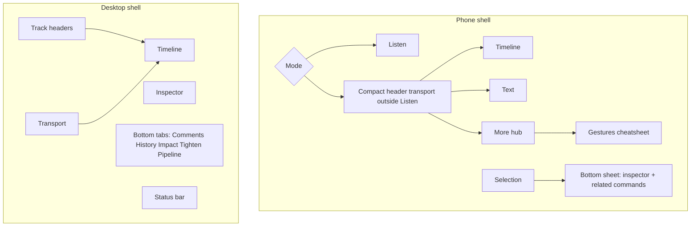
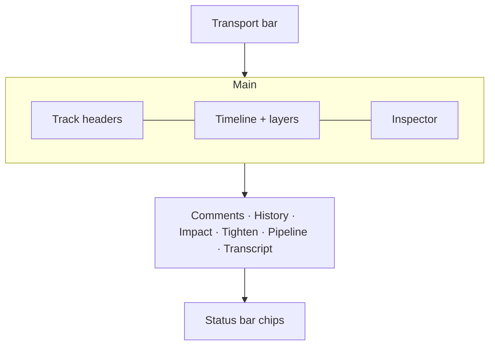
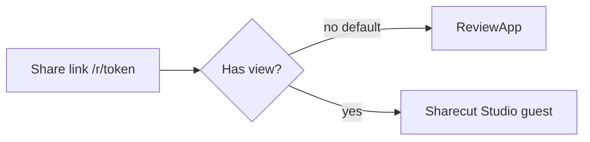

# Screen inventory — Sharecut Studio

Per-surface **display schemas**: what regions exist, what data they show, empty/loading states, and what’s out of scope. Pair with [Domain glossary](#/glossary) for field definitions.

**Breakpoints:** phone &lt;768 · tablet 768–1100 · desktop &gt;1100. Spec: [docs/gui-mobile.md](https://github.com/calebn/sharecut-studio/blob/main/docs/gui-mobile.md).

**Live reference:** [See the UI](#/demo) — screenshots + [`sharecut_ux_demo`](https://github.com/calebn/sharecut-studio/tree/main/tests/fixtures/sharecut_ux_demo) fixture.

---

## Host home (no project)

| | |
|--|--|
| **Purpose** | Create a new episode workspace or open an existing `episode.project.json` on the host |
| **Primary actions** | New project… · Open project… · **Browse…** (OS file dialog via the local engine) · paste path · **Connect agent…** · **Help** (create a sanitized diagnostics zip; attach it to a GitHub issue — nothing is uploaded; local **Creating…** busy, not StatusBar) |
| **Data shown** | Episode name + workspace directory (New); path to `episode.project.json` (Open) |
| **Empty / error** | Missing OS dialog tool → keep paste field + alert; wrong filename → server error |
| **Out of scope** | Guests / share tokens; uploading project JSON as a browser File |

---

## Information architecture



---

## Shared: Transport bar

| | |
|--|--|
| **Purpose** | Playhead control, audition mode, comment entry, zoom Fit, View and project menus |
| **Layout (wide)** | Three zones: project name · Play/Stop, timecode, and audition mode centered · render status, tools, Fit, **View** menu, and **Menu** on the right. When status pills widen the right zone, the center shifts left and the project name truncates; zones never overlap. Play is the only orange control and is disabled until the project has media. |
| **Primary actions** | Play / Stop, seek via timecode context, Select/Blade/Comment when expanded, Fit, View, Menu |
| **Always visible (collapsed)** | Outside Listen: Play/Stop, compact playhead time, Comment icon, Fit, Menu icon. Listen uses its own body transport and no header transport. |
| **Menu → Project (host)** | New / Open, **Connect agent…** (local Streamable HTTP MCP URL), Bounce…, **Share…** (collaboration extension), Record room…, Export deliverables |
| **Menu → Media / Help** | Import audio, track add / remove / move; Help… and Keyboard shortcuts. Items show their shortcut (⌘ on Apple platforms, Ctrl elsewhere) and sections carry visible labels. |
| **View menu (wide)** | Layer toggles, zoom, Fit if omitted, theme, focus modes. View and Menu are exclusive: opening one closes the other, and Escape returns focus to the button that opened the current menu. |
| **Menu (collapsed)** | One combined menu: Project, Media, audition Mix/FX/Raw, session, **Refresh mix** when render is stale, layers, view, Help |
| **Data shown** | Playhead (timeline sec) · duration · audition kind · optional stale-render note |
| **Empty / error** | Known `?project=` but shell not yet: real transport chrome, **Loading episode…**, play disabled. Zero tracks after load: ingest “Drop audio files” (not the loading well). Host with no path: home launch. Guest: token/project load failure. The empty stage names the import shortcut in platform form (⌘I on Apple platforms, Ctrl+I elsewhere) and uses themed ink on the light stage; Play stays disabled until the project has media. |
| **Out of scope** | Full mixer; pipeline step runner (status chips / Pipeline tab) |

The overflow Menu panel caps to remaining space under the trigger (`min(90dvh, var(--menu-available-height))`) and scrolls so **Keyboard shortcuts** stays reachable on short laptop heights, including when guest/follow banners sit above the transport. The shortcut dialog explains that character keys apply when the timeline or transcript has focus.

**Collapsed when:** phone, tablet compact, or bar width ≤720px.

```
┌─ ▶  12:34 / 58:39  [Cmt*] [Fit*] [⋯*] ─┐
│ * icon buttons (bubble / fit / menu)  │
```

---

## Host: Share dialog

| | |
|--|--|
| **Purpose** | Mint, copy, and revoke public review share links for the open episode |
| **Open** | Menu → Project → **Share…** (`share.manage`; collaboration extension slot `share.ui.menu`) |
| **Primary actions** | Role (viewer / commenter / editor) · Allow agent (MCP) · **Create link** · Copy link (button reads **Copied** briefly) · Stop sharing |
| **Data shown** | Live coolname, Docs-like role, review mix label, last used; MCP URL when `mcp` is granted |
| **Empty / error** | Quiet “No live review links.” / “No live record rooms.” text (no field-like box). Create publishes a **Share mix** review version if none exists (needs premix/mastered) |
| **Out of scope** | Restricted ACL / invites; expiry picker; in-place role edit (rotate = new link + stop old); guest connect-an-agent UI |

The dialog caps to `90dvh` with a single `.command-palette-body` scroller so **Record rooms** and other lower sections stay reachable on phone and short laptop viewports. Header (title + Close) stays pinned.

Guests never see this dialog (`canManageProjects` is false on `share:{token}`).

---

## Host: Connect agent dialog

| | |
|--|--|
| **Purpose** | Copy the local Streamable HTTP MCP URL so Cursor/Claude talk to the running DAW |
| **Open** | Menu → Project → **Connect agent…** (`mcp.connect`); home **Connect agent…** |
| **Primary actions** | **Copy URL** (`http://127.0.0.1:8765/mcp`) · **Copy snippet** (Cursor `mcpServers` JSON) |
| **Data shown** | Loopback MCP URL; client snippet; reminder to keep Sharecut Studio running |
| **Empty / error** | No episode open: URL still copies, tools error until a project is open |
| **Out of scope** | Writing `~/.cursor/mcp.json`; PATH-installing `podcast-mcp`; guest share-token MCP (that stays on Share…) |

Not the Share dialog. Guest share agents use `{base}/mcp/{token}/mcp`.

---

## Shared: Selection → Inspector / Bottom sheet

| | |
|--|--|
| **Purpose** | Modifier for whatever is selected (pending cut, clip fade, track FX, word, …) |
| **Primary actions** | Approve / Reject / Restore · Play around · param edits · Close |
| **Data shown** | Type badge · label · agent reason · source + timeline ranges · shape-specific params |
| **Phone** | Half → full bottom sheet; never stack; Close always visible. Error + audition footer stay pinned; long errors scroll in a capped slot; Ask scrolls. Taller half peek for any modifier (clip/track/chapter too). |
| **Tablet** | Peek sheet over timeline, docked above the tabs band (same pin/scroll as phone) |
| **Desktop** | Side inspector pane |
| **Empty** | “Select a clip, edit, or word” |
| **Out of scope** | Deep nested wizards; one panel per MCP tool name |

---

## Phone — Listen

| | |
|--|--|
| **Purpose** | Guest-style review: scrub mix, scan comments, jump from chips |
| **Primary actions** | Coarse scrub · ±15s · open comment · tap status chip → destination |
| **Always visible** | Listen hero (the project name as the visible heading, large timecode, full-width scrubber (slim transport-ink track, orange thumb, 44pt tall), −15s · Play · Stop · +15s) · comment list · icon mode nav |
| **Fit** | Not shown on Listen; use Timeline for timeline fit |
| **Data shown** | Mix playhead · `review.comments[]` (time, body, resolved) · pending/stale chips |
| **Empty** | “No comments yet.” (the shared quiet empty state). With no tracks yet, Play and Stop are disabled (“Import audio to play”), like the desktop strip. While episode JSON is loading: disabled Listen body transport + “Loading episode…” well (not the ingest coach) |
| **Out of scope** | Multitrack waveform editing |

```
┌─ Episode name ───────────────────────┐
│ 12:34 / 58:39                        │
│ ══════════●═══════════════════     │
│     −15s  (▶)  ■  +15s               │
└──────────────────────────────────────┘
│ Pending: 3 · Stale render          │
│ ● 04:12  “level feels low”         │
│ ○ 11:02  “cut cold open?”          │
├─ Listen │ Timeline │ Text │ More ──┤
```

Audition Mix / FX / Raw remains available in the compact transport Menu on Timeline, Text, and More; Listen keeps its review controls deliberately focused on playback, scrub, and comments.

---

## Phone — Timeline

| | |
|--|--|
| **Purpose** | Spatial seek/edit with **fixed-center playhead**; drag timeline to scrub. The line always shows the transport time, from 0 to the end even at Fit, with overlay or classic scrollbars: half-viewport margins before 0 and after the end give the scroll room, and switching Listen → Timeline, fitting, or zooming from the menu or keys never moves the time. Pinch zooms anywhere on the timeline except the lane rail, and scrubbing stops at the session end: zoomed out below Fit, the lanes and ruler end there and the margins show beyond it. |
| **Primary actions** | Scrub · Fit · layer chips · select clip/edit → sheet · drag clip (Select tool) · tap lane gutter → track sheet |
| **Always visible** | Transport (Comment + Fit) · layer chips · sticky lane gutter (44pt lane-colored initials chip per lane, lane-colored edge) + waveforms whose clip labels carry the full track name · Select/Blade rail · mode nav |
| **Data shown** | `timeline.tracks` · `timeline.clips` rectangles · overlay layers (edits/levels/markers/comments) |
| **Empty** | Loading episode: skeleton lanes in the same header/gutter grid. No tracks after load → ghost drop lane + dismissible coach (“one file per speaker”); tracks with no clips → empty lane until Import/Replace |
| **Out of scope** | Desktop moving-playhead metaphor; dense mixer strip on narrow panes; disconnected chip strip above lanes; full-page upload card |

```
┌─ Play  12:34  [Cmt] [Fit] [⋯] ──────┐
│ Edits  Levels  Markers  Comments    │
│ ref │░░░░│░░░░░│░░░░░░░░░░░░░░░░   │
│ gue │░░░░│░░░░░░░░│░░░░░▼░░░░░░░   │  ← Ferrite gutter + CapCut ▼
│ [Select] [Blade] [Cut at playhead]  │  ← editing rail (Comment is on transport)
├─ Listen │ Timeline │ Text │ More ──┤
│ ┌ sheet: track / Pending cut ── X ┐ │
│ │ M/S/Volume or Approve / Reject │ │
│ └────────────────────────────────┘ │
```

Lane identity is a slim sticky gutter in the same scroller as the waveforms. Tap the gutter row (› disclosure) → track sheet with **M**/**S** and the **Volume** fader (saved; host and editors; envelopes on Levels). Solid M = muted in the mix; dashed = only you hear it that way (a guest's listen-only mute, or a track your solo silences). Pane density uses `@container timeline` (gutter vs mid/full rail) — not viewport width alone.

---

## Phone — Text

| | |
|--|--|
| **Purpose** | Read/fix transcript; seek by word; suggest cut-away |
| **Primary actions** | Follow playhead · Edit mode · tap word → sheet · suppress / correct |
| **Data shown** | Speaker labels · `transcripts` words (text, confidence, suppressed) · selection range |
| **Empty / loading** | No transcript yet · low-confidence chips when present |
| **Out of scope** | Full desktop bottom-tab bundle |

```
┌─ Play  12:34  Follow · Edit ────────┐
│ HOST                                 │
│ so we ┌were┐ talking about …         │
│ GUEST                                │
│ yeah and the ┌launch┐ …              │
├─ Listen │ Timeline │ Text │ More ───┤
```

---

## Phone — More hub

**Host** destinations:

| Destination | Shows | Source |
|-------------|-------|--------|
| Comments | Thread list / detail | `review.comments` |
| History | Undo/redo · grouped steps (follows document snapshots) | `history` |
| Impact | Pending bulk + removed duration | `editorial.edit_decisions` + impact report |
| Tighten | Searchable filler/pause/repetition/restart list · preview/skip/apply · apply-all avoiding harsh cuts | pending tighten decisions |
| Pipeline | Step checklist · params · Analyze · Batch/gates · run · progress (headline + bar/elapsed) | working-set config + live job |

Destinations render as one settings-style list (hairline rows, 44pt targets), not stacked slabs. Plus **Overlay legend** on the hub. Theme and audition mode live in transport **Menu**, not a Settings destination. The bottom mode nav shows icon + label tabs; the active tab is tinted with an accent top indicator.

**Guest** More hub: Comments + Overlay legend only (History / Impact / Tighten / Pipeline stay host-only).

Long-lived panels; do not stack sheets to reach these — navigate More.

---

## Tablet

| | |
|--|--|
| **Purpose** | Timeline-first with peek inspector; side inspector when wide enough |
| **Layout** | Transport (often collapsed) · headers + timeline · tabs band (~40–45%, capped to viewport); peek sheet docks above tabs. Modifier sheets pin error + audition footer; long errors scroll in a capped slot; Ask scrolls in the body. |
| **Playhead** | Moving (desktop-like), not phone fixed-center |
| **Out of scope** | Phone bottom mode nav as primary IA |

```
┌─ Transport ─────────────────────────────┐
│ Headers │ Timeline    ┌ peek inspector ┐│
├─────────┴─────────────┴────────────────┤
│ Transcript / Comments / … (tabs band)  │
└────────────────────────────────────────┘
```

---

## Desktop — four-pane grid



| Region | Content schema |
|--------|----------------|
| **Track headers** | Identity bar in the lane color · track name · stem status dot (trailing) · M/S (M solid = saved mix mute, dashed = only you; S listen-only) · FX badge · role · gain strip (output gain: staging + volume); content is top-aligned, selected = neutral chip |
| **Timeline** | Clips · body-drag move (Select tool) · fades/joins · layer overlays · moving playhead · pinch/ctrl-wheel zoom. Lanes grow to fill the stage when every track fits (72–240px) and scroll beyond that; the marker lane shows only rows with content (chapters, social, comments) and collapses to one 24px row when empty |
| **Inspector** | Track selection adds the mixer group: M/S and the saved **Volume** fader (−60 to +12 dB; double-click or **Reset** sets 0 dB; read-only without edit, with the reason shown). Selection modifier (same shapes as sheet): eyebrow badge, title, subtitle only when it differs, full-width fields, one section gap; the body scrolls with edge shadows |
| **Comments** | Filter segmented control (Open · Open actions · Resolved · All) · list + thread · timeline seek · action items |
| **History** | Groups · Undo/Redo · step count (“No edits yet” when empty) · diff affordances; list updates from Applied snapshots (SHELL project, or DETAIL/TRACKS/CLIPS/FX/ENVELOPES/MIX/COMMENTS patches) |
| **Impact** | Pending count · bulk approve/reject · removed duration |
| **Tighten** | Filler/pause/repetition/restart list · search/filters · preview/skip/apply · apply-all (avoid harsh) |
| **Pipeline** | Checklist (empty state until Analyze) · param inspector · Analyze · Batch vs leave-gates (align + refine) · Terms and guest-name vocabulary editor with a re-transcribe action when the saved list changes · SSE progress (live headline) |
| **Transcript** | Follow/edit (also focus mode `text`); Follow unlocks only on wheel / touch / scrollbar / scroll-key input. Long transcripts (≥200 turns) render only nearby turns plus the active, selected and focused ones — browser find-in-page reaches only rendered turns |
| **Status** | Actionable chips (pending, **Render: fresh/stale** from the same state as the transport pill, **Transcript: needs sync** only when stale); overflow-x on narrow |

### Focus modes (desktop)

| Mode | Key | Effect |
|------|-----|--------|
| default | `1` | Full grid |
| timeline | `2` | Collapse bottom tabs — more lane height |
| text | `3` | Expand transcript; shrink timeline |
| review | `4` | Comments-forward + mix-oriented chrome |

---

## Guest / share (`/r/{token}`)

Which UI loads depends on capabilities — not a single “guest Sharecut Studio.”



### Which surface?

| Share setup | Surface | What the guest sees |
|-------------|---------|---------------------|
| **Default** `play` + `comment` (+ reply/action) | **ReviewApp** | Frozen review mix + comments. Header shows episode name and `mode {guest_mode}`. No Sharecut Studio mode banner. |
| `view` present (+ play/comment/…) | **Sharecut Studio guest** | Timeline / Listen / Text / More with capability gates. Mode **banner** at top. |

Step flows: [Guest journeys](#/journeys).

### Capability → plain language

| Cap | Guest can… |
|-----|------------|
| `play` | Hear the review mix (ReviewApp) or session audio (Sharecut Studio) |
| `view` | Open Sharecut Studio guest (timeline, transcript, sanitized project) |
| `comment` | Leave time-anchored comments |
| `reply` | Reply in a comment thread |
| `action` | Check off comment action items |
| `suggest` | Propose structural cuts (pending); nudge; **not** hard-apply |
| `edit` | Approve/reject pending, fades/joins, FX bypass, apply structural cuts |
| `mcp` | Connect an **external** agent at `{base}/mcp/{token}/mcp` (host Share dialog copies the URL; **no guest in-app MCP connect UI**) |

### Sharecut Studio guest chrome (when `view` is granted)

| Banner string | Typical mode |
|---------------|--------------|
| *Shared edit view* | `edit` |
| *Shared suggest view* | `suggest` |
| *Shared read-only view* | `view` (listen + inspect; not “no audio”) |
| *Shared comment view* | comment-forward guest mode |

**Approve without Impact:** Impact is **always host-only**. Edit guests approve/reject from Timeline overlay + inspector (pending chip on Listen routes to Timeline).

**Playback:** prefer **proxy media** (short MP3 listen chunks, often via CDN) so ordinary listen does not pull long host WAVs through the tunnel. Fallback to WAV when proxies are unavailable.

**More hub (guest):** Comments + Overlay legend only.

**Remote agent (`mcp`):** Hosts copy the agent URL from Menu → Share… when minting with Allow agent. Guests still connect via an external MCP client — not a guest Settings pane. Same caps as the human on that share. Listen-first Suggested is HTTP (`guest_pending_preview` / `GET …/daw/pending-preview`), not host speakers.

---

## Guest / record (`/rec/{token}`) (lobby + keepers + mix-minus + landing + live comments shipped)

Lobby, consent, roster, REC/PAUSED, local dry WAV keepers, mix-minus
monitor, chunk upload, timeline landing, and live comments ship.
Spec: [recording-session.md](../../docs/recording-session.md).
Journeys: [Guest journeys § 6–7](#/journeys).

| Surface | Who | What they see |
|---------|-----|----------------|
| **Record lobby** | Guest (recorded) | Name, headphones, mic test, device picker, recording-consent notice. Wait for host Start. **Shipped (no screenshot yet).** |
| **Record lobby** | Producer | Name only; **Not recorded** roster group; no mic, no consent. **Shipped (no screenshot yet).** |
| **Record room** | Guest | Persistent **REC** / **PAUSED** + clock; mute (zeros on the keeper + send stops); roster; local-recording copy; **Hearing the room.** Upload until ACK, then host timeline clips. **Shipped (no screenshot yet).** |
| **Record panel** | Host | Start / Pause / Resume / Stop / **Land**; upload ACK roster. File ACK auto-lands clips; Land retries. **Shipped (no screenshot yet).** |
| **Record room** | Producer | Same REC/PAUSED + **Not recorded** group; mix-minus of recorded peers; no keeper / upload. **Shipped (no screenshot yet).** |
| **Full room** | 5th recorded or 3rd producer | Full-room copy; never `getUserMedia`. **Shipped (no screenshot yet).** |
| **Declined** | Guest who declined while REC/PAUSED | Declined copy; host may re-invite as producer. **Shipped (no screenshot yet).** |
| **Host offline** | Recorded guest | “Host offline: still recording locally.” Keeper stays open. **Shipped with keepers.** |
| **Native close confirmation** | Host or recorded guest in the desktop app | During REC, PAUSED, or finalizing, closing the native window asks for confirmation. Host copy warns that the session stops for everyone; guest copy warns about the local keeper. This is local desktop protection and sends no remote close command. The macOS app menu and **Cmd+Q** use the confirmation path; Dock **Quit** and OS shutdown remain best-effort. |

Not ReviewApp. Prefix `/rec/` 404s a review token.

---

## Cross-cutting states

| State | Where surfaced |
|-------|----------------|
| **Pending edits** | Host Impact · chips · edit overlay · inspector (guests: Timeline/inspector, not Impact) |
| **Stale render** | Status · Listen chips · wide-bar transport pill; collapsed Menu → Refresh mix |
| **Transcript stale / reconcile** | Status · Text affordances |
| **Pipeline / activity running** | Pipeline tab lists pipeline jobs in the summary. While bounce/export/`render_preview` occupy the shared pipeline-slot, Run is disabled and Cancel is on the Pipeline tab. Host StatusBar + phone Listen chip show the most recent live job (`status-pipeline` chrome: truncated headline, dim **stale “last update Ns ago”** companion, elapsed, pulse; phone chip ellipsizes overflow). Guests also see the chip on phone Listen (non-interactive — Pipeline tab is host-only). Non-pipeline kinds (`agent` from in-process host MCP, `bounce`, `export`, `render_preview`, guest remote MCP) use **Activity** copy; a count badge (“2 activities”) when more than one job is live. Chip/Listen open Pipeline only for slot jobs; agent chips are not a navigation target. Instant tools never flash a chip. |
| **Loading episode** | `?project=` known, shell not yet (HTTP or document WS): DAW grid/skeleton chrome (“Loading episode…”). Distinct from zero-track ingest coach. After shell, live edits apply SHELL snapshots and overlay word chips by source clocks |
| **Offline host (relay)** | Share/tunnel offline page |
| **Offline edit queue** | Host and guest edits wait offline and drain on reconnect; guest structural ops demote to propose |
| **Offline attention** | Host pending count and host/guest conflicts appear in **Needs attention**; conflicts are dismissible |
| **Presence** | Transport **avatar stack** (follow/unfollow); ghost cursors on timeline lanes and DAW chrome (`data-presence-anchor`); unresolved anchors hidden. Follow mirrors tab/transcript/audition/selection when capable. Status-bar names on desktop/tablet; phone **More → People**. Follow banner is a dedicated shell row (guest Mix / host-only tab hints). Phone Listen = listen-along; phone Timeline = colored center needle (not a copied zoom window). Follower count only; followers do not broadcast a lagging playhead. Guests never draw their own cursor. |

---

## Wireframe coverage checklist

Use this when auditing mocks:

- [ ] Transport primary vs Menu secondary on ≤720px width  
- [ ] Phone Listen hides Fit from primary bar  
- [ ] Sheet Close + no stacking  
- [x] Listen-first footer on every modifier (pending: Current / Suggested / A/B) 
- [ ] Guest capability chrome  
- [x] Record lobby / room / full / declined (`/rec/{token}`); keepers + mix-minus shipped  
- [ ] Empty comments / no transcript / no pending  
