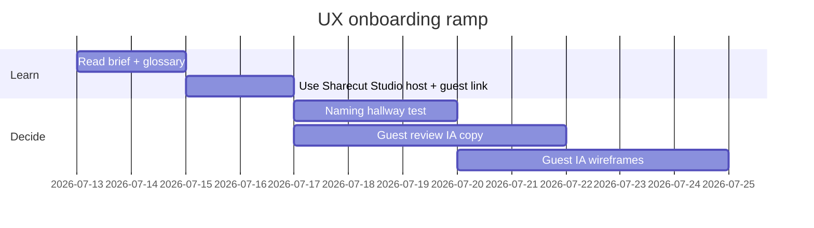

# UX backlog — open design work

Prioritized asks for a UX partner. Engineering roadmap (often more granular): [ROADMAP.md](https://github.com/calebn/sharecut-studio/blob/main/ROADMAP.md).

Status key: **Now** (shape decisions) · **Next** (after Now) · **Later** (strategic).

---

## Now — highest leverage

### 1. Listen-first edit suggestions — shipped

**Decision (2026-08-26):** Review stays on the **current timeline + pending inspector** (no modal). Default preview is **Suggested** (session-scope `remove` only). Modes: Current | Suggested | A/B (~0.4s gap). One `TimelineComment` thread per pending decision (`edit_decision_id`; first Ask = root, later notes = replies). Mobile Listen **Pending** chip selects the first review-required pending and switches to Timeline.

**Still later (ROADMAP):** Transcript Select → suggest-cut; FFmpeg in-memory approve bounce; frozen sidecar.

**Touches:** Pending inspector, comments, share `suggest`, [screen: Inspector](#/screens), [Guest journeys](#/journeys).

---

### 2. Guest review IA (share link)

**Problem:** Guests arrive cold on phone. Capability tiers must feel obvious without host chrome.

**Shipped (engineering):** ReviewApp (default) vs Sharecut Studio guest (`view`); mode banner on Sharecut Studio guest; proxy MP3 guest playback; offline edit queue + **Needs attention**; capability-scoped remote MCP URL; relay host-offline page. Documented in [Screens](#/screens) + [Guest journeys](#/journeys).

**Still open for UX:** First-run orientation copy; comment vs suggest-cut IA; when to offer ReviewApp vs Sharecut Studio; plain-language Needs attention bodies; revoked/expired link copy.

**Touches:** Guest banner, Listen mode, Comments, transport Menu, relay offline page, Needs attention.

---

### 3. Naming & information scent

**Problem:** Impact, premix, suppress, reconcile, applied edit log — accurate for engineers, muddy for hosts/guests.

**UX to decide:** UI glossary (see [Domain glossary naming watchlist](#/glossary)); keep code IDs stable.

**Deliverable:** Label map + hallway test (script below).

---

### 4. Tablet portrait density

**Problem:** Peek inspector + timeline is shipped MVP; proportions, dismiss rules, and Text-vs-Timeline priority need validation.

**UX to decide:** Default peek height; when Text replaces peek; landscape side-inspector breakpoint polish.

---

## Next

### 5. Presence & follow (multi-user)

**Shipped:** Transport **avatar stack** (max three + overflow; collapsed bar and phone **More → People**) with follow/unfollow. Ghost cursors on the timeline (`lane_pos`) and DAW chrome (`data-presence-anchor`; unresolved anchors hidden). Follow mirrors Look (viewport, tab/phone mode, transcript scroll, selection) and Hear (audition/mute/solo when capable). Phone: listen-along banner + playhead sync; Timeline keeps their time on the Ferrite center needle (zoom not copied). Guests stay Mix + Transcript/Comments; banner names host-only tabs and FX/Raw. Strong navigation unfollows (seek/play/stop, zoom/scroll, tab); mute/solo/audition do not. Esc or **Stop following**. Idle peers keepalive. Follower **count** only. Followed guests hide their own cursor.

**Still open:** Leader-initiated spotlight / bring-everyone-to-me, hide-cursor, tight Web Audio clock sync, richer presence without turning the DAW into a chat app. **Account-scoped presence** (person vs tab) waits on Guest sign-in / host accounts — [ROADMAP § v1](../../ROADMAP.md#accounts--freemium-podcast_online).

### 6. Pipeline progress for humans

Engineering contract: shared `progress_task` / choke-point wraps / `make progress-check` warn mode ([docs/progress.md](../../docs/progress.md)). **Studio chrome (Pipeline tab + StatusBar + phone Listen chip):** honest determinate bar vs pulse while running, phase headline, elapsed companion, distinct fail/cancel, **stale “last update Ns ago”** when domain heartbeats stop — no progress log panel ([gui-integration.md](../../docs/gui-integration.md) § Progress). Guests see the same Activity chip on ReviewApp and phone Listen (live region without elapsed ticks). **Consumer fan-out:** `compose_progress` attaches only live sinks (CLI TTY/JSON, MCP `progressToken` over Streamable HTTP SSE, in-process publish-only SSE on a live job, in-process **agent jobs** from host `/mcp` onto the same job/SSE plane, guest WS for the initiating share token). Instant tools never flash a chip; StatusBar shows the most recent live job plus a count badge when N>1. Chip/Listen open Pipeline only for slot jobs; agent **Activity** chips are status-only until the activity-history drawer. **Activity** copy for bounce/export/agent/render-preview; Pipeline tab summary stays pipeline-only, with Run disabled + Cancel while a slot job is busy. Instant ops live in `contracts/progress-exemptions.json` (partial set; remaining mute ops still warn); rich ops in `contracts/progress-richness.json`. Remaining: **cross-process CLI job adopt** (Typer is not installed by the GUI); activity-history drawer. Track rows in [ROADMAP.md § Progress UX](../../ROADMAP.md#progress-ux).

**Related roadmap:** MCP host notification polish, guest display, hard `progress-check` gate.

### 7. Social / video clip future

Audio candidates exist; video ingest, 9:16 export, captions, active-speaker — greenfield UX. Don’t bolt onto Timeline without a separate “Clips” job story.

### 8. Short-lived review media (free tier)

**Shipped (MVP):** Guest proxy MP3 chunks; review-mix MP3 redirect; revoke cleans unused objects when no other share references them. Operators may configure their own media storage.

**Product ownership:** the independently maintained `podcast_online` provider extension owns hosted-account policy and short-lived shared review files.

**Still open for UX:** Expiry defaults, “link died” / revoked copy, free-tier quota framing without forever-public URLs.

---

## Later

| Item | Note |
|------|------|
| Always-on hosted projects (SaaS) | Collaboration without laptop host; owned by the independently maintained `podcast_online` provider extension. |
| Recording session (beta) | Recording links + full-session audio from browser/desktop — [ROADMAP § Recording session](../../ROADMAP.md#recording-session). Design locked: [docs/recording-session.md](../../docs/recording-session.md). Audio MVP shipped. Follow-up leftover (producer `talk`/`control`, room chat, Tauri cpal, restricted record shares): [ROADMAP § Follow-up](../../ROADMAP.md#follow-up). |
| Full design system | Only if polish/scale demands it; Sharecut Studio uses CSS tokens today |
| Marketing site | Separate from this UX pack |
| Annotated FigJam wireframes | Optional; until then use [Screens](#/screens) ASCII + [Guest journeys](#/journeys). Add a FigJam link here when one exists. |

---

## Hallway research script (5 users)

**Recruit:** 2 hosts (edit podcasts), 3 guests (smart phone users, not DAW experts). 25–30 minutes each.

**Setup:** Host Sharecut Studio demo fixture + one ReviewApp link + one Sharecut Studio `view`+`suggest` share (see [Demo](#/demo)).

| # | Task | Success looks like |
|---|------|--------------------|
| 1 | Open ReviewApp share; leave one comment | Comment posts without coaching; &lt; 5 min |
| 2 | Open Sharecut Studio guest; say what you can do | Mentions banner / listen / suggest correctly |
| 3 | Find and audition a pending cut (host phone) | Reaches Play around without Impact confusion |
| 4 | (Optional) Simulate offline conflict → Needs attention | Notices banner; can dismiss |

**Debrief prompts:** What words confused you? Where did you look first? Would you trust approving a cut here?

**Record:** Pass/fail per task, quotes for naming watchlist, screenshots of stuck moments.

---

## Decision log (fill as you go)

| Date | Decision | Owner | Links |
|------|----------|-------|-------|
| 2026-09-14 | Whole-DAW follow: Look/Hear/Do rubric; chrome ghosts via `data-presence-anchor`; guests degrade host-only tabs and non-Mix audition in the banner; mute/solo/audition do not unfollow | Eng | [session-sync](https://github.com/calebn/sharecut-studio/blob/main/docs/session-sync.md), [gui-integration](https://github.com/calebn/sharecut-studio/blob/main/docs/gui-integration.md) |
| 2026-09-14 | Account-scoped presence deferred until logged-in users: person id vs connection id (Figma/Discord); anonymous guests stay tab-as-person | Eng | [ROADMAP](../../ROADMAP.md), [session-sync](https://github.com/calebn/sharecut-studio/blob/main/docs/session-sync.md) |
| 2026-09-14 | Guest share WS echoes assigned `client_id` so a followed guest does not see their own ghost | Eng | [session-sync](https://github.com/calebn/sharecut-studio/blob/main/docs/session-sync.md), [gui-integration](https://github.com/calebn/sharecut-studio/blob/main/docs/gui-integration.md) |
| 2026-09-14 | Follow chrome per shell: phone listen-along + Ferrite center needle; tablet/desktop viewport follow; rem/`@container app` + `@container transport` touch floors | Eng | [Screens](#/screens), [gui-mobile](https://github.com/calebn/sharecut-studio/blob/main/docs/gui-mobile.md), [gui-integration](https://github.com/calebn/sharecut-studio/blob/main/docs/gui-integration.md) |
| 2026-09-14 | Follow mode + ghost cursors: avatar stack, canvas presence, loose listen sync, Esc unfollows; phone More → People | Eng | [Screens](#/screens), [Glossary](#/glossary), [session-sync](https://github.com/calebn/sharecut-studio/blob/main/docs/session-sync.md), [gui-integration](https://github.com/calebn/sharecut-studio/blob/main/docs/gui-integration.md) |
| 2026-07-22 | Guest share chrome: ReviewApp default vs Sharecut Studio+`view`; mode banner; proxy listen; offline queue / Needs attention; Presence on desktop/tablet only | Eng | [Screens](#/screens), [Journeys](#/journeys), [host-online-relay](https://github.com/calebn/sharecut-studio/blob/main/docs/host-online-relay.md) |
| 2026-07-22 | UX pack framed as orientation kit; dual-track glossary; guest journeys page | Eng | [Home](#/), [Glossary](#/glossary) |
| 2026-08-14 | Share API hardening: typed document commands, comment body max 8000, action-done HTTP twin, content-addressed proxy URLs, tunnel HMAC claims | Eng | [host-online-relay](https://github.com/calebn/sharecut-studio/blob/main/docs/host-online-relay.md) |
| 2026-08-14 | Document-command contract: OpenAPI/MCP boundary rejects + schema sync docs in session-sync | Eng | [session-sync](https://github.com/calebn/sharecut-studio/blob/main/docs/session-sync.md) |
| 2026-08-26 | Listen-first pending preview: Suggested skip default; Current/A/B modes; Ask thread on pending inspector (`edit_decision_id`); Listen Pending chip → Timeline | Eng | [daw-editing](https://github.com/calebn/sharecut-studio/blob/main/docs/daw-editing.md), [Journeys](#/journeys) |
| 2026-08-26 | Share agent = share user: HTTP-first façade (same caps as the human; `play` = both can hear). Named MCP only for agent-shaped ops; peaks/proxy/WS stay HTTP. Host capabilities.manifest remains the host catalog, not share ACL. | Eng | [host-online-relay](https://github.com/calebn/sharecut-studio/blob/main/docs/host-online-relay.md) |
| 2026-09-05 | Zoom-matched waveforms: shared uint8 overview + per-tab detail tiles; amplitude zoom Shift+ArrowUp/Down; snap ticks for suggest/edit guests | Eng | [gui-integration](https://github.com/calebn/sharecut-studio/blob/main/docs/gui-integration.md), [Shortcuts](#/shortcuts) |
| 2026-09-05 | ROADMAP grooming: Passes 0–8 marked shipped; guest-account / MCP-connect / SaaS rows owned by podcast_online; markers + Pass 8 docs aligned | Eng | [ROADMAP](../../ROADMAP.md), [gui-integration](../../docs/gui-integration.md), [session-sync](../../docs/session-sync.md) |
| 2026-09-24 | Owner GUI routes require the host role; relay tunnel marks guest traffic (x-sharecut-relayed) and owner routes refuse it | Eng | [host-online-relay](https://github.com/calebn/sharecut-studio/blob/main/docs/host-online-relay.md), [gui-integration](https://github.com/calebn/sharecut-studio/blob/main/docs/gui-integration.md) |
| | | | |

---

## How to work with engineering

1. Prefer proposals against **screens + display schemas** in this pack, not one mock per MCP tool.
2. Respect **listen-first** and **non-destructive** principles ([Brief](#/brief)).
3. Phone must not become a scaled desktop grid ([gui-mobile](https://github.com/calebn/sharecut-studio/blob/main/docs/gui-mobile.md)).
4. File issues / PRs with journeys (“guest approves cut on phone”) over component laundry lists.
5. Copy Markdown from the UX site into Google Docs when stakeholders need comments-in-Doc.

---

## Suggested first two weeks

Dates are placeholders — shift to the hire’s start date.
